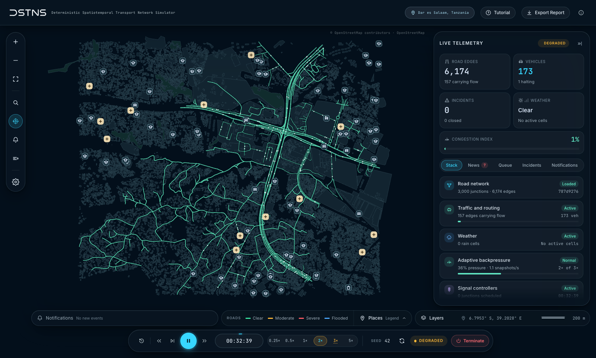
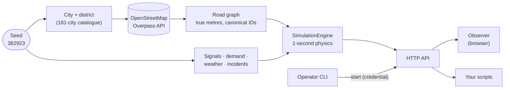
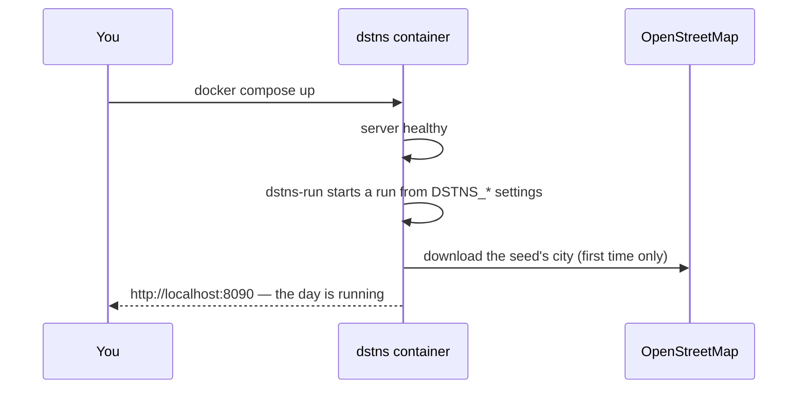

<div align="center">

<picture>
  <source media="(prefers-color-scheme: dark)" srcset="docs/assets/wordmark-light.svg">
  
</picture>

### Deterministic Spatiotemporal Transport Network Simulator

**DSTNS selects a city district from OpenStreetMap using a seed and simulates a
virtual day of traffic, signals, demand, weather, flooding and incidents on one
authoritative clock.** Reproducible results require the same seed, configuration,
map bytes and compatible build; see [Reproducible experiments](#reproducible-experiments).

[](https://github.com/varunkarthic/DSTNS/actions/workflows/ci.yml)
[](https://dstns.readthedocs.io/en/latest/)
[](https://github.com/varunkarthic/DSTNS/actions/workflows/codeql.yml)
[](SECURITY.md)
[](LICENSE)
[](https://en.cppreference.com/w/cpp/20)
[](https://react.dev/)
[](docs/getting-started/docker.md)
[](https://www.openstreetmap.org/copyright)
[](docs/components/sumo-adapter.md)

[**Documentation**](https://dstns.readthedocs.io/) ·
[Quick start](#quick-start) ·
[Docker](#run-with-docker) ·
[From source](#run-from-source) ·
[API](docs/api/index.md) ·
[Troubleshooting](docs/troubleshooting.md)



</div>

---

## Contents

- [Highlights](#highlights)
- [Scope and intended use](#scope-and-intended-use)
- [Quick start](#quick-start)
- [How it works](#how-it-works)
- [Run with Docker](#run-with-docker)
- [Run from source](#run-from-source)
- [Using the observer](#using-the-observer)
- [Using the API](#using-the-api)
- [Configuration](#configuration)
- [Reproducible experiments](#reproducible-experiments)
- [Operations and security](#operations-and-security)
- [Testing](#testing)
- [Project layout](#project-layout)
- [Documentation](#documentation)
- [Troubleshooting](#troubleshooting)
- [Contributing](#contributing)
- [License](#license)

## Highlights

| Capability | Description |
|---|---|
| **Seed-based geographic selection** | A seed resolves to one of **181 cities** on every inhabited continent and a district inside it. The road network is downloaded from OpenStreetMap once and cached. |
| **Deterministic simulation** | SHA-256 sub-seeds per subsystem, counter-based random numbers, fixed one-second physics, checkpoint replay. Matching inputs and compatible builds produce matching scenario and runtime state. |
| **Integrated traffic and environmental models** | Signals snapped to real junctions and coordinated in green waves; place-driven weekday and weekend demand; storms with Wendland C² rain fields; flooding that closes roads; at least four incidents a day. |
| **Checkpoint replay** | Pause, step, seek backwards and forwards through the day; undo and redo operator controls. |
| **Browser observer** | Live map, telemetry, notifications, Auto Focus, a guided tutorial and a PDF report, kept in step by adaptive backpressure. |
| **HTTP API** | Every view and control over JSON, a self-describing route index, and an [OpenAPI 3.1 description](docs/api/openapi.yaml). |
| **Container deployment** | A multi-architecture image (234 MB in the recorded October 2026 build) that starts a simulation with one command; optional TLS gateway and SUMO. |
| **SUMO integration** | Export any world to Eclipse SUMO and run it microscopically as a batch job. |

> [!NOTE]
> The live model is **aggregate** — flows and queues per directed road segment,
> not individual vehicles — which is what makes a whole day of a 3,000-junction
> district efficient enough for interactive seeking and replay.

## Scope and intended use

DSTNS supports transport-model experimentation, algorithm integration, teaching,
and repeatable demonstrations. The live engine models aggregate flows and queues
on directed road segments. SUMO provides a separate microscopic export and
validation workflow; it does not drive the live observer.

A seed alone is insufficient to reproduce an old experiment if upstream map data
or model code has changed. Retain the map, resolved configuration, source revision
and operator actions alongside the seed. The model is a research and development
tool; it has no documented calibration or certification for operational traffic
control. See [Reproducibility](docs/concepts/reproducibility.md) for the exact
inputs and floating-point limitations.

## Quick start

**With Docker** (nothing else to install):

```bash
git clone https://github.com/varunkarthic/DSTNS.git && cd DSTNS
docker compose up --build
```

**From source** (macOS or Linux):

```bash
git clone https://github.com/varunkarthic/DSTNS.git && cd DSTNS
./launcher
```

Then open **<http://localhost:8090>**. The observer narrates the seed resolving
to a city, the map downloading (20–60 s the first time for a city) and the
world being built, then the day starts.

## How it works



| Part | What it is |
|---|---|
| **Core** (`dstns_server`) | C++20. Compiles a scenario from a seed, runs the virtual day, serves the API and the observer on one port. |
| **Operator CLI** (`./launcher`) | Node.js. Builds what changed, starts and supervises the server, starts runs, saved seeds, logs, tests. |
| **Observer** (`ui-engine/`) | React 19. Watches a run in the browser: map, telemetry, playback, reports. |

Read [Architecture](docs/concepts/architecture.md) for the full picture.

## Run with Docker

### Requirements

- Docker Engine 24+ or Docker Desktop, with Compose v2.
- About 1 GB free memory, 250 MB for the image, up to 50 MB per downloaded city.

### Start

```bash
docker compose up --build            # foreground; Ctrl-C to stop
docker compose up --build -d         # background
docker compose logs -f               # follow the log
```

The container starts the server, then a run, and the observer is at
**<http://localhost:8090>**.



### Choose the run

```bash
DSTNS_SEED=382923 DSTNS_DAY_TYPE=weekend DSTNS_SPEED=2 docker compose up
```

or put the same settings in a `.env` file next to `docker-compose.yml`:

| Variable | Default | Meaning |
|---|---|---|
| `DSTNS_SEED` | `auto` | The seed; `auto` draws a fresh one |
| `DSTNS_DAY_TYPE` | `weekday` | `weekday` or `weekend` |
| `DSTNS_SPEED` | `1` | Speed, more than 0 and at most 5 |
| `DSTNS_DURATION` | `3600` | Wall-clock seconds per virtual day at 1× (60–3600) |
| `DSTNS_OSM_FILE` | `auto` | `auto` lets the seed choose a city; or a path in the container |
| `DSTNS_HOST_PORT` | `8090` | Port on your machine |
| `DSTNS_AUTOSTART` | `1` | `0` starts the server with no run |

All variables: [Docker deployment](docs/deployment/docker.md#environment-variables).

### Common tasks

```bash
docker compose exec dstns dstns-run --seed 42                     # start another run, no restart
docker compose exec dstns dstns-run --seed 42 --day-type weekend --speed 3
docker compose exec dstns dstns-run --status                      # what is running
DSTNS_OSM_FILE=/app/data/fixtures/real_network.osm.xml docker compose up   # offline, bundled map
docker compose --profile tls up --build                           # also HTTPS on :8443
DSTNS_WITH_SUMO=1 docker compose up --build                       # include Eclipse SUMO
docker compose down                                               # stop (keeps cached maps)
docker compose down --volumes                                     # stop and delete maps and logs
```

> [!TIP]
> No internet? The image includes a recorded real district (1,196 junctions):
> set `DSTNS_OSM_FILE=/app/data/fixtures/real_network.osm.xml`.

## Run from source

### Requirements

| Tool | Version |
|---|---|
| C++ compiler | GCC 12+, Clang 15+ or Apple Clang 15+ |
| CMake | 3.22+ |
| SQLite 3 and zlib | development headers |
| Node.js / npm | 20+ / 9+ |
| Python | 3.10+ |
| Eclipse SUMO | optional |

<details>
<summary><b>Installing them</b></summary>

**macOS**

```bash
xcode-select --install
brew install cmake node python
```

**Ubuntu / Debian**

```bash
sudo apt-get install -y build-essential cmake git python3 libsqlite3-dev zlib1g-dev
curl -fsSL https://deb.nodesource.com/setup_22.x | sudo -E bash - && sudo apt-get install -y nodejs
```

**Windows**: use WSL 2 with Ubuntu, then follow the Ubuntu steps.

</details>

### Start

```bash
./launcher                                   # build what changed, start, open the observer
./launcher start --seed 382923               # a particular seed
./launcher start --seed 382923 --day-type weekend
./launcher start --speed 3 --duration 1800
./launcher start --osm-file data/fixtures/real_network.osm.xml   # offline
./launcher start --seed 42 --save-seed demo  # save the configuration
./launcher start --saved-seed demo           # replay it exactly
./launcher seeds list
./launcher console                           # interactive dashboard
./launcher logs                              # inspect logs
./launcher test                              # run the test suites
```

Build and map-fetch times depend on hardware, network access and cache state;
the timings above are indicative. The first build typically takes a few minutes;
later starts can take seconds. The launcher
verifies the machine before every run and says what to fix when it cannot run.

### Build by hand

```bash
cmake -S . -B build -DCMAKE_BUILD_TYPE=Release -DDSTNS_BUILD_TESTS=ON
cmake --build build -j
npm ci --prefix ui-engine && npm run build --prefix ui-engine
./build/dstns_server --port 8090          # then: ./launcher start --seed 382923
```

The CMake commands configure and compile a release build with tests enabled.
`npm ci` installs the observer from its lockfile, and `npm run build` type-checks
and bundles it. The last command runs the server in the foreground; run the
launcher in another terminal to submit a simulation. Server availability alone
does not mean a run has started.

Full details: [Installation](docs/getting-started/installation.md) and
[Building from source](docs/development/building.md).

## Using the observer

| Do | Control |
|---|---|
| Play, pause | Play and Pause buttons in the command rail |
| Faster or slower | 0.25× … 5× |
| Jump 15 minutes back or forward | Back and Forward buttons (backward movement uses checkpoint replay) |
| Step one minute | Step button |
| Start the day over | Restart button |
| A different city | **Generate a new world**, next to the seed |
| Follow events automatically | **Auto Focus** in the sidebar |
| Layers, legends | **Layers** in the lower bar |
| A PDF of the day | **Export Report** |
| Learn the interface | **Tutorial** |

Walkthrough: [Your first simulation](docs/getting-started/first-simulation.md).
Reference: [Observer interface](docs/guide/observer-interface.md).

## Using the API

Everything the observer does is an HTTP call:

```bash
curl -s localhost:8090/api/v1/playback/status | python3 -m json.tool | head
curl -s -X POST localhost:8090/api/v1/playback/seek -d '{"target_time":"17:30:00"}'
curl -s localhost:8090/api/v1/view/traffic
curl -s -X PUT localhost:8090/api/v1/control/edges/412 -d '{"closed":true}'
curl -s -X POST localhost:8090/api/v1/control/undo -d '{"count":1}'
curl -s localhost:8090/api/v1            # the server's own route index
```

| Group | Routes |
|---|---|
| Playback | start, prepare, status, play, pause, seek, step, stop, reset |
| View | topology, snapshot, nodes, edges, places, signals, congestion, event queue, … |
| Control | speed, day, modules, road overrides, signals, rain, surges, undo/redo |
| System | health, info, map status, backpressure, terminate |

These requests inspect playback, seek to a virtual time, read traffic, override
a road and undo the most recent control. Edge `412` is illustrative: obtain a
valid ID from `/api/v1/view/topology` for the current run. A seek may continue
playback when the run is already running; pause first when collecting a fixed-time
snapshot. See the [explained curl examples](docs/api/examples.md) for preconditions,
error handling and operator credentials.

Guide: [API](docs/api/index.md) · Reference: [routes](docs/api/reference.md) ·
[OpenAPI](docs/api/openapi.yaml) · [Errors](docs/api/errors.md)

> [!IMPORTANT]
> There are no user accounts: anyone who can reach the port can watch and
> control the run. Starting or preparing a run requires the operator credential
> in `logs/operator.token`, used by the CLI and authorized local scripts. The browser origin guard rejects unapproved cross-origin writes, but is
> not user authentication. The server and Compose both bind to loopback
> (`127.0.0.1`) by default. Remote deployments need access control as well as TLS;
> the bundled gateway supplies encryption, not authentication. See [Security](docs/deployment/security.md) and
> the [security policy](SECURITY.md).

## Configuration

| File / flag | Controls |
|---|---|
| `config/defaults.json` | Run defaults: duration, speed, day, modules, map limits, port |
| `config/ui-config.json` | The observer's starting state: time format, layers, Auto Focus, notifications |
| `./launcher start --…` | Per-run seed, day type, speed, duration, map |
| `dstns_server --…` | Host, port, logs and map directories, map cache policy |
| `DSTNS_*` environment | Operator token, allowed origins, regeneration, Overpass endpoints, Docker run settings |

Every setting: [Configuration](docs/guide/configuration.md).

## Reproducible experiments

Start with the bundled map to remove the network download from the experiment:

```bash
./launcher start --seed 382923 --day-type weekday \
  --osm-file data/fixtures/real_network.osm.xml --no-open
```

The launcher builds and starts the server, selects the specified map and submits
an authenticated start request. Map paths are resolved on the server. Wait until
`/api/v1/playback/status` reports `RUNNING`; an accepted start request only means
preparation has begun.

In another terminal, collect the run's provenance:

```bash
mkdir -p artifacts/experiment-382923
curl --fail --silent --show-error http://127.0.0.1:8090/api/v1/view/manifest \
  -o artifacts/experiment-382923/manifest.json
git rev-parse HEAD > artifacts/experiment-382923/revision.txt
./build/dstns_replay_verify 382923
```

The manifest describes the active scenario and its hashes. The revision identifies
the source checkout. The replay verifier is an independent deterministic test using
its own grid and OSM fixtures; it does not certify the currently running session.
Retain the input map and configuration separately. Do not include
`logs/operator.token` in experiment artifacts.

For a complete script that starts, waits, pauses, seeks and saves a snapshot,
see the [Python API walkthrough](docs/api/client-walkthrough.md).

## Operations and security

| Responsibility | Guidance |
|---|---|
| Report a suspected vulnerability | [Security policy](SECURITY.md): supported versions, confidential reporting, triage and disclosure |
| Restrict access to the API | [Deployment security](docs/deployment/security.md): trust boundaries, credentials, origins and proxy requirements |
| Verify a deployment and recover from failure | [Operations runbook](docs/deployment/operations.md): readiness, backups, updates and recovery |
| Review automated dependency updates | [Dependency maintenance](docs/development/dependencies.md): lockfile review, tests and merge criteria |

DSTNS runs one shared simulation per server. Every client with network access can
control that simulation through endpoints other than the credential-protected
start and prepare routes, so the server **binds to `127.0.0.1` by default** and
refuses cross-site, DNS-rebinding and cross-origin-read attempts from browsers.
Expose it to a network only behind an authenticating proxy, and give access only
to trusted operators who are permitted to change the run.

## Testing

```bash
./scripts/test.sh                                   # core, observer, API and selected CLI suites
ctest --test-dir build --output-on-failure          # native and registered HTTP suites
npm test --prefix ui-engine                         # observer unit and component tests
python3 tests/api/api_smoke.py --server build/dstns_server
./build/dstns_replay_verify 382923                  # reproducibility check
```

The commands above cover different layers: CTest validates registered native and
HTTP suites, Vitest checks observer behavior, and the API smoke test starts an
isolated server. Check the exit status of each command. Test counts can change;
the output from the current checkout is authoritative.

CI runs the native, HTTP, observer, documentation and Docker builds on every
push. Details: [Testing](docs/development/testing.md).

## Project layout

```text
apps/dstns_server/    server entry point
include/dstns/, src/  the C++ core: engine, API, scenario, OSM, events, backpressure
ui-engine/            the observer (React, Vite, Vitest)
dstns-operator-cli/   the operator CLI
tests/                native, HTTP and CLI suites, fixtures
tools/                scenario export, replay verification, road index, benchmark
docker/               entrypoint, dstns-run, TLS gateway
config/               defaults.json, ui-config.json
docs/                 documentation (MkDocs, published on Read the Docs)
```

## Documentation

**<https://dstns.readthedocs.io/>** — or browse [`docs/`](docs/index.md):

| Start here | Understand it | Integrate and run it |
|---|---|---|
| [Quick start](docs/getting-started/quick-start.md) | [Architecture](docs/concepts/architecture.md) | [API guide](docs/api/index.md) |
| [Installation](docs/getting-started/installation.md) | [Simulation engine](docs/concepts/simulation-engine.md) | [Docker deployment](docs/deployment/docker.md) |
| [Run with Docker](docs/getting-started/docker.md) | [Mathematical model](docs/concepts/mathematical-model.md) | [Security](docs/deployment/security.md) |
| [Your first simulation](docs/getting-started/first-simulation.md) | [Seeds and places](docs/guide/seeds-and-places.md) | [Configuration](docs/guide/configuration.md) |
| [Operator CLI](docs/guide/operator-cli.md) | [Reproducibility](docs/concepts/reproducibility.md) | [Troubleshooting](docs/troubleshooting.md) |

Preview the site locally:

```bash
python3 -m venv .venv-docs && .venv-docs/bin/pip install -r docs/requirements.txt
.venv-docs/bin/mkdocs serve        # http://127.0.0.1:8000
```

## Troubleshooting

| Symptom | Fix |
|---|---|
| `MAP_FETCH_FAILED` | No route to OpenStreetMap: check the network, set `DSTNS_OVERPASS_ENDPOINTS`, or run a cached / bundled map with `--osm-file` |
| Port 8090 in use | The CLI picks the next free port; with Docker set `DSTNS_HOST_PORT` |
| Observer shows **DEGRADED** | The browser is behind; DSTNS slows itself to match and recovers on its own |
| `CROSS_ORIGIN_FORBIDDEN` | A page on another origin tried to change state; allow it with `DSTNS_ALLOWED_ORIGINS` |
| Build fails after a system update | `cmake --fresh -S . -B build -DCMAKE_BUILD_TYPE=Release` |
| SUMO reported unavailable | `sumo --version` must work; reinstall or rebuild SUMO |

More: [Troubleshooting](docs/troubleshooting.md) and [FAQ](docs/faq.md).

## Contributing

Issues and pull requests are welcome. Read [CONTRIBUTING.md](CONTRIBUTING.md) and
the [Code of Conduct](CODE_OF_CONDUCT.md) first: behavior changes need regression
coverage that fails without the change, documentation changes need a strict site
build and verified examples, and every change records itself in
[CHANGELOG.md](CHANGELOG.md). **Report security vulnerabilities privately**, as
described in [SECURITY.md](SECURITY.md); never in a public issue.

## License

Copyright © 2026 Varun Karthic. DSTNS is free software under the
[GNU Affero General Public License v3.0 or later](LICENSE). If you offer a
modified DSTNS over a network, you must offer its source to its users.

Map data © [OpenStreetMap contributors](https://www.openstreetmap.org/copyright),
ODbL 1.0. See [License](docs/license.md) for third-party components.
