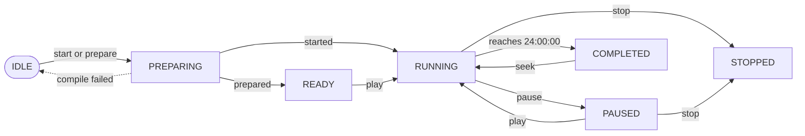

# Lifecycle

Every run is in exactly one lifecycle state, reported as `lifecycle` by
`/health`, `/playback/status` and every envelope's `clock.playback_state`.

From `RUNNING`, `PAUSED`, `COMPLETED` and `STOPPED`, **reset** returns the server to
`IDLE`. From `IDLE` or any run state, **terminate** moves it to `TERMINATING` and the
process exits.

`SEEKING` is held only momentarily while a seek or step replays physics, so it is
not drawn: a seek leaves a run `RUNNING`, `PAUSED` or `COMPLETED` as the table
below describes.

| State | Meaning | Clock |
|---|---|---|
| `IDLE` | No world. `preparation_error` explains a failed start | — |
| `PREPARING` | Compiling: resolving the seed, downloading, building | — |
| `READY` | Compiled by `/prepare`, not started; start it with `POST /playback/seek {"target_time": 0, "play": true}` | Stopped at 00:00:00 |
| `RUNNING` | Playing | Advancing |
| `PAUSED` | Held | Stopped |
| `SEEKING` | A seek or step is replaying physics (momentary) | Jumping |
| `COMPLETED` | Reached 24:00:00 | Stopped at the end |
| `STOPPED` | Ended by `/stop`; the world is still readable | Stopped |
| `TERMINATING` | The process is exiting | — |

## Which actions are allowed when

| Action | `IDLE` | `PREPARING` | `READY` | `RUNNING` | `PAUSED` | `COMPLETED` | `STOPPED` |
|---|---|---|---|---|---|---|---|
| start | Allowed | 409 | Allowed | 409 | 409 | Allowed | Allowed |
| play | 409 | 409 | 409 | no-op | Allowed | 409 | 409 |
| pause | 409 | 409 | 409 | Allowed | no-op | 409 | 409 |
| seek | 400 (no world) | 409 | Allowed | Allowed | Allowed | Allowed | Allowed |
| step | 409 | 409 | Allowed | Allowed | Allowed | 409 | Allowed |
| controls | 409 / 400 | as the world allows | Allowed | Allowed | Allowed | Allowed | Allowed |
| regenerate | 409 | 409 | Allowed | Allowed | Allowed | Allowed | Allowed |
| reset, terminate | Allowed | Allowed | Allowed | Allowed | Allowed | Allowed | Allowed |

A refused action returns 409 `LIFECYCLE_CONFLICT` (see [Errors](errors.md)).

## Revisions

Three counters let a client tell what changed:

| Counter | Increments on | Use |
|---|---|---|
| `playback_revision` | Every lifecycle transition | Guards for automated play/pause (`expected_playback_revision`) |
| `state_revision` | Every physics commit | Skip duplicate snapshots |
| `config_revision` | Every control that changes configuration | Refresh settings displays |

## World regeneration

Regeneration is a background job beside the lifecycle. The current world is
paused, the job compiles a new one, and on success swaps it in `PAUSED` at
00:00:00 with a new `run_id`; on failure the old world is untouched. Track it
with `GET /api/v1/world/status` (`state`: `idle`, `generating`, `ready`,
`failed`). See [API reference: world regeneration](reference.md#world-regeneration).
