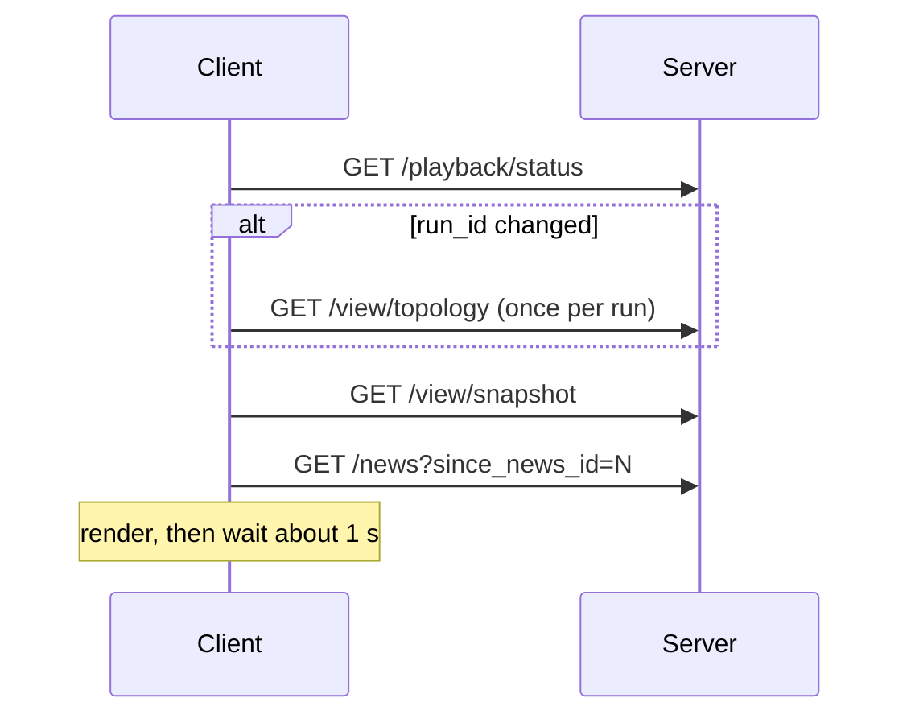

# Streaming

DSTNS offers two [server-sent event](https://html.spec.whatwg.org/multipage/server-sent-events.html)
endpoints. Each sends **one event per connection** and closes it, with a
`retry: 1000` hint, so an `EventSource` reconnects every second and receives a
fresh event each time: effectively once-a-second delivery with browser-managed
reconnection.

| Route | Event | Data |
|---|---|---|
| `GET /api/v1/view/stream` | `snapshot` | The same envelope as `GET /api/v1/view/snapshot` |
| `GET /api/v1/news/stream` | `news` | The same envelope as `GET /api/v1/news?since_news_id=0&limit=100` |

```text
HTTP/1.1 200 OK
Content-Type: text/event-stream
Connection: close

retry: 1000
event: snapshot
data: {"ok":true,"run_id":"run_4f1fccc516c6", … }
```

```js
const source = new EventSource("/api/v1/view/stream");
source.addEventListener("snapshot", (e) => {
  const snapshot = JSON.parse(e.data);
  render(snapshot.data);
});
```

## Polling instead

The observer polls rather than streams, because polling lets it pace itself and
report its lag to [Adaptive backpressure](../concepts/backpressure.md). For
most clients that is the better model too:



## Static and dynamic layers

Topology (geometry, names, places) never changes during a run, so it is
fetched once per `run_id`. Snapshots carry only the dynamic state, indexed by
the same node and edge IDs, so geometry is never resent.

## Recovering after a disconnect

1. Reconnect (an `EventSource` does this automatically).
2. If `run_id` is unchanged, carry on.
3. If it changed, fetch `/view/topology` again and reset any news cursor.
4. If `clock.virtual_day_seconds` went backwards, the operator seeked; reset
   the news cursor.

`state_revision` increases with every physics commit within a run and can be
used to skip duplicate frames.
