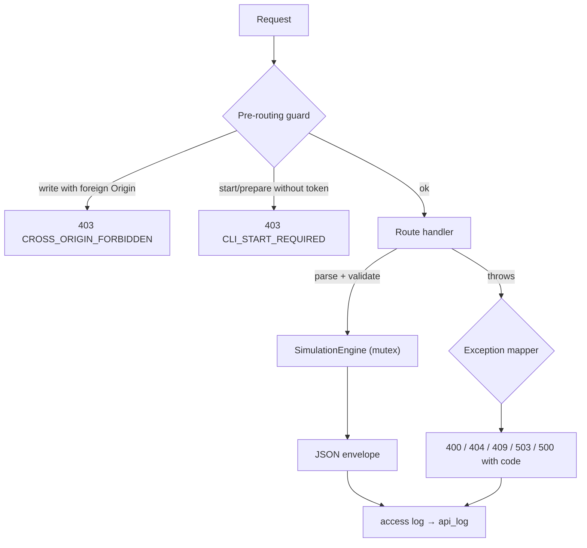

# HTTP API server (`dstns::ApiServer`)

Source: `include/dstns/api.hpp`, `src/api.cpp`, on
[cpp-httplib](https://github.com/yhirose/cpp-httplib) 0.28.

## Responsibilities

- Register every route (`ApiServer::routes`) and serve the observer bundle from
  `ui-engine/dist`.
- Parse and validate requests: JSON bodies, path IDs (32-bit, never wrapped),
  query numbers, times, seeds, configuration.
- Refuse cross-site state changes and unauthenticated starts (pre-routing
  guard).
- Map exceptions to statuses and stable error codes.
- Log every request to the SQLite journal.
- Shut the process down cleanly on `POST /terminate`.

## Request path

## Exception mapping

| Thrown | Status | Code |
|---|---|---|
| `MapFetchError` | 503 | `MAP_FETCH_FAILED` |
| `nlohmann::json::parse_error` | 400 | `INVALID_JSON` |
| `nlohmann::json::out_of_range` | 400 | `MISSING_FIELD` |
| `nlohmann::json::type_error` | 400 | `INVALID_FIELD_TYPE` |
| `std::invalid_argument` | 400 | `INVALID_REQUEST` |
| `std::out_of_range` | 404 | `NOT_FOUND` |
| `std::logic_error` (other) | 409 | `LIFECYCLE_CONFLICT` |
| anything else | 500 | `INTERNAL_ERROR` |

So a handler validates by throwing the right type; it never builds error
responses itself.

## Concurrency

cpp-httplib runs handlers on a thread pool. Handlers call `SimulationEngine`
methods directly; the engine serialises them with one recursive mutex, shared
with its playback loop. A few calls are deliberately lock-free: `/health`
(lifecycle mirror), `/system/map-status` (download progress) and terminate, so
they answer while a compilation holds the lock for a download.

## Responses

Every JSON response goes through `send`, which adds `ok` from the status and
serialises with `dump_json` (refusing invalid UTF-8). Responses are gzip
compressed when the client accepts it; a large topology shrinks several-fold.
Default headers include `Cache-Control: no-store` and CORS granted only to the
server's own origin and `DSTNS_ALLOWED_ORIGINS`. See [Security](../deployment/security.md).
