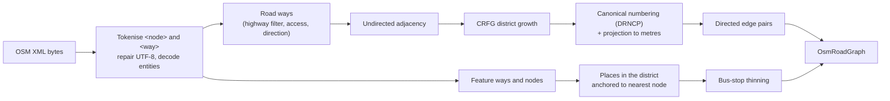

# OSM loader (`dstns::OsmRoadLoader`)

Source: `include/dstns/osm.hpp`, `src/osm.cpp`.

Turns an OpenStreetMap XML file into a connected, canonically numbered,
true-scale road graph with its places.

## Interface

```cpp
struct DistrictAnchor {
    bool valid{false};                 // false: no seed-resolved location (fixtures, pinned maps)
    double lat{}, lon{};               // grow the district from the road nearest here
    std::uint32_t target_nodes{3000};  // district size cap
};

struct OsmRoadGraph {
    NodeId root;
    std::vector<NodeStatic> nodes;
    std::vector<EdgeStatic> edges;
    std::string source_hash;           // "sha256:" of the whole input
    std::vector<MapFeature> features;  // places
    double projection_lat{}, projection_lon{};
};

class OsmRoadLoader {
public:
    [[nodiscard]] OsmRoadGraph load_xml(const std::filesystem::path& file, std::uint32_t max_nodes,
                                        const DeterministicRng& rng, const DistrictAnchor& anchor = {}) const;
};
```

## Pipeline



## Rules

| Concern | Rule |
|---|---|
| Road types | `motorway`, `trunk`, `primary`, `secondary`, `tertiary` (and their `_link`s), `unclassified`, `residential`, `living_street`, `service`, `track` |
| Excluded | `access=private` or `access=no`; ways with fewer than two nodes in the file; every other highway type (`footway`, `cycleway`, `path`, `steps`, …) |
| Direction | `oneway=yes/1/true`; `oneway=-1` reverses the way; an untagged `junction=roundabout` is one-way |
| Classes | Speed, capacity and lanes by class; see [OSM map generation](../concepts/osm-map-generation.md#which-ways-are-roads) |
| Node roles | Bus stops, signal candidates, and node-level school/office/mall/store demand from tags |
| Coordinates | Must be finite, within ±90° and ±180°, or the file is refused |
| Text | Attribute values repaired to valid UTF-8 and capped at 512 bytes |
| Hash | `source_hash` is SHA-256 over the complete bytes |

Errors (`std::invalid_argument`, so 400 over the API): an unreadable file, no
eligible road ways, ways that reference no present nodes, invalid coordinates,
no usable connected region.

## Known limitations

- The tokenizer expects every `<way>` to have a closing `</way>`. A
  self-closing `<way/>` (which Overpass does not emit for road queries) would be
  paired with the next way's closing tag.
- Turn restrictions and lane-level tags are not modelled.
- Places are anchored to the nearest road node by a linear scan; very large
  place counts make loading slower.
