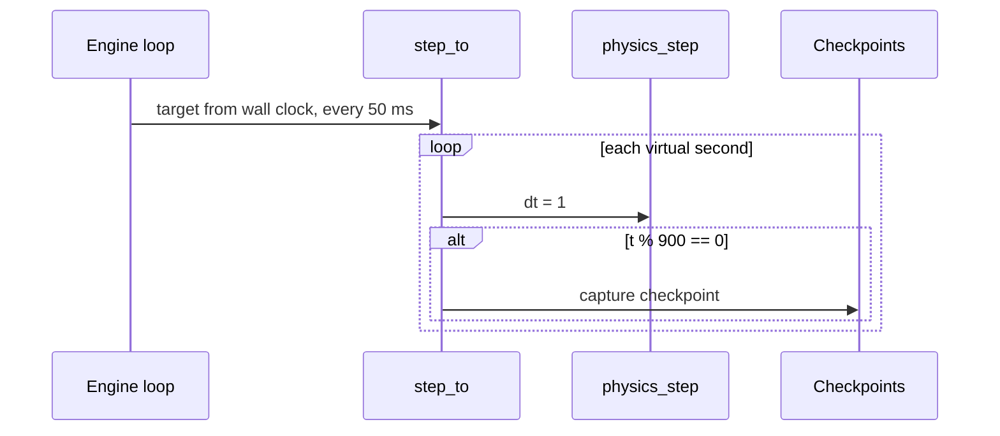

# Playback and checkpoints (`dstns::SimulationEngine`)

Source: `SimulationEngine::loop`, `step_to`, `capture_checkpoint`,
`restore_to`, `seek`, `step`, `set_tick_rate` in `src/engine.cpp`.

## Clocks

| Quantity | Definition |
|---|---|
| Playback duration \( T_P \) | Wall-clock seconds a virtual day takes at 1×, 60 to 3600 |
| Base rate | \( 86400 / T_P \) virtual seconds per wall-clock second |
| Tick rate \( k \) | Speed multiplier, \( 0 < k \le 5 \); the interface offers 0.25, 0.5, 1, 2, 3, 5 |
| Target virtual rate | base rate × \( k \) (the *applied* \( k \), which ASB may cap) |

## The loop

The engine thread wakes every 50 ms. While `RUNNING`:

\[
t_{\text{target}} = \min\big(86400,\; t_{\text{anchor}} + (\text{now} - \text{wall}_{\text{anchor}}) \times \text{base rate} \times k\big)
\]

and `step_to(target)` advances physics **one virtual second at a time**,
capturing a checkpoint whenever the clock crosses a multiple of 900 s. Reaching
86,400 while running completes the day. Every rate change, pause, play and seek
first catches up to the wall clock, then re-anchors.

## Checkpoints and seeking

A checkpoint stores the node and edge dynamic arrays, the event runtime, the
congestion tracker, and the news length and next ID.

- **Forward seek** simulates to the target.
- **Backward seek** restores the latest checkpoint at or before the target,
  discards later checkpoints, carries operator edge overrides across, and
  simulates to the target.
- **Step** simulates exactly the requested seconds (1 to 3600) and pauses.

Because physics is fixed-step and deterministic, all three reach identical
state for the same target.

Memory: 96 checkpoints per day, each a copy of every node's and edge's
dynamic state. This is the main memory cost of a run.

See [Simulation engine](../concepts/simulation-engine.md) and
[Lifecycle](../api/lifecycle.md).
