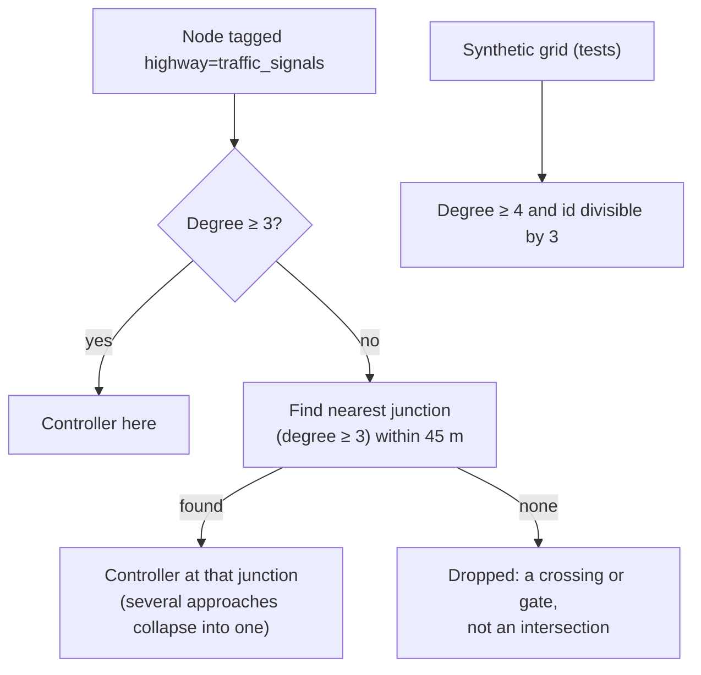

# Signal planning and control (`dstns::ScenarioCompiler::plan_signals`)

Source: `ScenarioCompiler::plan_signals` (`src/scenario.cpp`) places and times
controllers; `EventRuntime` (`src/events.cpp`) runs them; the engine applies
manual overrides.

## Where controllers go



OpenStreetMap usually tags the stop line a few metres back along one approach,
not the junction itself. Taking tags literally would scatter signals along
straight roads; snapping them to the junction gives one controller per
signalised intersection. Junction candidates are bucketed in 45 m cells so
snapping stays linear in the number of tagged nodes, and ties are broken by
node ID.

## Timing

For a controller at node \( v \) with degree \( d_v \), north-south and
east-west arriving capacity \( C_{NS}, C_{EW} \) (from the edges entering it)
and a seeded uniform \( u \):

\[
\text{cycle} = \operatorname{clamp}\big(45 + 4 d_v + (C_{NS} + C_{EW})/1200 + 20u,\; 50,\; 120\big) \text{ s}
\]

\[
\text{green}_{NS} = \operatorname{clamp}\Big((\text{cycle} - 8)\,\frac{C_{NS}}{C_{NS} + C_{EW}},\; 12,\; \text{cycle} - 20\Big),
\qquad \text{green}_{EW} = \text{cycle} - 8 - \text{green}_{NS}
\]

The plan has six phases: green A, 3 s amber, 1 s all-red, green B, 3 s amber,
1 s all-red.

## Green waves

The offset of each controller is the travel time from the centroid of all
controllers at a nominal 13.9 m/s (50 km/h), wrapped into its cycle:

\[
\text{offset}_v = \frac{\lVert p_v - \bar p \rVert}{13.9} \bmod \text{cycle}_v
\]

Neighbouring junctions therefore differ by the time it takes to drive between
them, so a platoon released at one tends to arrive at the next on green.

## At run time

The event runtime keeps one pending transition per controller in a min-heap
ordered by time, so a network of 10,000 controllers costs O(log n) per
transition. An approach's `signal_multiplier` is 1.0 on green, 0.4 on amber and 0.08 on red;
it scales both speed and capacity. The concepts are explained in
[Traffic signals](../concepts/signals.md).

A **manual override** (`POST /api/v1/control/signals/{node}`) forces the
north-south (phase 1) or east-west (phase 2) approaches green, with
multipliers 1.0 and 0.08, until it is undone; undo returns the junction to its
plan. Overrides survive seeking.

## Reading signal state

`GET /api/v1/view/signals` and the snapshot's `signals`:

```json
{ "signal_id": 5, "junction_id": 5, "enabled": true, "cycle_length": 76,
  "phases_s": [35, 3, 1, 33, 3, 1], "phase": 3, "phase_name": "B green",
  "group_a": "red", "group_b": "green",
  "phase_started_at": -14, "time_in_phase": 14, "next_transition_at": 19,
  "manual_override": false }
```

The topology's nodes also carry `signal`, `signal_cycle_s`, `signal_offset_s`
and `signal_green_s`.
