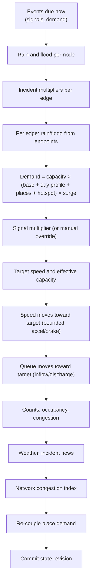

# Traffic model

Source: `SimulationEngine::physics_step` (`src/engine.cpp`).

The aggregate traffic model computes, every virtual second and for every
traversable directed edge: demand, effective speed and capacity, a vehicle
queue, and congestion. Synthetic reverse edges (against a one-way restriction)
are held at zero.

## Per-second sequence

Every formula, with its constants, is in [Mathematical
model](../concepts/mathematical-model.md). The model is deterministic and
separate from the optional SUMO batch run.

## Inputs per edge

| Input | Source |
|---|---|
| Base capacity, free speed, lanes, length | Road class at compile time |
| Hotspot susceptibility | Seeded per edge; 24 or so hotspots per district |
| Place attraction | Places within 400 m, through the event runtime |
| Signal multiplier | Controller phase, or a manual override |
| Rain, flood | Mean of the endpoints |
| Incident multipliers, closure | Active incidents (minimum across overlaps) |
| Operator multipliers, closure | Edge overrides |
| Surge | Strongest active surge covering either endpoint |
