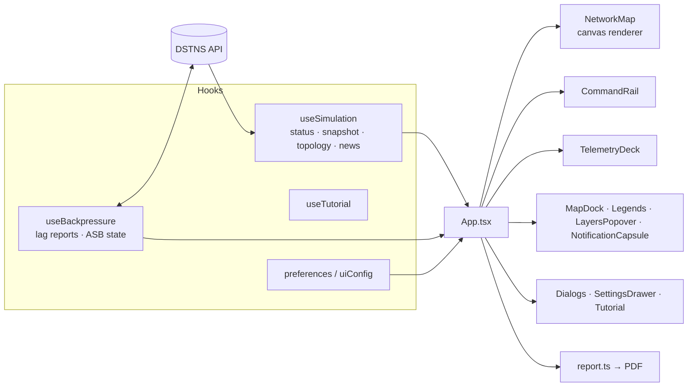

# Observer (UI engine)

Source: `ui-engine/` — React 19, TypeScript, Vite, Vitest, jsPDF. The full
user-facing guide is [Observer interface](../guide/observer-interface.md); this
page is the developer's map.

## Data flow



## Modules

| Module | Role |
|---|---|
| `api.ts` | Typed client; validates envelopes, maps errors to messages |
| `useSimulation.ts` | Polls status every second, then snapshot and news; fetches topology once per `run_id`; resets the news cursor when time moves backwards |
| `useBackpressure.ts` | Reports lag, frame time and poll interval; applies ASB's instructions |
| `App.tsx` | The shell: layout, dialogs, world regeneration, Auto Focus, completion |
| `NetworkMap.tsx`, `mapModel.ts`, `mapProjection.ts` | Canvas rendering: static and dynamic layers, viewport culling, insets for panels |
| `CommandRail.tsx` | Playback, time, speed, seed, status, terminate |
| `TelemetryDeck.tsx`, `telemetryModel.ts`, `telemetryRecorder.ts` | Live measures and lists |
| `notificationModel.ts`, `notificationGroups.ts`, `notificationHistory.ts` | News to notifications: taxonomy, grouping, Do Not Disturb, history |
| `autoFocus.ts`, `focusNotification.ts` | Choosing and framing events |
| `Dialogs.tsx` | About, confirms, completion, suspension |
| `Tutorial.tsx`, `tutorialSteps.ts`, `useTutorial.ts` | The guided tour |
| `report.ts`, `reportModel.ts`, `pdfLayout.ts` | The PDF report, built in the browser |
| `uiConfig.ts`, `preferences.tsx` | Operator defaults merged with this browser's preferences |
| `theme.css`, `system.css`, `hud.css`, `style.css` | Design tokens and layout |

## Principles

- **No simulation state of its own.** Everything shown comes from the API;
  preferences only change presentation.
- **One poll at a time.** A new poll starts a second after the previous one
  finishes, so a slow server is never flooded.
- **Same-origin requests.** In development Vite proxies `/api`; in production
  the server serves the bundle. Writes from other origins are refused by the
  server.
- **Minimum size** 1024 × 640; below it the interface says so.

## Working on it

```bash
npm ci --prefix ui-engine
./scripts/dev.sh                          # server on 8090 + Vite on 5173
npm test --prefix ui-engine               # 24 files, 286 tests
npx --prefix ui-engine tsc -b             # type check
```

See [Testing: observer suites](../development/testing.md#observer-suites).
