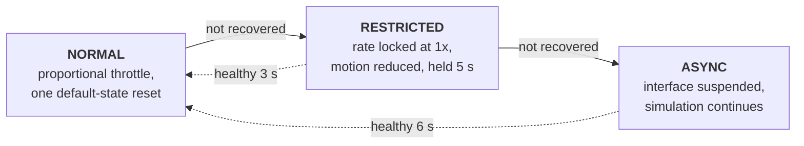

# ASB — Adaptive Simulation Backpressure

## The problem

The core advances virtual time on its own clock. The observer consumes
snapshots over HTTP and draws them. Nothing couples the two, so on a slow
machine, a dense district, or a high rate multiplier they drift apart: the
picture on screen stops corresponding to the state the core is actually in.

Left alone this fails badly. The operator reads stale numbers as current ones,
the map animates traffic that has already cleared, and the usual response — turn
the speed up because it looks slow — makes it worse.

ASB measures that drift, scores it, and throttles the simulation to close it.

## The score

One number in `[0, 1]`, recomputed on each report. Three symptoms are measured
and **the worst one wins** — averaging would let a severe problem in one
dimension hide behind health in the others.

| Symptom | Meaning | Scored against |
| --- | --- | --- |
| `virtual_lag_s` | Virtual seconds between the snapshot the observer last rendered and the state the core holds | `1.5 × tick_rate`, floored at 1 s, over a 4× window |
| `client_frame_s` | Wall-clock interval between the observer's own frames | 33 ms healthy → 233 ms saturated |
| `since_poll_s` | Seconds since the observer last managed to poll | 2 s healthy → 8 s saturated |

Lag is judged *relative to the rate*, because at 20× the observer is expected to
be several virtual seconds behind simply because each poll covers more ground.
A fixed threshold would declare every fast run unhealthy.

Thresholds (`include/dstns/asb.hpp`, exported so tests state the contract in the
same terms the implementation does):

```
kAsbSyncedScore    0.35   below this: in sync
kAsbStressedScore  0.60   above this: drift is real
kAsbCriticalScore  0.85   above this: recovery is overdue
kAsbEscalateAfterS 3.0    stressed this long -> act
kAsbRestrictedHoldS 5.0   minimum time in Restricted
kAsbRecoverAfterS  3.0    healthy this long -> relax
```

Between `synced` and `stressed` is a deliberate dead band: the controller holds
position rather than flapping on noise.

## The control law

This section gives the exact arithmetic (`src/asb.cpp`), with a worked example.

### Component scores

Each symptom is normalised to \( [0, 1] \) by a clamped linear ramp,
\( \operatorname{clamp}(x) = \min(1, \max(0, x)) \). With \( L \) the virtual lag,
\( F \) the observer's frame interval, \( P \) the time since its last poll and
\( k \) the tick rate:

\[
\begin{aligned}
\sigma_{\text{lag}} &= \operatorname{clamp}\!\left(\frac{L}{4\,\max\big(1,\; 1.5\,\max(1, k)\big)}\right) \\[4pt]
\sigma_{\text{frame}} &= \operatorname{clamp}\!\left(\frac{F - 0.033}{0.200}\right) \quad (F > 0) \\[4pt]
\sigma_{\text{poll}} &= \operatorname{clamp}\!\left(\frac{P - 2}{6}\right)
\end{aligned}
\]

The **raw score** is the worst of the three, because averaging would let a severe
problem in one dimension hide behind health in the others:

\[
\rho = \max\big(\sigma_{\text{lag}},\; \sigma_{\text{frame}},\; \sigma_{\text{poll}}\big)
\]

```cpp
double lag_component(const AsbSample& s) {
    const double tolerance = std::max(1.0, 1.5 * std::max(1.0, s.tick_rate));
    return std::clamp(s.virtual_lag_s / (tolerance * 4.0), 0.0, 1.0);   // lag judged against the rate
}
double frame_component(const AsbSample& s) {
    if (s.client_frame_s <= 0) return 0.0;
    return std::clamp((s.client_frame_s - 0.033) / 0.20, 0.0, 1.0);    // 33 ms healthy, 233 ms saturated
}
double poll_component(const AsbSample& s) {
    return std::clamp((s.since_poll_s - 2.0) / 6.0, 0.0, 1.0);          // 2 s healthy, 8 s saturated
}
```

The lag tolerance grows with the rate because at \( k \times \) speed each poll
legitimately covers \( k \) times as much virtual time; a fixed threshold would
call every fast run unhealthy.

### Smoothing

The controller acts on a **damped** score \( \sigma \), an exponential moving mean
of \( \rho \) whose time constant depends on direction:

\[
\sigma \leftarrow \sigma + (\rho - \sigma)\,\alpha, \qquad
\alpha = 1 - e^{-\Delta t / \tau}, \qquad
\tau = \begin{cases} 2.5\ \text{s} & \rho > \sigma \ (\text{worsening}) \\ 1.8\ \text{s} & \rho \le \sigma \ (\text{improving}) \end{cases}
\]

with \( \Delta t \) clamped to \( [0, 5] \) s. Rising is slower than falling on
purpose: a problem must persist to be believed, while a recovery is credited
promptly. The first report after a reset seeds \( \sigma = \rho \) directly.

```cpp
const double dt    = std::clamp(now_s - last_observed_, 0.0, 5.0);
const double tau   = raw_score_ > score_ ? kAsbRiseTauS : kAsbFallTauS;   // 2.5 s up, 1.8 s down
const double alpha = tau > 0 ? 1.0 - std::exp(-dt / tau) : 1.0;
score_ += (raw_score_ - score_) * alpha;
```

### Worked example

An observer at \( k = 3\times \) reports \( L = 12.4 \) s of lag, a 48 ms frame
interval and a 1.02 s poll interval, once a second, starting from a healthy
\( \sigma = 0.05 \).

\[
\sigma_{\text{lag}} = \frac{12.4}{4 \cdot \max(1,\ 4.5)} = 0.689, \quad
\sigma_{\text{frame}} = \frac{0.048 - 0.033}{0.2} = 0.075, \quad
\sigma_{\text{poll}} = 0
\;\Rightarrow\; \rho = 0.689
\]

The damped score climbs with \( \alpha = 1 - e^{-1/2.5} = 0.330 \):

| Report | 1 | 2 | 3 | 4 | 5 | 6 |
|---|---|---|---|---|---|---|
| \( \sigma \) | 0.261 | 0.402 | 0.496 | 0.560 | **0.602** | 0.631 |

It crosses the *stressed* threshold (0.60) on the fifth report, so a single bad
sample, or even three, never triggers anything. At that point the throttle applies.
The same lag at \( k = 5\times \) scores only \( \rho = 0.413 \), inside the dead band
between *synced* (0.35) and *stressed* (0.60), so ASB leaves a fast but coping
observer alone.

If the observer then recovers (\( \rho = 0 \), \( \tau = 1.8 \) s,
\( \alpha = 0.426 \)), \( \sigma \) falls 0.620 \( \to \) 0.356 \( \to \) **0.204**: below
the *synced* threshold after two reports, which is why recovery feels prompt.

### Proportional throttle

When \( \sigma > 0.60 \), the rate ceiling is set from the damped score and snapped
down to a rate the interface offers, \( \mathcal{R} = \{1, 2, 3, 5\} \):

\[
c = \max\Big\{\, r \in \mathcal{R} \;:\; r \le \max\big(1,\; k\,(1 - \sigma)\big) \Big\}
\]

At \( \sigma = 0.62 \): for \( k = 3 \), \( 3 \times 0.38 = 1.14 \to c = 1 \); for
\( k = 5 \), \( 5 \times 0.38 = 1.9 \to c = 1 \). The ceiling is never below 1×, and it
changes at most once every 4 s (`kAsbRateHoldS`) so the rate cannot flap. The
operator's *requested* rate is remembered, and as health returns the ceiling steps
back up through \( \mathcal{R} \) one rung per hold period until it reaches the request.

```cpp
const double target = quantise_rate(std::max(1.0, sample.tick_rate * (1.0 - score_)));
if (target < cap_ && now_s - cap_changed_at_ >= kAsbRateHoldS) {      // at most once per 4 s
    cap_ = target;
    note("throttle", "observer behind; reducing the rate ceiling to close the gap", now_s, before, cap_);
}
```

## The ladder

Strictly ordered. Each rung is entered only after the previous one has been
given a fixed window to recover, and recovery is always explicit.



### Normal

Full operator control. Two responses, in order of cost:

1. **Proportional throttle.** The moment the score passes `stressed`, the rate
   ceiling drops to `tick_rate × (1 − score)`, never below 1×. This is
   continuous, cheap, and usually enough. The operator's *requested* multiplier
   is remembered throughout, so it returns on its own.
2. **The default state**, once, after 3 s of sustained stress. Forces 1×,
   switches the display layers off, and soft-restarts the observer — the
   equivalent of Ctrl+R without reloading the page. The recovery gets its own
   3 s window.

### Restricted

Entered when the default state did not restore synchronization. The rate is
**locked at 1×** and **reduced motion is forced on**, both shown in the
interface as locked rather than simply changed. Held for **at least 5 s**
regardless of how quickly things improve, so the system gets a genuine chance to
settle before being judged again.

### Async

Entered when Restricted also failed. The observer's GUI is **suspended**:

> This simulation's interface has been suspended by the ASB (Adaptive Simulation
> Backpressure) because the simulation and the GUI were out of sync and failed to
> re-establish synchronization.

**The simulation is not affected.** It keeps running and keeps streaming data.
Exactly four controls remain: play/pause, reset, terminate, and nothing else.
The interface resumes on its own after 6 s of sustained health.

## API

### `GET /api/v1/system/backpressure`

Read the current state without reporting anything.

### `POST /api/v1/system/backpressure`

The observer reports its own health; the response is the authoritative state,
so one round trip both informs and instructs.

```json
{ "virtual_lag_s": 12.4, "client_frame_s": 0.048, "since_poll_s": 1.02 }
```

```json
{
  "state": "NORMAL",
  "score": 0.41,
  "synced": false,
  "rate_locked": false,
  "motion_locked": false,
  "gui_suspended": false,
  "rate_capped": true,
  "rate_cap": 11.8,
  "applied_tick_rate": 11.8,
  "requested_tick_rate": 20,
  "stressed_for_s": 0,
  "state_for_s": 143.2,
  "throughput": { "snapshots_per_s": 1.02, "bytes_per_s": 1842365 },
  "actions": [
    {
      "at_s": 141.8,
      "action": "throttle",
      "reason": "observer behind; reducing the rate ceiling to close the gap",
      "score": 0.41,
      "rate_before": -1,
      "rate_after": 11.8
    }
  ],
  "thresholds": { "synced": 0.35, "stressed": 0.6, "critical": 0.85, ... }
}
```

Notes on the contract:

- `rate_cap` and an action's `rate_before`/`rate_after` are `-1` when no ceiling
  is in force. JSON has no infinity, and `-1` is unambiguous against a domain
  that is always positive.
- `applied_tick_rate` is what the simulation is running at; `requested_tick_rate`
  is what the operator asked for. They differ exactly while ASB is governing.
- `throughput` is the measured delivery rate of snapshots, which is what the
  link is actually sustaining.
- `actions` is bounded to the last 24 transitions. Every one carries a reason in
  plain language, so a rate that changed is explainable rather than mysterious.

## Observer side

`ui-engine/src/useBackpressure.ts`:

- Frame cost is sampled from animation frames the browser is producing anyway —
  measurement never drives rendering.
- The exponential mean (`0.85 / 0.15`) is responsive to a sustained stall but
  unmoved by one slow frame caused by something outside the app.
- A malformed or unrecognised response is treated as *no report*, exactly as
  being offline already is. `isBackpressure()` validates the shape; an old core
  or a proxy error page cannot crash the interface.
- The default state raises a soft-restart token once per action, not on every
  poll that still mentions it.

## Configuration

`config/ui-config.json`:

```json
"asb": { "enabled": true, "report_interval_ms": 1000 }
```

Disabling it stops the observer reporting, which leaves the core ungoverned —
appropriate for a display-only deployment on known-good hardware, and a bad idea
anywhere else.

## Testing

`tests/unit/asb_tests.cpp` drives the controller with **injected time**, so
every window is exercised exactly rather than by sleeping and hoping. Fourteen
groups cover: a healthy observer never being interfered with; the score being
normalized and monotone in the drift; each symptom registering alone;
throttling preceding escalation; the default state being tried exactly once;
Restricted locking rate and motion and honouring its minimum hold; Async
suspending the GUI while the simulation runs; recovery requiring a *sustained*
good spell; alternating marginal samples never escalating; the action log being
bounded and always explained; throughput reporting; and `reset()` fully clearing
state so one run cannot colour the next.

The observer side is covered in `ui-engine/tests/appShell.test.tsx`, which
asserts the Async overlay's exact promise (suspended interface, running
simulation, four controls) and that Restricted genuinely locks the rate slider
and the motion toggle.
