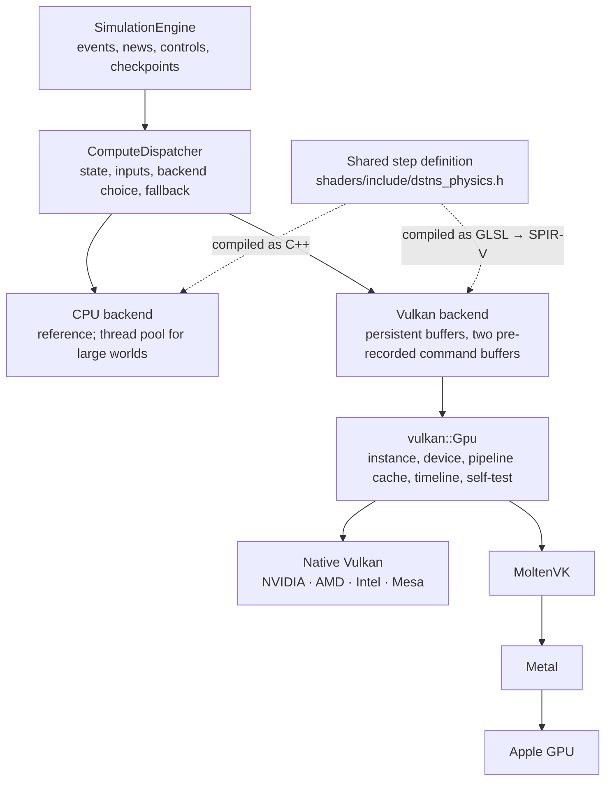

# Compute architecture

The physics step, the rain, flood, environment and traffic dynamics of every
junction and road each simulated second, runs on a *compute backend*. There
are two: the CPU, which is the reference, and Vulkan, which runs the same step
on a GPU from any vendor (on Apple hardware, through MoltenVK and Metal). The
engine does not know which one ran: both produce the same state, bit for bit.

This page explains how that is built and why it can be trusted. To use it, see
[GPU acceleration](../guide/gpu-acceleration.md); for the Vulkan module itself,
see the [Vulkan backend](../components/vulkan-backend.md) reference.

## The layers



| Layer | Why it exists |
|---|---|
| `SimulationEngine` | Owns what is irregular and branchy: the event heap, signal timing, demand couplings, news, operator controls, undo, checkpoints and seeks. It describes each step in model units (storms, surges, signal phases) and never calls Vulkan. |
| `ComputeDispatcher` | The engine's single point of contact. Owns the run's authoritative fixed-point state and the step's inputs, chooses the backend, moves state between backends at step boundaries, and recovers from a failed device. Serves the `GraphStore` its double-precision view. |
| CPU backend | The correctness reference, and the fastest choice for ordinary worlds. Splits worlds above 32,768 edges across a fixed thread pool. |
| Vulkan backend | The step on a GPU: per-world buffers created once, one submission and one host wait per simulated second. |
| `vulkan::Gpu` | One device, opened, verified by a self-test, with its pipeline cache. Shared by every Vulkan workload: the road network today, the structured-grid field solvers ([below](#beyond-the-road-network)) that future weather and water models build on. |
| `dstns_physics.h` | The step itself, written once. |

`GraphStore` keeps its role as the scenario's topology and the API's view of
dynamic state, but no longer owns that state: when a dispatcher is attached,
its `NodeDynamic`/`EdgeDynamic` vectors are a cache, refreshed from the
dispatcher the first time they are read after a change. Every reader of the
graph (snapshots, routing, the global view) is unchanged.

## One source for every backend

The step is defined once, in `shaders/include/dstns_physics.h`. That file is
compiled twice: as C++ for the CPU backend (wrapped in
`include/dstns/compute/physics.hpp`) and as GLSL for the Vulkan shaders, which
`#include` it unchanged. It is written in the intersection of the two
languages: integer types supplied by the includer, every literal wrapped in an
explicit constructor so no implicit conversion is relied on, value parameters
only, and no floating point at all.

So the GPU does not run a translation of the CPU's arithmetic that someone
keeps in step by hand. It runs *the same* arithmetic. The shader drivers that
call it (`node_step.comp`, `edge_step.comp`) only load words, loop over
storms and surges in the same order as the CPU, call the shared functions and
store words.

## Fixed point

GPU drivers may contract `a*b+c` into a fused multiply-add, reassociate sums,
flush denormals and implement `sin` differently. Floating-point results
therefore differ between vendors, drivers and compiler versions, and would
differ from the CPU. Integer arithmetic does not: addition, multiplication,
shifts and unsigned division are exact on every conformant implementation.
The step is therefore integer fixed point throughout.

Values are quantised once, on the CPU, when they enter the dispatcher
(`compute::to_q30` and friends), so every backend sees the same words.

| Quantity | Format | Range | Resolution | Out of range | Rounding |
|---|---|---|---|---|---|
| Rain, flood (nodes and edges) | Q30, unsigned | [0, 1] | 9.3 × 10⁻¹⁰ | clamped to [0, 1] | products floored |
| Multipliers: signal, rain, flood, incident | Q30, unsigned | [0, 1] | 9.3 × 10⁻¹⁰ | clamped on entry | nearest on entry, then floored |
| Operator speed and capacity multipliers | Q30, unsigned | [0, 2] | 9.3 × 10⁻¹⁰ | clamped on entry (the API already limits them) | nearest on entry |
| Congestion, observed congestion, occupancy | Q30, unsigned | [0, 1] | 9.3 × 10⁻¹⁰ | clamped | floored |
| Speeds (free, effective, mean) | Q16 m/s | [0, 65,536) | 1.5 × 10⁻⁵ m/s | clamped on entry | free speed truncated on entry, so a quantised speed never exceeds the road's |
| Vehicle load, queue capacity | Q16 vehicles | [0, 65,536) | 1.5 × 10⁻⁵ | clamped on entry | load rounded half up to a vehicle count |
| Demand flow | Q8 veh/h, signed | ±8.4 × 10⁶ | 0.004 veh/h | cannot overflow for capacities below 65,536 veh/h and surges up to 10× | floored |
| Base and effective capacity | Q8 veh/h | [0, 65,536) on entry | 0.004 veh/h | clamped on entry | nearest on entry |
| Place attraction | Q28, signed | (−8, 8) | 3.7 × 10⁻⁹ | clamped | nearest |
| Queue baseline coefficient (h) | Q24 | [0, 256) | 6 × 10⁻⁸ | clamped | nearest on entry |
| Surge factor | Q16 | [0, 65,536) | 1.5 × 10⁻⁵ | clamped | nearest |
| Positions, radii | 1/256 m, int32 | ±4,194 km | 3.9 mm | clamped | nearest |
| Day profile | Q30 | [0, 1] | 9.3 × 10⁻¹⁰ | clamped | nearest |

Thresholds are exact integer comparisons: a road is flood-affected when its
flood word exceeds 10,737,418 (0.01 · 2³⁰), closed by flood at
1,052,266,988 (0.98), and closed at an operator override when flood is at
least 1,020,054,733 (0.95). Model coefficients are the original decimal
constants rounded to the nearest Q30 or Q16 value.

Products of two fractions need 64 bits, so the shaders require
`shaderInt64`, which every desktop GPU, Apple GPU and Mesa's drivers provide.
Square roots (storm distance) use an exact bit-by-bit integer square root;
the Wendland kernel is a polynomial; storm and surge curves, which need `sin`
and `cos`, are evaluated on the CPU once per step and passed in as positions,
radii and strengths, so no transcendental function runs on a GPU.

The fixed-point step reproduces the previous double-precision model to about
10⁻⁷ (it is a change of representation, not of model) and costs no CPU time:
a simulated day runs as fast as before.

## One simulated second

```mermaid
sequenceDiagram
    participant E as SimulationEngine
    participant D as ComputeDispatcher
    participant G as GPU (Vulkan)
    E->>E: advance the event heap (signals, demand), news
    E->>D: signal phases, overrides, demand couplings, incidents
    E->>D: step(storms, surges, day profile, modules)
    D->>D: quantise parameters; journal the changed input words
    D->>G: write parameters and changed words to host-visible buffers
    D->>G: submit the pre-recorded command buffer (one submission)
    Note over G: scatter changed inputs → node pass → barrier →<br/>edge pass + workgroup reductions → barrier →<br/>copy 3 edge fields, partial sums, counters → signal timeline
    D->>G: wait for this step's timeline value
    G-->>D: rain, flood, flags per edge; partial sums; flood-event count
    D->>D: swap committed and candidate state
    D-->>E: flood-event count, congestion index
    E->>E: flood events and news in edge order
    E->>E: demand couplings read the edge conditions
    E->>E: commit (the graph's view is now stale)
```

On the CPU the same request runs the node and edge passes directly on the
dispatcher's host state, with no submission and no copies.

The host must wait every step: the next step's demand couplings depend on
this step's rain, flood and closures, and the engine's event and news logic
reads them. That dependency is the model's, not the backend's, and it is why a
small world is faster on the CPU (see [Performance](../deployment/performance.md)).

Snapshots, checkpoints and the API never see a partial step. A step runs
under the engine's lock, readers take the same lock, and the GPU writes only
the candidate state, which becomes the committed state only after the step
has completed and been read back.

## What moves, and when

| Direction | What | When | Size |
|---|---|---|---|
| CPU → GPU | Static tables (positions, susceptibility, road constants) | Once per world | 16 B per node, 56 B per edge |
| CPU → GPU | Step parameters | Every step | 64 B, plus 16 B per active storm or surge |
| CPU → GPU | Changed input words: signal phases, place attraction near modelled places, signal overrides, incident and operator controls | Every step, only words that changed | 8 B per changed word |
| CPU → GPU | The whole state | A new world, a restored checkpoint, a backend switch | 8 B per node, 68 B per edge |
| GPU → GPU | Committed and candidate state swap roles | Every step | none: the two buffers swap, nothing is copied |
| GPU → CPU | Rain, flood and flags of every edge; one partial sum per workgroup; counters | Every step | 12 B per edge |
| GPU → CPU | The whole state | Checkpoints (every 900 virtual seconds), a snapshot requested after a step, a seek, and at most every 300 steps for recovery | 8 B per node, 68 B per edge |

A seek replays hundreds of steps without moving the full state: only the
per-step 12 bytes per edge cross back, and the full state once, at the end.

## Why scheduling cannot change results

- **Every invocation writes only its own element.** A node invocation writes
  that node's two words; an edge invocation writes that edge's words. Edges
  read node results only after a barrier.
- **The candidate state is separate from the committed state.** No
  invocation reads a value another invocation of the same pass writes.
- **Reductions are integer.** The congestion index sums
  `weight × (congestion >> 14)` per workgroup in shared memory and finishes on
  the host; integer addition gives the same total in any order. The
  flood-event count is an integer atomic, whose final value is order-free. No
  floating-point atomic exists anywhere.
- **Loops run in a fixed order.** Storms are combined in schedule order, then
  manual order, on every backend; that order matters for rounding and is the
  same everywhere.
- **No random numbers are drawn on a device.** The step is a pure function of
  state and inputs. Every random quantity in DSTNS is a counter-based draw
  made on the CPU when the scenario is compiled.
- **The host never sends two updates to one word in a step**, so the scatter
  of changed inputs has no ordering to get wrong.

The backend is not an input to the simulation: no GPU property enters the
`scenario_hash`, `graph_hash`, `event_hash` or `run_id`, and none could change
the state.

## Choosing a backend

| `compute.backend` | Behaviour |
|---|---|
| `auto` (default) | The CPU below 40,000 nodes *and* 150,000 edges. Above either, if a GPU is healthy, both backends are timed on this world from its initial state (two warm-up and five timed steps each, medians compared) and the GPU is chosen only if it is at least 10% faster. |
| `cpu` | Always the CPU; Vulkan is not even initialised. |
| `vulkan` | Vulkan for every world, whatever its size. If it cannot run, the CPU with the reason logged, or, with `require_vulkan`, the server refuses to start. |

The thresholds are set below the break-even measured with
`dstns_benchmark compute` (about 50,000 nodes and 200,000 edges on an Apple
M4), so the measurement on the actual world decides near the crossover. Because
both backends compute the same state, choosing at run time costs nothing in
reproducibility.

A device is *available* only after it has run a self-test: buffers allocated,
every pipeline created, a kernel dispatched, and the result read back and
checked, including 64-bit integer arithmetic through the shared definitions.

## When something fails

| What happens | Effect |
|---|---|
| No Vulkan loader, no device, no driver | Detected at start-up; the CPU backend runs. System information gives the reason. |
| MoltenVK missing on macOS | No Apple device is enumerated; the CPU runs. `./launcher bootstrap` installs it. |
| A device without Vulkan 1.2, 64-bit shader integers or timeline semaphores | Reported as unusable with the missing feature; another device or the CPU is used. |
| Only a software implementation (llvmpipe, SwiftShader) | Not used unless allowed or named explicitly: it is slower than the CPU backend. |
| The world does not fit the device (storage-buffer limit, allocation limit, or more than half the memory budget) | Checked before allocating; this world runs on the CPU and the device stays available for later worlds. |
| Allocation fails anyway | The same: the world runs on the CPU. |
| A shader module or pipeline cannot be created | Vulkan is unavailable for the process; the CPU runs. |
| A submission fails | The committed state is intact: the dispatcher reads it back, recomputes the step on the CPU and continues there. |
| The device is lost, or a step exceeds the timeout (10 s) | The device's memory is gone. The dispatcher rebuilds the state on the CPU from its last complete host copy and its journal of every step's inputs since, recomputes the failed step, and continues. The result is exactly the state the device would have produced. |
| Verification mode finds a mismatch | The CPU's answer is kept and Vulkan is retired for the process. |
| A registered validation layer fails to load | The instance is created without it and a warning logged. |

A failed device is torn down and never retried every second: it is marked
`failed` until the process restarts. If even the journal cannot rebuild the
state (it is always available in practice), the engine restores its latest
checkpoint and replays on the CPU; a request that arrives meanwhile is
answered `503 COMPUTE_RECOVERING`.

The recovery is exact because of determinism, and it covers operator
actions: the journal records the actual words each step used, so a road
closed between the last copy and the failure is replayed at the moment it
was closed.

## Checkpoints, seeks and switching

A checkpoint stores the complete fixed-point state (and the event runtime,
news position and congestion history, as before). Restoring one and replaying
reaches exactly the state of continuous execution on either backend; the
tests check this on Vulkan across many checkpoints.

Operator controls (edge overrides, signal overrides) are dispatcher inputs,
kept outside the checkpointed state, so a backward seek keeps them standing,
as it always has.

The run can move between backends at any step boundary
(`select_compute_backend`): moving to the CPU downloads the state; moving to
a GPU uploads it. The tests switch back and forth mid-run and compare with a
CPU-only run.

## Beyond the road network

Future spatial models, such as standing water on a terrain model, rain fields,
and the wind and pressure of an atmospheric model, are fields on a uniform
grid, advanced many steps at a time. They are a better fit for a GPU than the
road step, because they need not return to the host between iterations.

The compute layer is built for them. `vulkan::Gpu` provides an opened,
verified device to any workload; a workload adds its own pipelines and
buffers. The first such workload is in place: `shaders/include/dstns_fields.h`
defines an integer diffusion step once for the CPU and the GPU,
`compute::diffuse` is the reference, and the Vulkan `FieldSolver` keeps a field
on the device and records any number of iterations into one submission. Its
equivalence suite holds it to the same bit-for-bit standard. Batched this
way, 300 iterations on a 512 × 512 grid take 20 ms on an Apple M4 against
110 ms on the CPU.

The second is the [surface-water model](surface-water.md): seven shaders from
`shaders/include/dstns_hydrology.h`, one submission per 5 s step, the fields
resident on the device, the host reading per-row tallies and per-road
summaries. It is bit-identical to its CPU reference, so a run may change
backend, and recover from a lost device, without changing a result.

### Which environmental work runs where

| System | CPU | GPU |
|---|---|---|
| DEM | Tile fetch, decode, resampling, smoothing, gradient (once per world, milliseconds) | — (too small to repay a submission) |
| DCM | Solar geometry, cloud field, surface energy balance (every 60 s, ~12k cells) | — (as above) |
| DWS surface water | Source preparation (rain with carry, evaporation potentials), ledger totals, Froude diagnostics, the reference solver below the threshold | The local-inertial step from 131,072 cells (or when Vulkan is preferred); per-row tallies; per-road summaries |
| DDS drainage | Inlet exchange and pipe routing (every 5 s, about 1,200 pipes) | — (a sparse graph; the exchange with the street is exact on either backend) |
| DAS wind | Canopy, lattice Boltzmann solve (on the hour, 0.15 to 0.4 s on eight threads for 23k cells), per-minute scaling and road headwinds | — (not yet ported; the cell-local update would suit it) |
| Road state | Vehicle dynamics, per-edge environment inputs | Read by the traffic step on whichever backend runs it |
| Traffic | The step below its thresholds | The step above them |

## The observer is separate

The observer's rendering is independent of the simulator's compute backend.
It remains React drawing on a Canvas over HTTP, whichever backend runs the
physics, and reads the same API. Its telemetry deck can show which backend
is running, purely as information. Rendering the map with WebGPU, if
profiling ever shows the Canvas to be the bottleneck, would be a separate
browser-side project with Canvas as its fallback. The server never renders
images.
