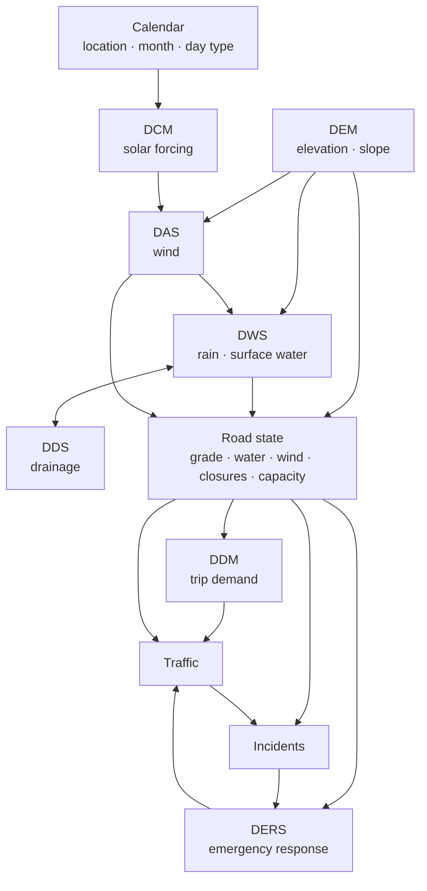

# The coupled city

DSTNS began as a traffic simulator with a weather effect and scheduled
incidents. It is becoming one deterministic synthetic city, in which terrain,
the Sun, air, water, drains, demand and emergency services exchange state
through a single clock, so that what the operator sees *emerges* from simulated
causes instead of being scripted:

> Rain → surface water → lower road usability → slower, rerouted traffic,
> not "rain → speed × 0.8".

This page is the map of that system: which modules exist, what each owns, what
flows between them, and in what order they run. Each module has its own page
with its mathematics.

## Modules

| Module | Owns | Reads | Status | Page |
|---|---|---|---|---|
| **Calendar** | Location, month, day type of the run | The seed | Implemented | [Seeds and places](../guide/seeds-and-places.md) |
| **DEM** | Elevation, gradient, slope; road grade | Road network, terrain tiles | Implemented | [Terrain](terrain.md) |
| **DCM** | Solar position and irradiance, surface temperature | Calendar, location, clock, terrain, cloud | Implemented | [Sun and surface](solar.md) |
| **DWS** | Rainfall field, surface water depth and discharge, the water ledger | Storm schedule, terrain, surface temperature, green space | Implemented (CPU and Vulkan) | [Surface water](surface-water.md) |
| **DDS** | Drain inlets, pipes, outfalls; flow and surcharge | Surface water, terrain | Planned | |
| **DAS** | Near-surface wind field | Terrain, buildings, solar heating, background weather | Planned | |
| **Vehicle dynamics** | Speed and power on grade and in water; road state | Road grade, water depth | Implemented (wind to come) | [Vehicle dynamics](vehicle-dynamics.md) |
| **DDM** | Trip demand between zones, rerouting | Places, calendar, road state | Planned (place-driven demand in place) | [Demand and places](demand.md) |
| **DERS** | Emergency units, dispatch, transport | Incidents, road state, facilities | Planned | |
| **Causal incidents** | Incidents caused by city state, and their consequences | Road state, weather, traffic | Planned (scheduled incidents in place) | [Incidents](incidents.md) |

## Data flow

The modules exchange **derived state**, never recompute each other's: the DEM
computes elevation once and everything else samples it; the hydrology computes
water depth and the road state reads it.

## Shared state

The authoritative state lives where it already lived, extended rather than
replaced:

| State | Owner | Lifetime |
|---|---|---|
| Scenario: graph, places, calendar, terrain, schedules | `Scenario` (compiled once) | Immutable for the run; copies share the terrain |
| Traffic and road physics | `ComputeDispatcher` fixed-point state | Per step; checkpointed |
| Signals, demand couplings, event history | `EventRuntime` | Per step; checkpointed |
| Environmental fields: solar forcing, surface temperature (and later water, drainage, wind) | `EnvironmentRuntime` | Per module cadence; the whole state copied into each checkpoint |

## Scheduling

Each second of virtual time the engine runs, in order:

1. advance the clock, evaluate storms, surges, signals and demand couplings;
2. **environment**: each module whose instant has come (DCM every 60 s, surface
   water every 5 s in CFL substeps);
3. **road state**: every directed road's grade and water become the traffic
   step's environment inputs;
4. **traffic**: the physics step on the compute backend;
5. flood and weather events, incidents, the congestion index, demand recoupling.

Every module cadence divides the 900 s checkpoint interval, so replay from any
checkpoint meets the same update instants. State a module produces at time
\( t \) is read by the others from the next step on, never recursively within
one instant, so feedback loops (traffic → incidents → traffic) cannot oscillate
inside a step.

All environmental fields live on one **environment grid** (see
[Terrain](terrain.md#the-environment-grid)), so one module's output is another's
input without resampling.

## Determinism

Every module draws randomness only from its own derived stream
(`seed.derive("<module>")`, with its own `RngDomain`), so adding a module, or
draws to one, never shifts another. A golden test pins values recorded before
the new modules existed. Three levels of reproducibility are distinguished
throughout these pages:

| Level | Meaning | Holds for |
|---|---|---|
| **Logical replay** | Same inputs, same build, same machine: identical results | Every module |
| **Bitwise across backends** | The CPU and every GPU produce the same bits | The traffic step and every integer field kernel |
| **Across machines** | Same results on another CPU architecture | Integer state everywhere; terrain resampling up to centimetre rounding (see [Terrain](terrain.md#determinism)) |

## Degradation

No external dataset can stop a run unless the configuration requires it. A
missing DEM gives flat terrain, marked **degraded** in the provenance, the
manifest, the notifications and the report. Imported, estimated, synthetic and
assumed data are labelled as such wherever they appear.
