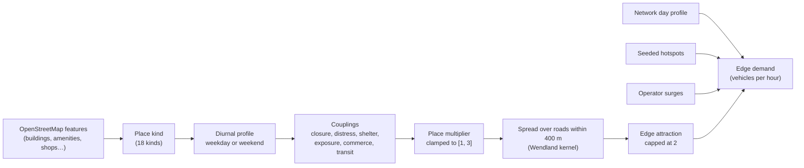

# Demand and places

Where traffic comes from in DSTNS: the places on the map, the daily rhythm of each kind
of place, how places respond to what is happening around them, and how all of that
becomes a demand figure on every road. The equations are in the
[Mathematical model](mathematical-model.md#demand); the source files are described in
[Buildings and places](../components/buildings.md).

## Overview



Demand is computed for every directed road segment every virtual second. It drives
the target queue on each road, and through it speed, congestion and everything the
observer colours.

## Places

A **place** is any mapped feature that can attract traffic: a school, an office, a
shop, a hospital, a park, a bus stop. DSTNS reads them from OpenStreetMap ways and
nodes tagged `building`, `amenity`, `shop`, `office`, `leisure`, `landuse`, `railway`
or `public_transport`, and anchors each one to its nearest road node.

Each place is classified into one of 18 **kinds**:

| Kind | Modelled | Trip generator | Commercial |
|---|---|---|---|
| School, university, office, industrial, transport, hospital | Yes | Yes | No |
| Retail, mall | Yes | Yes | Yes |
| Food | Yes | No | Yes |
| Pharmacy, hotel, culture, park, bus stop, parking | Yes | No | No |
| Residential, worship, other | No | No | No |

- **Modelled** kinds have a demand profile. Unmodelled kinds stay at a multiplier of
  1.0 all day and are hidden from the observer's legend by default.
- **Trip generators** are what bus-stop demand follows.
- **Commercial** places are what parking demand follows.

`GET /api/v1/view/place-kinds` returns the exact flags and the count of each kind in
the current world.

## Daily profiles

Each modelled kind has a **diurnal profile**: a baseline plus one or more smooth
peaks at the times that kind of place is busy. A school peaks at 08:00 and 15:15 on
weekdays and is flat at weekends; an office peaks at 08:45, 12:30 and 17:45; food
outlets peak at lunch and dinner and are busier at weekends; parks peak in the
afternoon and more so at weekends. The full table of peak times, widths and heights
is in the [Mathematical model](mathematical-model.md#place-profiles).

The **day type** (`--day-type weekday|weekend`) chooses which set of profiles
applies for the whole run.

## Couplings: places respond to the network

A profile describes an ordinary day. **Couplings** describe how a place responds to
what is happening around it right now. Each is a factor; the factors multiply, and
the product with the profile is clamped to \([1, 3]\).

| Coupling | Applies to | Rises when |
|---|---|---|
| Closure | Every modelled place | Roads near the place are blocked, so traffic concentrates on what remains |
| Distress | Pharmacy, hospital | Incidents or flooding occur nearby |
| Shelter | Retail, mall, food, transport, bus stop, culture | It rains, and people move indoors |
| Exposure | Park | It rains; this factor *falls*, to as little as 0.2 |
| Commerce | Parking | Nearby commercial places are busy |
| Transit | Bus stop | Nearby trip generators are busy |

"Nearby" means within 400 m, considering at most the 24 strongest neighbours so the
cost per second stays bounded in dense centres. Every factor other than 1 is reported
with the place, so any multiplier can be explained:

```bash
curl -s 'localhost:8090/api/v1/view/places?kind=school&limit=3' | python3 -m json.tool
```

```json
{ "feature_id": "way/4021187", "kind": "school", "multiplier": 1.92,
  "baseline": 1.85, "radius_m": 400, "active": true,
  "factors": [ { "cause": "closure", "multiplier": 1.04 } ] }
```

## From places to roads

A place's **excess demand**, its multiplier minus 1, is spread over the roads around
it with the Wendland kernel of radius 400 m, so a road next to a school receives
most of the school's effect and a road 400 m away receives none. Contributions are
redistributed onto roads that are still open and reachable, and summed per road,
capped at 2. The result is the road's **attraction**.

Three more terms complete a road's demand:

| Term | Meaning |
|---|---|
| Network day profile | A smooth curve over the whole day, lowest overnight and highest in the late afternoon, applied to every road |
| Hotspot susceptibility | A seeded subset of central roads (one per 80 roads, between 1 and 24) is permanently more attractive, between 0.5 and 1.0 |
| Surge | An operator-placed demand pulse that rises and falls over its life; its radius varies between 35% and 100% of the nominal value |

The demand on road \(e\) is its base capacity times
\(0.18 + 0.68 \times \text{day profile} + 0.60 \times \text{attraction} + 0.35 \times \text{hotspot}\),
times the strongest surge covering it. Roads whose direction is forbidden by a one-way
restriction carry nothing.

## Scheduled demand events

Significant places also produce **demand events** in the event queue, so changes are
visible ahead of time:

| Place | Windows | Label |
|---|---|---|
| School | 07:45 to 09:15 and 14:30 to 16:00, weekdays only | School arrival / departure |
| Office | 08:15 to 10:00 and 17:00 to 19:30, weekdays only | Office commute |
| Mall | 12:00 to 14:00 and 18:00 to 21:30 | Retail peak |
| Other commercial places | 11:00 to 20:00 | Commercial demand |
| Hospital | All day, at a constant 1.15 | Hospital baseline demand |

Real institutions do not all open on the same minute, so each place's windows are
shifted by up to 20 minutes either way and stretched to between 80% and 120% of their
length. Each place's peak height is drawn between 1.4 and 1.9, plus 0.15 at weekends.
All three are derived from the place's own identity, so they belong to the scenario
and are identical on every run of it. Demand changes are evaluated every 300 virtual
seconds (`demand_bin_virtual_s`).

In the observer, a place whose demand is active turns red on the map, and important
changes appear in **News** and as notifications in the `demand` category.

## Modules

| Module off | Effect |
|---|---|
| `buildings` | Places exert no demand and report a multiplier of 1.0 |
| `traffic` | No base or hotspot demand: roads stay empty apart from surges |

## Determinism

Place classification depends only on the map. Profiles are fixed tables. Peak heights
and hotspots are drawn from the seed through their own sub-seeds, so a change to one
subsystem never shifts another's random choices. See
[Deterministic seeding](deterministic-seeding.md).

## Related

- [Mathematical model: demand](mathematical-model.md#demand): every equation and constant
- [Buildings and places](../components/buildings.md): source files and data structures
- [Events](events.md): how demand changes are scheduled
- [View API: places](../api/view-api.md): reading place state
