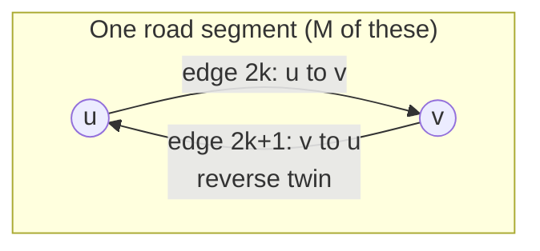

# Graph model

The road network is a directed graph. This page defines its nodes and edges, the
invariants that always hold, how static geometry is separated from dynamic state,
and how to verify the invariants against a running server. The code is
`GraphStore` and `RoutePlanner` in `include/dstns/graph.hpp` and `src/graph.cpp`,
with the data types in `include/dstns/model.hpp`.

## Definition

\[
G = (V, E), \qquad V = \{0, \dots, N-1\}, \qquad E = \{0, \dots, 2M-1\}
\]

where \( N \) is the number of junctions and \( M \) the number of **road
segments** (a stretch of road between two consecutive nodes of an OpenStreetMap
way). Every segment yields **two directed edges**, one in each direction, so
\( |E| = 2M \).



Identifiers are **dense**: node IDs are \( 0 \dots N-1 \) and edge IDs
\( 0 \dots 2M-1 \), so any lookup is an array index, \( O(1) \), and the whole
state is a handful of contiguous vectors. How the numbers are assigned is covered in
[DRNCP](../components/drncp.md).

## Static data

Static data never changes during a run. It lives in the compiled `Scenario`.

### Nodes

```cpp
struct NodeStatic {
    NodeId id;  std::int64_t osm_node_id;  Point position;   // position in lat/lon and metres
    std::uint16_t degree;                                    // road segments meeting here
    bool bus_stop, signal;
    std::optional<BuildingType> building;
    double building_impact, building_radius_m;               // node-level demand (see Places)
    double flood_susceptibility, drainage;                   // seeded, in (0.2, 0.95) and (0.2, 0.9)
    std::uint16_t signal_cycle_s, signal_offset_s, signal_green_s;
    std::vector<TimeWindow> tmax;                            // activity windows
};
```

`flood_susceptibility` \( s_v \) and `drainage` \( \delta_v \) are drawn per node from the
seed (\( s_v = 0.2 + 0.75u_1 \), \( \delta_v = 0.2 + 0.70u_2 \) for uniform
\( u_1, u_2 \)) and feed the [flood integrator](mathematical-model.md#flooding).

### Edges

```cpp
struct EdgeStatic {
    EdgeId id;  NodeId from, to;  EdgeId reverse_twin;
    std::int64_t osm_way_id;  std::uint32_t segment_index;
    RoadClass road_class;                 // motorway ... service
    bool source_oneway, synthetic_reverse;
    std::uint16_t lanes;
    double length_m, free_speed_mps, base_capacity_vph;
    double hotspot_susceptibility, flood_susceptibility;
    std::vector<Point> geometry;  std::string name;  std::map<std::string, std::string> tags;
};
```

The edge length is the straight-line distance between its endpoints in projected
metres:

\[
L_e = \sqrt{(x_v - x_u)^2 + (y_v - y_u)^2}
\]

Free speed and capacity come from the road class; see
[OSM map generation](osm-map-generation.md#which-ways-are-roads) for the table.

### Directionality

A one-way road has a legal direction and a **synthetic reverse**, kept so the graph
stays drawable and indexable but marked and excluded everywhere that matters:

```cpp
[[nodiscard]] constexpr bool is_source_direction_allowed(const EdgeStatic& edge) noexcept {
    return !edge.synthetic_reverse;
}
```

A synthetic reverse carries no demand, capacity or speed, is never routed through,
and is omitted from the SUMO export. Counting only legal edges, \( |E_{\text{legal}}|
= |E| - |E_{\text{synthetic}}| \).

## Dynamic data

Dynamic state is rewritten every virtual second and stored in two parallel arrays,
one entry per node and per edge, so the physics loop is a linear sweep.

```cpp
struct NodeDynamic { double rainfall, flood, building_effect;  std::uint64_t state_revision; };
// 32 bytes

struct EdgeDynamic {
    double demand_vph, effective_capacity_vph, effective_speed_mps;
    double rainfall, flood, congestion_model, congestion_observed, congestion;
    double signal_multiplier, rain_speed_multiplier, flood_speed_multiplier;
    double rain_capacity_multiplier, flood_capacity_multiplier;
    double manual_speed_multiplier, manual_capacity_multiplier;
    double incident_speed_multiplier, incident_capacity_multiplier;
    std::uint32_t vehicle_count, halting_count;  double vehicle_load, mean_speed_mps, occupancy;
    bool manual_closed, incident_closed, closed;  std::uint64_t state_revision;
};
// 184 bytes
```

The separate multiplier channels (signal, rain, flood, operator, incident) are
deliberately kept distinct and multiplied only at use, so an operator override can
be undone without disturbing weather, and an incident ending leaves the others
intact.

`commit()` increments a global `state_revision` after every physics step and stamps
it on every record, so a client can tell whether a record changed.

## Invariants

These hold for every graph DSTNS builds. The property and unit tests
(`dstns_prop_tests`, `dstns_tests`) assert index validity and twin reciprocity,
and the script below checks all of them on a live graph.

| Invariant | Statement | Why it matters |
|---|---|---|
| Dense IDs | Node IDs \( 0 \dots N-1 \), edge IDs \( 0 \dots 2M-1 \) | Array indexing |
| Twin reciprocity | `edges[edges[i].reverse_twin].reverse_twin == i` | Every edge has exactly one opposite |
| Twins are opposite | `edges[i].from == edges[edges[i].reverse_twin].to` | |
| Handshake | \( \sum_{v} \deg(v) = |E| \) | Each segment adds 1 to two nodes' degree and creates 2 edges |
| Length | \( L_e \) equals the endpoint distance | Consistent scale |
| Direction | Synthetic reverses are never routed, loaded or exported | One-way restrictions hold |

The handshake identity is the graph-theory lemma restated for this model: each of
the \( M \) segments contributes 1 to the degree of each of its two endpoints, so
\( \sum_v \deg(v) = 2M = |E| \).

### Checking them on a live graph

```python
import json, math, urllib.request

d = json.load(urllib.request.urlopen("http://127.0.0.1:8090/api/v1/view/topology"))["data"]
nodes, edges = d["nodes"], d["edges"]

assert sum(n["degree"] for n in nodes) == len(edges)                       # handshake
assert all(edges[edges[i]["reverse_twin"]]["reverse_twin"] == i            # reciprocity
           for i in range(len(edges)))
assert all(edges[i]["from"] == edges[edges[i]["reverse_twin"]]["to"]       # twins are opposite
           for i in range(len(edges)))

for e in edges:                                                            # length is the endpoint distance
    a, b = nodes[e["from"]]["position"], nodes[e["to"]]["position"]
    assert abs(math.hypot(a["x_m"] - b["x_m"], a["y_m"] - b["y_m"]) - e["length_m"]) < 1e-6

print(f"{len(nodes)} nodes, {len(edges)} edges, "
      f"{sum(e['synthetic_reverse'] for e in edges)} synthetic reverses: all invariants hold")
```

On the bundled district this prints `1196 nodes, 2554 edges, 502 synthetic reverses`.
Each assertion corresponds to one row of the table above; the first line is the
handshake lemma, and a violation of any of them means the loader or compiler has a
bug.

## Sizes

| Quantity | Formula | Bundled district | Dar es Salaam district |
|---|---|---|---|
| Nodes \( N \) | | 1,196 | 3,000 |
| Directed edges \( \lvert E \rvert = 2M \) | | 2,554 | 6,174 |
| Road length | \( \tfrac12 \sum_e L_e \) | 34.1 km | |
| Dynamic state | \( 32N + 184\lvert E \rvert \) bytes | 0.49 MiB | 1.17 MiB |

The dynamic state is what a checkpoint copies; see [Performance](../deployment/performance.md#memory)
for what that costs over a day.

## Related

- [OSM map generation](osm-map-generation.md): how the graph is built from a file.
- [Routing](routing.md): shortest paths over it.
- [Simulation engine](simulation-engine.md): how the dynamic arrays are rewritten each second.
