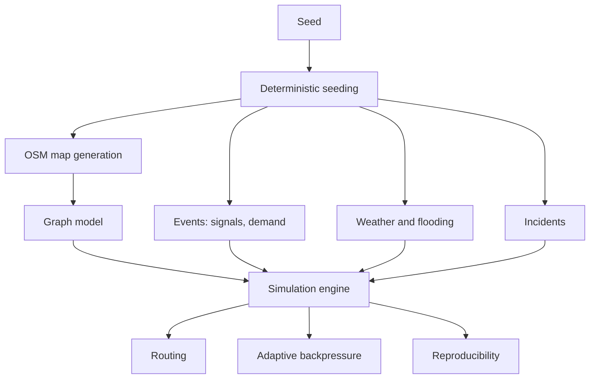

# Concepts

How DSTNS works inside. Read [Architecture](architecture.md) first; the other
pages each take one part of it in depth.

| Page | Question it answers |
|---|---|
| [Architecture](architecture.md) | What are the parts, threads and data flows? |
| [Simulation engine](simulation-engine.md) | What happens every virtual second, and how do seeking and undo work? |
| [Mathematical model](mathematical-model.md) | What are the formulas? |
| [Graph model](graph-model.md) | What is a node, an edge, a place? |
| [OSM map generation](osm-map-generation.md) | How does a seed become a road network? |
| [Deterministic seeding](deterministic-seeding.md) | How does one number drive every random choice independently? |
| [Events](events.md) | How are signal changes, demand and storms scheduled and executed? |
| [Weather and flooding](weather.md) | How do storms move and roads flood? |
| [Incidents](incidents.md) | How are accidents and closures planned and applied? |
| [Routing](routing.md) | How are shortest paths found? |
| [Adaptive backpressure](backpressure.md) | How does the simulation slow down for a slow browser? |
| [Reproducibility](reproducibility.md) | What exactly is guaranteed to repeat, and how is it checked? |
