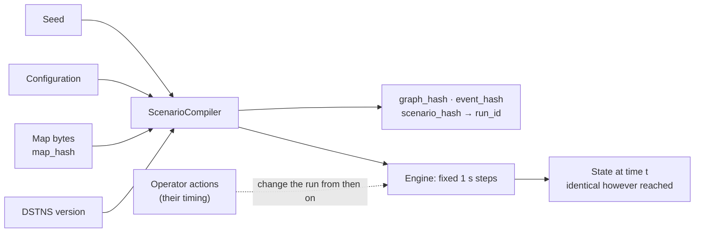

# Reproducibility

DSTNS is built so that a run can be repeated exactly: same world, same events,
same numbers, on any machine. This page states precisely what is guaranteed,
what it depends on, what can break it, and how it is tested.

## The guarantee

Given the same

1. **seed** (128-bit),
2. **resolved configuration** (day type, duration, modules, weather frequency,
   map limits, map selection version),
3. **map bytes** (the OSM extract, byte for byte), and
4. **DSTNS version**,

the compiled scenario is identical (same `graph_hash`, `event_hash` and
`scenario_hash`, so the same `run_id`) and the dynamic state at any virtual
time is identical, however that time was reached.



## What does not affect results

| Thing | Why not |
|---|---|
| Speed (tick rate) and playback duration's pacing | Physics always advances in 1-second steps; speed changes how fast steps are taken, not what they compute |
| Seeking vs playing | A seek restores a checkpoint and replays the same steps |
| The observer, its layers and preferences | It only reads |
| Adaptive backpressure | It governs pacing only |
| SUMO | A separate batch export; never writes back |
| Wall-clock time, thread scheduling, machine | No random draw depends on time, addresses or iteration order |

!!! note "Playback duration"
    `playback_duration_seconds` is part of the configuration because it fixes
    how storms are spaced in playback time. Two runs with different durations
    can therefore have different weather. Speed does not.

## What does

| Thing | Effect |
|---|---|
| Operator actions | Edge overrides, signal toggles, manual rain, surges, day and module changes all change the run from the virtual second they are applied. Undo restores the control's value from then on; it does not rewind its effects |
| A different map file | Even a byte-level change gives a new `map_hash` and `scenario_hash`, though the district may look identical |
| A DSTNS version that fixes a modelling or parsing bug | Results change for the affected maps; the [changelog](../changelog.md) says which |

## How determinism is achieved

- **Sub-seeds per subsystem.** The master seed derives one seed per subsystem
  (`map.city`, `map.anchor`, `map`, `signals`, weather, incidents, demand, …)
  with SHA-256 and a fixed label. A change to how one subsystem draws numbers
  never shifts another's. See [Deterministic seeding](deterministic-seeding.md).
- **Counter-based random numbers.** Each draw is a pure function of a sub-seed
  and an index tuple, such as (storm 2, intensity). Nothing depends on how many
  numbers were drawn before.
- **Canonical numbering.** Nodes are numbered by OSM ID, edges by way ID and
  segment, places by ID, so containers iterate in the same order everywhere.
- **Deterministic tie-breaking.** Shortest paths, junction snapping, stop
  thinning and the event heap break ties by ID or sequence number.
- **Integer route costs.** A* uses integer milliseconds, so floating-point
  summation order cannot change a route.
- **Fixed steps and checkpoints.** One-second physics, and checkpoints that
  capture the complete dynamic state including the event runtime.

## The hashes

| Hash | Covers | Reported in |
|---|---|---|
| `map_hash` | SHA-256 of the complete input bytes | `/view/manifest` |
| `graph_hash` | The canonical graph | `/view/manifest`, topology |
| `event_hash` | The scheduled weather and incidents | `/view/manifest` |
| `scenario_hash` | All of the above and the configuration | `/view/manifest`; its first 12 hex digits form `run_id` |

```bash
curl -s localhost:8090/api/v1/view/manifest | python3 -m json.tool
```

Two runs with equal `scenario_hash` are the same scenario.

## Checking it yourself

```bash
./build/dstns_replay_verify 382923
```

```text
Replay Verification Tool
Seed: 0x0000000000000000000000000005d7cb
PASS [grid]: graph, scenario, event, and full runtime snapshot matched.
PASS [osm]: graph, scenario, event, and full runtime snapshot matched.
Deterministic compile and runtime replay verified successfully.
```

It compiles the seed twice on a synthetic grid and on the bundled real
district, runs two independent engines to 03:25:45 (12,345 s), and compares
every hash and the complete snapshot.

Across machines, compare manifests:

```bash
curl -s localhost:8090/api/v1/view/manifest | python3 -c \
  'import json,sys; d=json.load(sys.stdin)["data"]; print(d["scenario_hash"])'
```

## How it is tested

| Test | Checks |
|---|---|
| `dstns_replay_reproducibility` | Two compilations and two engines agree on hashes and full snapshots (grid and OSM) |
| `dstns_world_and_stepping` | Seeking and stepping to the same time give identical state |
| `dstns_unit_tests` | Sub-seed avalanche (a one-bit seed change flips at least 40 output bits) and domain separation |
| `dstns_modernization` | Clock-speed invariance: results do not depend on the tick rate |
| `dstns_map_sourcing` | A seed always resolves to the same city, anchor and cache file |

## Floating-point caveat

Results are reproducible across runs and machines built with the same
compiler and flags. Different compilers or architectures can, in principle,
round transcendental functions (`sin`, `exp`) differently in the last bit. The
tests assert equality on the platforms CI runs; if you compare results across
very different toolchains, compare hashes of the compiled scenario first.
