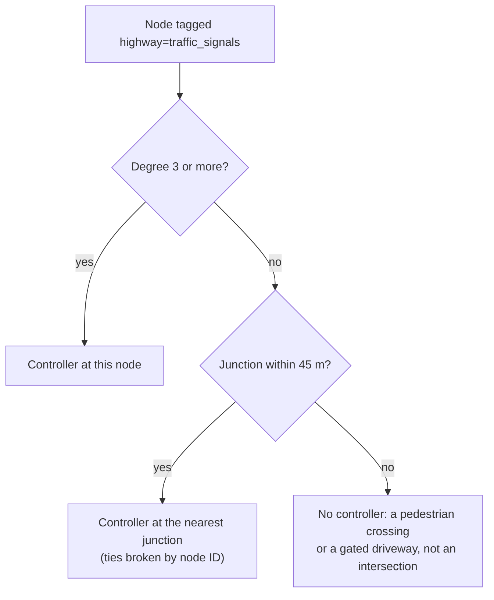

# Traffic signals

How DSTNS decides where signal controllers stand, how each one is timed, how
neighbouring signals are coordinated into green waves, and how a signal's state
changes the traffic on the roads that approach it. The implementation notes for the
same subsystem are in [Signals (component)](../components/signals.md).

## Summary

| Aspect | Behaviour |
|---|---|
| Placement | Every `highway=traffic_signals` tag snapped to the junction it governs |
| Approach groups | Two: mainly north-south (group A) and mainly east-west (group B) |
| Plan | Six fixed phases: A green, A amber (3 s), all-red (1 s), B green, B amber (3 s), all-red (1 s) |
| Cycle | 50 to 120 s, from junction size, arriving capacity and a seeded variation |
| Green split | In proportion to the capacity arriving on each group, at least 12 s each |
| Coordination | Offsets from travel time to the centre of the signalised area at 50 km/h |
| Effect | Speed and capacity on an approach multiplied by 1.0 on green, 0.4 on amber, 0.08 on red |
| Operator control | Force one group green; undo returns the junction to its plan |

## Where controllers go

OpenStreetMap does not usually tag the junction itself. It tags
`highway=traffic_signals` on the **stop-line node of one approach**, a few metres back
from the intersection. In the road graph that node has degree 2: it lies in the middle
of a road, not where roads meet.

Taking the tags literally would scatter controllers along straight roads. Requiring
the tagged node itself to be a junction would delete almost all of them: in one
Berlin district, all 49 tagged nodes had degree 2. DSTNS therefore **snaps** each
tagged node to the nearest junction (degree 3 or more) within 45 metres. Several
approaches to one intersection collapse onto the single controller that governs it.
In that Berlin district, 49 stop lines became 30 controllers, all at junctions of
degree 3 to 5 and none in the middle of a block.



A tagged node with no junction nearby is a pedestrian crossing or a gate. Those are
real, but they are not intersections, and DSTNS does not model them as signals.

## Approach groups

Every road entering a controlled junction belongs to one of two groups, decided by
its direction of travel:

- **Group A** if its north-south displacement is at least its east-west displacement;
- **Group B** otherwise.

Opposing approaches share a group and therefore a green, which is how most
two-phase intersections are operated.

## Timing

For a controller at node \(v\) with degree \(d_v\), capacity arriving on group A and
group B of \(C_A\) and \(C_B\) vehicles per hour, and a seeded uniform value
\(u \in (0, 1)\):

\[
\text{cycle}_v = \operatorname{clamp}\!\Big(45 + 4 d_v + \frac{C_A + C_B}{1200} + 20u,\; 50,\; 120\Big)\ \text{s}
\]

\[
\text{green}_A = \operatorname{clamp}\!\Big((\text{cycle}_v - 8)\,\frac{C_A}{C_A + C_B},\; 12,\; \text{cycle}_v - 20\Big),
\qquad
\text{green}_B = \text{cycle}_v - 8 - \text{green}_A
\]

The constant 8 is the two amber periods and the two all-red periods. Larger and
busier junctions get longer cycles; the busier direction gets the longer green. The
plan always sums exactly to the cycle, and it does not change during a run.

!!! note "A capacity proxy, not a demand measurement"
    Green splits follow the *capacity* of the roads arriving at the junction, which
    the map provides, rather than the turning counts a traffic engineer would
    measure. This keeps plans deterministic and explainable from the map alone.

## Green waves

If every controller started its cycle at a random time, neighbouring signals would
change independently and the map would flicker. Real corridors are timed so that a
platoon released at one junction reaches the next on green. DSTNS approximates this
with an **offset** for each controller equal to the travel time, at a nominal
13.9 m/s (50 km/h), from the centroid of all controllers, wrapped into its cycle:

\[
\text{offset}_v = \frac{\lVert p_v - \bar p \rVert}{13.9} \bmod \text{cycle}_v
\]

Neighbouring junctions therefore differ by about the time it takes to drive between
them, and signals along a road leading away from the centre turn green in sequence.

## At run time

The [event runtime](events.md) keeps exactly one pending transition per controller
in a min-heap ordered by `(virtual second, sequence)`. When a transition executes,
the controller's next one is inserted. This costs \(O(\log n)\) per transition, and a
network of 10,000 controllers is part of the test suite. Signal correctness does not
depend on how often anything polls or renders.

At 00:00:00 each controller starts part-way through its cycle, at the phase its
offset places it in (worked through in
[Events: initial phase from the offset](events.md#initial-phase-from-the-offset)).
Checkpoints store every controller's state, so seeking backwards restores the
signals exactly and replays them forward with the rest of the physics.

## Effect on traffic

Each approach carries a `signal_multiplier` that scales both its target speed and its
effective capacity:

| Phase of the approach's group | Multiplier |
|---|---|
| Green | 1.0 |
| Amber | 0.4 |
| Red, including all-red | 0.08 |

A low multiplier also raises the target queue on the approach and the share of its
vehicles counted as halting. The full equations are in the
[Mathematical model](mathematical-model.md#speed-and-capacity). With the `signals`
module switched off, every multiplier is 1.0.

## Operator overrides

`POST /api/v1/control/signals/{node}` forces group A (phase 1) or group B (phase 2)
green at one junction: the forced group gets multiplier 1.0 and the other 0.08, until
the override is undone. Undo returns the junction to its plan, and overrides survive
seeking. Overrides are part of the run's history; see
[Known limitations](../limitations.md#operator-edits-are-not-part-of-the-replay-journal).

## Observing signals

```bash
curl -s localhost:8090/api/v1/view/signals | python3 -m json.tool | head -30
```

Each controller reports its cycle, the six phase durations, the current phase and
its name, both groups' colours, when the phase started and when it next changes, and
whether it is overridden. Topology nodes also carry `signal`, `signal_cycle_s`,
`signal_offset_s` and `signal_green_s`. In the observer, the **Signals** layer
draws each controller's current phase, and signal transitions never produce
notifications.

## Related

- [Signals (component)](../components/signals.md): source files and data structures
- [Events](events.md): the scheduler that runs the controllers
- [Mathematical model](mathematical-model.md#signals): the equations in context
- [Control API](../api/control-api.md): overrides
