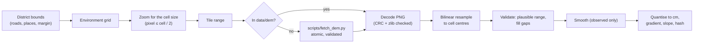

# Terrain (DEM)

DSTNS lays a digital elevation model under every district. Terrain is the first
layer of the [coupled city](coupled-city.md): it gives each road a
direction-specific grade, and later layers read it for surface water flow,
drainage and airflow.

| | |
|---|---|
| **Provides** | Elevation \( z(x, y) \) in metres, its gradient and slope, on the environment grid; node elevations; a grade for every directed edge |
| **Reads** | The road network and mapped places (to size the grid); the DEM source |
| **Data class** | *Imported* (terrain tiles), *synthetic* (analytic test surfaces) or *assumed* (flat) — always reported, never mixed up |
| **Runs** | Once, when the scenario is compiled; the result is immutable for the run |
| **Code** | `include/dstns/environment/terrain.hpp`, `src/environment/terrain.cpp`, `scripts/fetch_dem.py` |

## The environment grid

Every environmental field shares one uniform grid over the district, in the
scenario's local metres (x east, y north). The grid covers the bounding box of
all roads and places plus a margin, at a configured cell size:

| Setting | Default | Meaning |
|---|---|---|
| `environment.grid_cell_m` | 25 m | Cell size |
| `environment.grid_margin_m` | 150 m | Margin beyond the outermost road or place |
| `environment.max_grid_cells` | 262,144 | Cell budget; a larger grid is coarsened by 25% steps until it fits |

A typical 3,000-junction district is about 110 × 110 cells. Cell \( (i, j) \)
stands for its centre, \( x_i = x_0 + (i + \tfrac12)\Delta \),
\( y_j = y_0 + (j + \tfrac12)\Delta \). Values between centres are read by
bilinear interpolation, clamped at the edges.

## Sources

`environment.dem` (the `"environment": {"dem": ...}` start-request field) chooses
a **provider**. The simulation talks only to the provider interface, so another
dataset can be added without touching the models that use terrain.

| Source | What it is | Used when |
|---|---|---|
| `auto` | Terrain tiles for an OpenStreetMap district; flat for a synthetic test grid | Default. `DSTNS_DEM_SOURCE` changes what *auto* means (test suites set it to `flat`) |
| `terrarium` | [AWS Open Data Terrain Tiles](https://registry.opendata.aws/terrain-tiles/), Mapzen/Tilezen Terrarium encoding | Real terrain |
| `flat` | \( z = 0 \) | Configured, or the fallback when tiles cannot be obtained |
| `synthetic:slope[:g]` | Plane rising east at grade \( g \) (default 0.05) | Tests and validation scenarios |
| `synthetic:bowl[:d]` | Paraboloid depression \( d \) m deep (default 10) | Ponding tests |
| `synthetic:hill[:h]` | Gaussian hill \( h \) m high (default 30) | Wind and runoff tests |
| `synthetic:valley[:d]` | V-shaped valley, sides rising \( d \) m (default 15) | Channel-flow tests |

### Terrain tiles: licence and attribution

The tiles are a public dataset on AWS Open Data, assembled by Mapzen from SRTM,
GMTED2010, ETOPO1, USGS 3DEP and regional sources. They may be used, cached and
redistributed **with attribution** to Mapzen and to the underlying sources (most
are public domain; some regional ones are CC-BY). DSTNS:

- records the attribution in the run's provenance and in reports;
- credits *Terrain: Mapzen, USGS, NASA, NOAA* beside the map credit whenever
  imported terrain is in use;
- caches tiles locally under `data/dem/terrarium/z/x/y.png` and never
  re-downloads a tile it has, keeping load on the public bucket to one request
  per tile ever;
- does not commit tiles to the repository.

The full attribution list is in Tilezen's
[attribution document](https://github.com/tilezen/joerd/blob/master/docs/attribution.md).

## Loading pipeline

1. **Zoom.** The smallest Web Mercator zoom in [10, 14] whose ground pixel,
   \( 156{,}543.03 \cos\varphi / 2^z \) m, is no larger than half a cell. A
   25 m grid uses zoom 13 (11.6 m pixels at Berlin's latitude) or 14.
2. **Fetch.** Missing tiles are downloaded by `scripts/fetch_dem.py`, run in
   the same cancellable process group as the map download. Each tile is
   checked for the PNG signature and a plausible size and written atomically;
   a manifest records the URL and fetch time of every tile. At most 64 tiles
   are fetched for one district.
3. **Decode.** Terrarium encodes elevation in the red, green and blue bytes:
   \[
   z = 256R + G + \frac{B}{256} - 32768 \quad \text{metres.}
   \]
   The decoder checks every chunk's CRC and the zlib stream; a corrupt cached
   tile is deleted and fetched once more.
4. **Resample.** Each cell centre is projected to latitude and longitude, then
   to global Mercator pixel coordinates, and read by bilinear interpolation
   between pixel centres.
5. **Validate.** Values outside \( [-12{,}000, 9{,}000] \) m are treated as
   missing. Missing cells are filled from their valid four-neighbours in
   row-major passes (deterministic); if more than half the cells are missing,
   the source is treated as unavailable.
6. **Smooth.** Observed elevation is smoothed by `environment.dem_smoothing_passes`
   (default 1) passes of the 3 × 3 binomial filter
   \( \tfrac{1}{16}\begin{bmatrix}1&2&1\\2&4&2\\1&2&1\end{bmatrix} \).
   See [Limitations](#limitations) for why.
7. **Derive.** Elevations are rounded to the centimetre. The gradient uses
   central differences inside the grid and one-sided differences at its edges:
   \[
   \frac{\partial z}{\partial x}\Big|_{i,j} \approx \frac{z_{i+1,j} - z_{i-1,j}}{2\Delta}, \qquad
   s = \sqrt{\Big(\frac{\partial z}{\partial x}\Big)^2 + \Big(\frac{\partial z}{\partial y}\Big)^2}.
   \]
   A SHA-256 of the quantised field, its source and its grid becomes part of
   the scenario hash.

### When terrain cannot be had

A missing fetcher, no network, a rate-limited bucket, an unreadable tile or a
district mostly outside the dataset never stops the run. DSTNS logs
`terrain.fallback`, uses flat terrain, marks the provenance **degraded** with
the reason, and posts a `TERRAIN_DEGRADED` notification. Set
`environment.dem_required: true` to stop the run instead.

## Road grade

Grade is directional. For a road from \( A \) to \( B \):

\[
g_{AB} = \frac{z_B - z_A}{d_{AB}}, \qquad \theta_{AB} = \tan^{-1} g_{AB}, \qquad g_{BA} = -g_{AB}.
\]

Every physical road is two directed edges that share geometry; each carries its
own grade, and the pair are exact negations (the terrain test asserts it for
every edge).

Short segments are a special case. A DEM cannot resolve a slope over a run
shorter than its own error allows: a 5 m segment divided into a metre of DEM
noise reads as a 20% wall. So the rise is measured over a **baseline** of at
least `environment.grade_baseline_m` (default 100 m) and two cells, centred on
the segment and along its direction:

\[
g_{AB} = \frac{z(\mathbf m + \tfrac{L}{2}\hat{\mathbf u}) - z(\mathbf m - \tfrac{L}{2}\hat{\mathbf u})}{L},
\qquad L = \max(d_{AB},\, \text{baseline}),
\]

where \( \mathbf m \) is the segment's midpoint and \( \hat{\mathbf u} \) its
direction. Segments longer than the baseline use their endpoints. Grades are
clamped to ±35%, about the steepest public streets in the world; anything beyond
that is an artefact.

Grades are published per edge (`grade` in `/api/v1/view/topology`), for the
vehicle model to derive speed and power on slopes.

## Determinism

Terrain is a pure function of the scenario, the configuration and the tile
bytes. Decoding is exact (Terrarium values are multiples of 1/256 m);
interpolation and smoothing are double-precision arithmetic in a fixed order;
results are rounded to the centimetre before anything uses them. Two runs with
the same tiles therefore produce the same terrain hash. The tile bytes are a
*cached input*, like the OpenStreetMap extract: keep `data/dem/` to reproduce a
run offline. Across CPU architectures, a different floating-point contraction
could in principle move a value that sits exactly on a centimetre rounding
boundary; the terrain hash would show it.

## API and observer

| Route | Returns |
|---|---|
| `GET /api/v1/view/environment` | Terrain provenance (source, dataset, licence, attribution, zoom, native resolution, cache id, fetch time, bounding box, observed / degraded), grid, elevation range, hash, the largest road grade, and the fields available |
| `GET /api/v1/view/fields/elevation?max_side=N` | Elevation as a raster, block-averaged so neither side exceeds N cells (8 to 512, default 160), to 0.1 m |
| `GET /api/v1/view/fields/slope` | Slope magnitude, the same way |
| `GET /api/v1/view/topology` | `elevation_m` per node and `grade` per edge |
| `GET /api/v1/view/manifest` | The terrain block, for reproduction |

In the observer, **Layers → Field overlay → Elevation** draws the heatmap under
the roads, with a legend giving the range in metres and the pointer readout
giving the elevation under the cursor.

## Validation

`tests/environment/terrain_tests.cpp` (CTest `dstns_terrain`):

- PNG round trip, corrupt and truncated files refused;
- Terrarium decoding at zero, with a fraction and below sea level;
- Mercator origin, zoom choice;
- bilinear interpolation and clamping, gap filling;
- the gradient of a 5% plane is (0.05, 0) in every cell;
- eastbound roads climb at 5% on that plane, north–south roads are level,
  every edge's grade is the negation of its twin's;
- a bowl is lowest at its centre;
- tiles encoding a known ramp, planted in a private cache, decode to node
  elevations within 5 cm, with no network access;
- corrupt tiles with no way to re-fetch fall back to flat, marked degraded,
  and stop the run when terrain is required;
- the same terrain hashes the same; different terrain is a different scenario;
  terrain moves neither the road graph nor scheduled events.

`tests/cli/test_fetch_dem.py` exercises the downloader against a local tile
server.

## Limitations

- **Surface, not bare earth.** The tiles over most cities come from SRTM, a
  surface model with roughly 5 m of vertical error that partly includes
  buildings and trees. On central Berlin (fixture district) road grades come
  out at a median of 1.7% and a 95th percentile of 6.9% after one smoothing
  pass and a 100 m baseline (9.6% without them): steeper than the real streets.
  A morphological opening (minimum then maximum filter) removed only 0.1 to
  0.4 m on average there and was not adopted.
- **Resolution.** 10 to 20 m pixels cannot see kerbs, underpasses, bridges or
  embankments. A bridge takes the elevation of the valley under it.
- **Coast.** Over the sea the tiles carry bathymetry. Cells below
  `environment.sea_mask_m` (default −10 m) are treated as open water by the
  hydrology rather than as land.
- **One fetch per tile.** A tile fetched once is reused indefinitely; delete
  `data/dem/` to refresh it.
