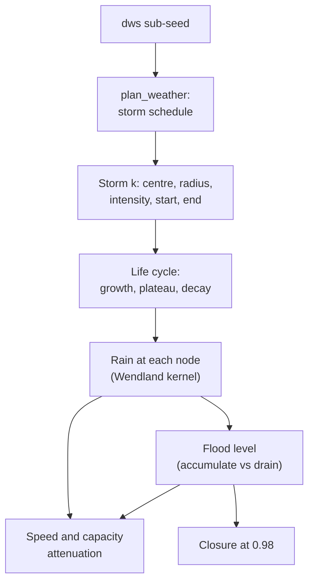

# Weather and flooding

!!! note "Since 2.3 this is the fallback"
    With the `hydrology` module on (the default), standing water comes from the
    [surface-water model](surface-water.md) and reaches roads through [vehicle
    dynamics](vehicle-dynamics.md): water flows over the terrain, is conserved exactly, and
    never drains away on a timer. The node flood model below applies only when
    `hydrology` is off, and is kept for that and for older runs.


DSTNS models storms as moving, fading discs of rain over the road network, and
flooding as water that accumulates faster than it drains. Both are deterministic: the
schedule comes from the seed, and the fields are pure functions of virtual time.

!!! note "Terminology"
    **DWS** stands for **Deterministic Weather Simulation**, the name of this
    subsystem. The code lives in `ScenarioCompiler::plan_weather` (schedule),
    `evaluate_storm_state` and `SimulationEngine::physics_step` (fields), and
    `SimulationEngine::add_weather` (manual storms).



## A storm

```cpp
struct DwsEvent {
    EventId id;
    NodeId epicenter;
    std::uint32_t start_ppm, end_ppm;   // parts per million of the virtual day
    double intensity;                   // peak, 0 to 1
    double radius_m;                    // nominal radius
    double flood_gain, recovery;        // recorded; the flood integrator uses fixed rates
};
```

Times are stored as parts per million of the day, \( \text{ppm} = 10^6\, t / 86400 \), so
a schedule is independent of any particular playback duration.

## Scheduling

`dws.frequency` storms per day (default 3) are drawn from the `DwsSchedule` domain.
For storm \( i \) of \( f \), with sorted uniform draws \( u_{(i)} \) and playback duration
\( T_P \):

\[
\begin{aligned}
\text{slack} &= T_P - 5\,(f - 1) \\
t^{\text{play}}_i &= 5\,i + \text{slack}\cdot u_{(i)} \\
t_{\text{start},i} &= \operatorname{round}\!\Big(10^6\,\frac{t^{\text{play}}_i}{T_P}\Big)\ \text{ppm}
\end{aligned}
\]

The \( 5\,i \) term guarantees consecutive storms start at least **5 playback
seconds** apart, so storms never pile up on one instant, and the schedule is refused
if \( 5\,(f - 1) \ge T_P \). The remaining parameters are

\[
\begin{aligned}
\Delta &= 45 + 75\,u_1^{1.5} \ \text{virtual minutes} \\
R &= 100 + 500\,u_4 \ \text{m} \\
I &= 0.15 + 0.85\,u_3^{1.7} \\
\text{gain} &= 0.35 + 0.60\,u_5
\end{aligned}
\]

The exponents skew the draws: \( u^{1.5} \) puts most storms toward the shorter end of
45 to 120 minutes, and \( u^{1.7} \) makes intense storms rarer than light ones (the
median of \( I \) is \( 0.15 + 0.85 \cdot 0.5^{1.7} \approx 0.41 \)). The epicentre is a
seeded node. Each parameter has its own address, so adding a sixth does not change the
existing five.

## Life cycle

At normalised phase \( p = (t - t_0)/(t_1 - t_0) \in [0, 1) \) a storm has a current
radius multiplier \( \rho(p) \) and intensity multiplier \( \iota(p) \):

\[
(\rho, \iota) =
\begin{cases}
\big(0.2 + 0.8\sin 2\pi p,\; \sin 2\pi p\big) & p < 0.25 \quad \text{growth} \\
(1,\; 1) & 0.25 \le p \le 0.70 \quad \text{plateau} \\
\big(1 - 0.65\,\tau^2,\; \cos\tfrac{\pi}{2}\tau\big),\ \tau = \tfrac{p - 0.7}{0.3} & p > 0.70 \quad \text{decay}
\end{cases}
\]

The current radius is \( \max(40,\, R\rho) \) metres and the current intensity
\( \operatorname{clamp}(I\iota,\, 0,\, 1) \). The growth sine reaches 1 exactly at
\( p = 0.25 \), where the plateau begins, and the decay's cosine reaches 0 at
\( p = 1 \), so the intensity is continuous throughout. The centre also **drifts** up
to 30% of the radius along a per-storm wind direction:

\[
\mathbf{c}(p) = \mathbf{c}_0 + 0.3\,R\,p\,\big(\cos\theta_k,\ \sin\theta_k\big), \qquad \theta_k = 1.396\,k + 0.785
\]

```cpp
const double wind_angle     = (e.id.value * 1.3962634) + 0.785398;   // 80 degrees per storm, offset 45 degrees
const double drift_distance = e.radius_m * 0.30 * phase;
```

## Rain at a node

Rain uses the compactly supported Wendland \( C^2 \) kernel, which is exactly zero at
and beyond its radius and smooth everywhere:

\[
W(d, R) = \begin{cases} (1 - q)^4\,(1 + 4q), & q = d/R < 1 \\ 0, & \text{otherwise} \end{cases}
\]

Overlapping storms combine as independent probabilities, so their sum can never
exceed 1:

\[
r_v \;=\; 1 - \prod_{k}\Big(1 - \iota_k I_k\, W\big(d(v, \mathbf{c}_k),\; \rho_k R_k\big)\Big)
\]

```cpp
rain = 1.0 - (1.0 - rain) * (1.0 - storm.cur_intensity * wendland_c2(dist, storm.cur_radius_m));
```

Two storms of rain 0.3 and 0.4 at one node give \( 1 - 0.7 \cdot 0.6 = 0.58 \), not 0.7.

## Flooding

Each node holds a flood level \( f_v \in [0, 1] \) that gains from rain and drains toward
zero, with per-node susceptibility \( s_v \) and drainage \( \delta_v \) (seeded in
\( (0.2, 0.95) \) and \( (0.2, 0.9) \)):

\[
\frac{df}{dt} = 0.018\; r\, s \;-\; 0.004\; \delta\, f
\]

discretised with the one-second step as \( f \leftarrow \operatorname{clamp}\!\big(f + (0.018\,r s - 0.004\,\delta f),\, 0,\, 1\big) \).
For constant rain this is a linear ODE with a closed-form solution:

\[
f(t) = f^\ast\big(1 - e^{-t/\tau_f}\big), \qquad
f^\ast = \frac{0.018\, r\, s}{0.004\, \delta} = 4.5\,\frac{r\, s}{\delta}, \qquad
\tau_f = \frac{1}{0.004\,\delta} = \frac{250}{\delta}\ \text{s}
\]

\( f^\ast \) is the level the node would settle at; it **saturates at 1** whenever
\( f^\ast > 1 \), that is when \( r s > \delta / 4.5 \). The time to reach a closure
threshold \( f_c \) is

\[
t_c = -\tau_f \ln\!\Big(1 - \frac{f_c}{f^\ast}\Big)
\]

An edge takes the mean of its two endpoints' rain and flood, and is **closed** once its
flood level reaches 0.98.

## Effect on traffic

For an edge with rain \( r \) and flood \( f \) the multipliers (applied to target speed
and effective capacity) are

\[
m^{\text{rain}}_v = 1 - 0.18\,r, \qquad
m^{\text{flood}}_v = \max(0.35,\; 1 - 0.55\,f), \qquad
m^{\text{rain}}_C = 1 - 0.15\,r, \qquad
m^{\text{flood}}_C = \max(0.30,\; 1 - 0.60\,f)
\]

so heavy rain alone slows traffic by at most 18% and cuts capacity by at most 15%;
flooding does the serious damage, reducing speed to as little as 35% before the road
closes entirely at \( f = 0.98 \).

## Worked example

A storm with \( R = 400 \) m and \( I = 0.8 \).

**At \( p = 0.10 \)** (growth): \( \sin 2\pi(0.1) = 0.588 \), so the radius is
\( 400 (0.2 + 0.8 \cdot 0.588) = 268 \) m and the intensity \( 0.8 \cdot 0.588 = 0.470 \).
A node 100 m from the centre has \( q = 100/268 = 0.373 \) and
\( W = (1 - 0.373)^4 (1 + 4 \cdot 0.373) = 0.385 \), so the rain there is
\( 0.470 \times 0.385 = 0.181 \). Beyond 268 m there is none.

**On the plateau** the full 400 m radius and intensity 0.8 apply:

| Distance (m) | 0 | 100 | 200 | 300 | 400 |
|---|---|---|---|---|---|
| \( W \) | 1.000 | 0.633 | 0.188 | 0.016 | 0 |
| Rain \( r \) | 0.800 | 0.506 | 0.150 | 0.013 | 0 |

**Flooding.** Take a node with \( s = 0.8 \), \( \delta = 0.5 \) under steady rain
\( r = 0.5 \): \( f^\ast = 4.5 \cdot 0.5 \cdot 0.8 / 0.5 = 3.6 \), well above 1, and
\( \tau_f = 250/0.5 = 500 \) s. The level passes 0.5 after

\[
t = -500 \ln\!\big(1 - 0.5/3.6\big) = 75\ \text{s}
\]

and reaches the 0.98 closure level after

\[
t_c = -500 \ln\!\big(1 - 0.98/3.6\big) = 159\ \text{s} \approx 2.6\ \text{minutes}.
\]

Drainage is far slower: once the rain stops, \( f \) halves in \( \tau_f \ln 2 = 347 \) s,
about 5.8 minutes. So in this model a low, poorly drained node floods in minutes and
takes much longer to recover, which is why a short, intense storm can close a road for
a long time.

## Manual storms

`POST /api/v1/control/events/weather` adds a storm at a node:

```bash
curl -s -X POST localhost:8090/api/v1/control/events/weather \
  -d '{"epicenter_node": 412, "intensity": 0.9, "radius_m": 500, "duration_virtual_minutes": 90}'
```

This requests a 90-minute storm of intensity 0.9 and radius 500 m at node 412. It
starts now, or 5 playback seconds after the previous manual storm, whichever is
later. Parameters are bounded (intensity and gain in [0, 1], radius above 0, duration
1 to 1440 minutes). Undo sets its intensity to 0.

## Observing weather

| Where | What |
|---|---|
| `GET /api/v1/view/weather` | Every scheduled and manual storm, with its window and whether it is active |
| Snapshot `active_weather` | The current centre, radius, intensity and phase of each active storm |
| News | `DWS_RAIN_SCHEDULED`, `DWS_RAIN_STARTED`, `DWS_RAIN_PEAK`, `DWS_RAIN_ENDED`, `FLOOD_STARTED` |
| The observer | Rain footprints on the map, the Weather tile, and Auto Focus |

Disabling the `dws` module removes all rain; flooding then drains away. Disabling
`flooding` holds every level at 0 while leaving rain and its speed effect.

## Determinism

Storm parameters come only from the `dws` sub-seed, and the fields depend only on
virtual time, never on the wall clock. Storms are therefore independent of incidents,
routing and demand: changing any of those leaves the weather identical for a seed.
See [Deterministic seeding](deterministic-seeding.md).
