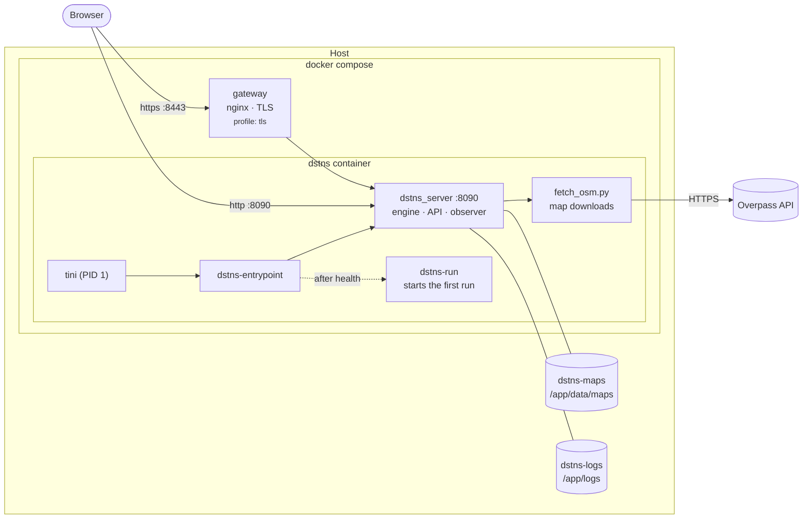
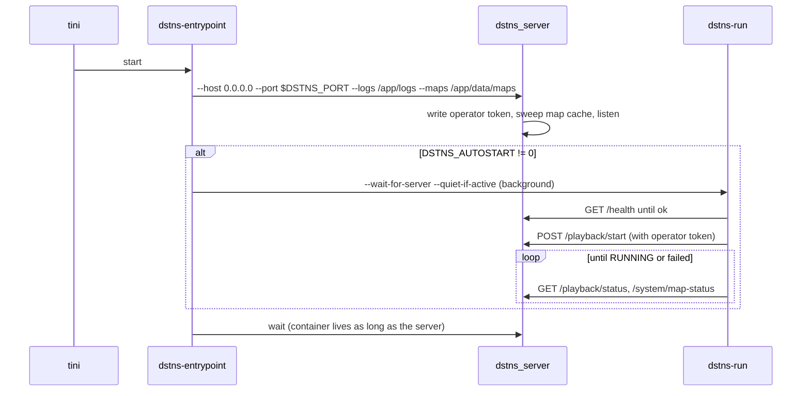

# Docker deployment

The reference for the DSTNS container: how the image is built, what it runs,
every setting, the optional TLS gateway, operating it day to day, and how to
fix it. For a first run, [Run with Docker](../getting-started/docker.md) is
shorter.


## Architecture



One container runs the whole of DSTNS: the server serves the observer and the
API from one port. The gateway is optional and only terminates TLS.

## The image

`Dockerfile` has three stages:

| Stage | Base | Produces |
|---|---|---|
| `ui` | `node:22-bookworm-slim` | The observer bundle (`npm ci`, `npm run build`) |
| `engine` | `debian:bookworm` | `dstns_server` and `dstns_scenario_export`, built Release without tests |
| runtime | `debian:bookworm-slim` | SQLite, zlib, Python 3, CA certificates, tini, optionally SUMO, and the files below |

```text
/app
├── build/dstns_server              the server
├── build/dstns_scenario_export     SUMO export tool
├── ui-engine/dist/                 the observer bundle
├── config/                         defaults.json, ui-config.json
├── scripts/fetch_osm.py            the map downloader
├── data/fixtures/real_network.osm.xml   offline district
├── data/maps/        (volume)      map cache
└── logs/             (volume)      system.log, runtime.db, operator.token
/usr/local/bin/dstns-entrypoint     start-up script
/usr/local/bin/dstns-run            run starter
```

Properties:

- **Multi-architecture.** Every base image is published for `amd64` and
  `arm64`, so it builds natively on Apple silicon without emulation.
- **Unprivileged.** It runs as user `dstns` (UID 10001), never root.
- **Small.** About 234 MB without SUMO.
- **Healthy means serving.** The health check fetches `/health` every 10 s.
- **Clean shutdown.** `tini` is PID 1; it forwards `SIGTERM` to the server,
  which kills any map download's process group and exits.

Build arguments:

| Argument | Default | Effect |
|---|---|---|
| `WITH_SUMO` | `0` | `1` installs Debian's `sumo` package (SUMO 1.15; the image grows to about 1.1 GB) |
| `DEBIAN_RELEASE` | `bookworm` | Debian release for every stage |

```bash
docker build -t dstns .
docker build -t dstns:sumo --build-arg WITH_SUMO=1 .
docker buildx build --platform linux/amd64,linux/arm64 -t registry.example.org/dstns:2.0 --push .
```

## What happens at start



If the first run fails (no network for the map, say), the server stays up and
the observer shows why; start another run with `dstns-run`.

## Environment variables

Set these in `docker-compose.yml`, a `.env` file, or with `-e` on `docker run`.

### Run configuration

| Variable | Default | Range | Meaning |
|---|---|---|---|
| `DSTNS_AUTOSTART` | `1` | `0`, `1` | Start a run once the server is healthy |
| `DSTNS_SEED` | `auto` | decimal, `0x` hex, `auto` | Seed of the first run |
| `DSTNS_DAY_TYPE` | `weekday` | `weekday`, `weekend` | Day type |
| `DSTNS_SPEED` | `1` | 0.01 to 5 | Speed multiplier |
| `DSTNS_DURATION` | `3600` | 60 to 3600 | Wall-clock seconds per day at 1× |
| `DSTNS_OSM_FILE` | `auto` | `auto` or a path in the container | Map source |

### Server

| Variable | Default | Meaning |
|---|---|---|
| `DSTNS_PORT` | `8090` | Port inside the container |
| `DSTNS_MAP_CACHE` | `prune` | `keep`, `prune` (newest N) or `clear` the map cache at start |
| `DSTNS_MAP_CACHE_KEEP` | `3` | N for `prune` |
| `DSTNS_DISABLE_WORLD_REGENERATION` | `0` | `1` hides **Generate a new world** from observers |
| `DSTNS_ALLOWED_HOSTS` | empty | Extra `Host` names accepted when bound to loopback; unnecessary in the container, which listens on all interfaces behind the loopback mapping |
| `DSTNS_ALLOWED_ORIGINS` | empty | Extra origins allowed to change state; see [Security](security.md#origin-check-cross-site-request-forgery) |
| `DSTNS_OVERPASS_ENDPOINTS` | public mirrors | Comma-separated Overpass endpoints |
| `DSTNS_OPERATOR_TOKEN` | generated | Fix the operator credential instead of generating one |
| `DSTNS_COMPUTE_BACKEND` | `auto` | `auto`, `cpu` or `vulkan`. Without a GPU passed in, `auto` runs the CPU backend; see [GPU in a container](#gpu-in-a-container) |

### Compose only

| Variable | Default | Meaning |
|---|---|---|
| `DSTNS_BIND` | `127.0.0.1` | Host address the ports are published on; `0.0.0.0` exposes them to the network |
| `DSTNS_HOST_PORT` | `8090` | Host port for the observer and API |
| `DSTNS_TLS_PORT` | `8443` | Host port for the gateway |
| `DSTNS_WITH_SUMO` | `0` | Build argument `WITH_SUMO` |
| `DSTNS_WITH_VULKAN` | `0` | Build argument `WITH_VULKAN`: the Vulkan loader and Mesa's drivers |

## Volumes and data

| Volume | Mount | Contents | Lose it and… |
|---|---|---|---|
| `dstns-maps` | `/app/data/maps` | City extracts and their manifests (up to about 50 MB each) | Maps are downloaded again when next needed |
| `dstns-logs` | `/app/logs` | `system.log`, `runtime.db`, `operator.token`, `global_view.json` | You lose history; nothing else |

Run state (the current day, checkpoints, undo history) lives in memory and
does not survive a container restart; a restarted container starts a fresh
run. Back up maps or logs with an ordinary volume copy:

```bash
docker run --rm -v dstns_dstns-logs:/logs -v "$PWD":/backup debian:bookworm-slim \
  tar czf /backup/dstns-logs.tgz -C /logs .
```

!!! note "Bind mounts"
    To use a host directory instead of a named volume, make it writable by UID
    10001: `mkdir -p maps && sudo chown 10001 maps`, then mount
    `./maps:/app/data/maps`. Otherwise downloads fail with a permission error.

## Starting runs: `dstns-run`

```text
dstns-run [--seed N] [--day-type weekday|weekend] [--speed X]
          [--duration S] [--osm-file auto|PATH] [--status]
```

Flags default to the `DSTNS_*` variables. It reads the operator credential
from `/app/logs/operator.token`, resets any active run, starts the new one,
and reports progress until it is live:

```bash
docker compose exec dstns dstns-run --seed 382923
docker compose exec dstns dstns-run --osm-file /app/data/fixtures/real_network.osm.xml
docker compose exec dstns dstns-run --status
```

Exit status is 0 when the run is live, 1 when the start was refused or
preparation failed, 2 for invalid flags.

The full operator CLI (`./launcher`) is not in the image. A source checkout's
CLI can watch and control a container's run (`DSTNS_API_PORT=8090 ./launcher
console`), but cannot start one: the operator credential lives inside the
container, so starting runs is `dstns-run`'s job.

## TLS gateway

```bash
docker compose --profile tls up --build
```

The `gateway` service (nginx 1.27) listens on 8443, terminates TLS 1.2/1.3 and
proxies everything to the engine, adding:

- `Strict-Transport-Security`, `X-Content-Type-Options: nosniff`,
  `X-Frame-Options: DENY`;
- `X-Forwarded-Host`, so the engine's cross-site check sees the host the browser
  used;
- unbuffered proxying with a one-hour read timeout for streams.

On first start it generates a 7-day self-signed certificate for `localhost`
into `docker/certificates/`. For a real certificate, place `dstns.crt` (full
chain) and `dstns.key` there before starting; they are used as is.

```bash
cp /etc/letsencrypt/live/dstns.example.org/fullchain.pem docker/certificates/dstns.crt
cp /etc/letsencrypt/live/dstns.example.org/privkey.pem   docker/certificates/dstns.key
docker compose --profile tls up -d
```

!!! tip "Only expose the gateway"
    When the gateway is in front, publish the engine on loopback only so
    remote clients cannot bypass it. Compose already publishes on `127.0.0.1`;
    leave `DSTNS_BIND` unset and put the proxy on the same host.
    Add authentication at the proxy or restrict access through a trusted network.
    TLS encrypts traffic but does not authorize operators; enabling this profile
    does not remove the backend port mapping.

## Plain `docker run`

Without Compose:

```bash
docker build -t dstns .
docker volume create dstns-maps
docker run -d --name dstns -p 8090:8090 \
  -v dstns-maps:/app/data/maps \
  -e DSTNS_SEED=382923 \
  dstns
docker exec dstns dstns-run --seed 42
docker logs -f dstns
```

## Operating the container

| Task | Command |
|---|---|
| Follow the log | `docker compose logs -f dstns` |
| Read the server's own log | `docker compose exec dstns tail -f /app/logs/system.log` |
| What is running | `docker compose exec dstns dstns-run --status` |
| Health | `docker compose ps` (the `STATUS` column) |
| Shell | `docker compose exec dstns bash` |
| Upgrade | `git pull && docker compose up -d --build` |
| List cached maps | `docker compose exec dstns ls -lh /app/data/maps` |
| Clear the map cache | `docker compose down && docker volume rm dstns_dstns-maps` |
| Stop gracefully | `docker compose stop` (the server gets `SIGTERM` and 10 s) |

The API works the same as on a workstation; see the [API guide](../api/index.md):

```bash
curl -s localhost:8090/api/v1/playback/status | python3 -m json.tool | head
curl -s -X POST localhost:8090/api/v1/playback/seek -d '{"target_time":"08:00:00"}'
```

## Production checklist

- [ ] Put the TLS gateway (or your own proxy) in front, and publish the engine
      on `127.0.0.1` only.
- [ ] Use a real certificate.
- [ ] Set `DSTNS_DISABLE_WORLD_REGENERATION=1` if viewers should not replace
      the world.
- [ ] Keep `dstns-maps` on persistent storage, and size it for
      `DSTNS_MAP_CACHE_KEEP` × 50 MB.
- [ ] Give the container 1 GB of memory, or 2 GB for districts near the
      50,000-node limit.
- [ ] Allow outbound HTTPS to the Overpass endpoints, or pin a map with
      `DSTNS_OSM_FILE`.
- [ ] Remember that anyone who can reach the port can control the run; read
      [Security](security.md).

## GPU in a container

The image always contains the Vulkan backend, but a container sees a GPU only if the
host passes one in, so by default the physics runs on the CPU, which is also the
faster choice for district-sized worlds. Results are identical either way.

For a GPU on a Linux host:

```bash
docker build -t dstns --build-arg WITH_VULKAN=1 .
docker run -d -p 127.0.0.1:8090:8090 --device /dev/dri dstns              # AMD, Intel (Mesa)
docker run -d -p 127.0.0.1:8090:8090 --gpus all \
  -e NVIDIA_DRIVER_CAPABILITIES=compute,graphics,utility dstns            # NVIDIA, with the Container Toolkit
```

Check what the container found:

```bash
docker exec <container> /app/build/dstns_server --gpu-diagnostics
curl -s localhost:8090/api/v1/system/compute
```

Docker Desktop on macOS cannot pass the Apple GPU into a Linux container; run DSTNS
natively on a Mac to use it.

## Resource use

Measured on Apple silicon (Docker Desktop, arm64), a 3,000-node district of
Dar es Salaam at 2×:

| Resource | Use |
|---|---|
| Image | 234 MB (without SUMO) |
| Memory | About 800 MB, mostly the 96 checkpoints a day of time travel needs |
| CPU | 5 to 15% of one core while playing |
| Map cache | 42 MB for this city |
| First start | About 4 minutes to build; 30 to 60 s to download a city |

Memory scales with district size: checkpoints store the full dynamic state of
every node and edge every 15 virtual minutes.

## Troubleshooting

??? failure "`[dstns-run] preparation failed: OSM download failed … no route to Overpass`"
    The container has no outbound HTTPS. Check `docker run --rm debian:bookworm-slim getent hosts overpass-api.de`.
    Behind a proxy, add `HTTPS_PROXY` to the `environment:` block. Or pin the
    bundled map with `DSTNS_OSM_FILE=/app/data/fixtures/real_network.osm.xml`.

??? failure "`OSM download failed … HTTP 429` or `implausibly small map`"
    The public Overpass mirrors are rate-limiting you. Wait a few minutes, or
    run your own Overpass instance and set `DSTNS_OVERPASS_ENDPOINTS`.

??? failure "`Permission denied` writing `/app/data/maps` or `/app/logs`"
    A bind-mounted host directory is not writable by UID 10001. `chown 10001`
    it, or use the named volumes.

??? failure "The container restarts in a loop"
    `docker compose logs dstns` shows the server's last words. `DSTNS fatal:
    --port must be in [1, 65535]` means `DSTNS_PORT` is invalid; `cannot write
    operator credential` means `/app/logs` is not writable.

??? failure "`CROSS_ORIGIN_FORBIDDEN` behind my own reverse proxy"
    The proxy rewrites `Host`. Forward the original with
    `proxy_set_header X-Forwarded-Host $http_host;` (nginx) or the equivalent,
    or list the public origin in `DSTNS_ALLOWED_ORIGINS`.

??? failure "The browser warns about the certificate"
    Expected with the generated self-signed certificate. Install a real one as
    described under [TLS gateway](#tls-gateway).

??? question "`linux/arm64` or `linux/amd64`?"
    The image builds natively for whichever your Docker runs. To build for
    another, use `docker buildx build --platform …`.

??? question "Can I run several simulations?"
    One server runs one simulation. Run several containers on different host
    ports, each with its own `-p` and project name:
    `DSTNS_HOST_PORT=8091 docker compose -p dstns2 up -d`.
