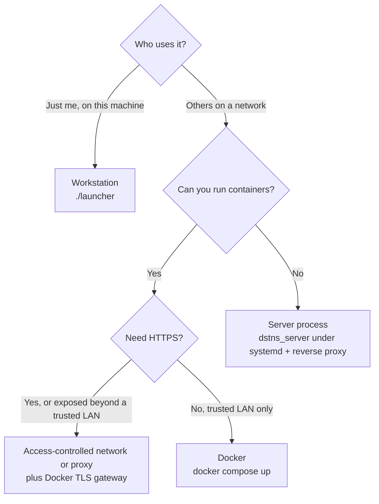

# Deployment

How to run DSTNS for other people: where it can run, how to choose between the
options, and what to look after once it is up.

## Choose a shape



| Shape | Start with | Good for | Look after |
|---|---|---|---|
| **Workstation** | `./launcher` | Development, research, one operator | Nothing special |
| **Docker** | `docker compose up` | Demos, classrooms, a shared lab machine | Volumes, port, who can reach it |
| **Docker + TLS** | `docker compose --profile tls up` | Remote use with separate access control | Authentication or VPN, certificates, backend isolation |
| **Server process** | `dstns_server` behind nginx or Caddy | Hosts without containers | A service manager, the reverse proxy's `Host` header |

## What every deployment needs

| Need | Why | How |
|---|---|---|
| One port | The server serves the observer and the API together | 8090 by default; `--port` or `DSTNS_HOST_PORT` |
| Outbound HTTPS to Overpass | Downloading a seed's city the first time | Or pin a map / use the cache |
| A writable map cache | Extracts are 5 to 50 MB each | `data/maps/`, or the `dstns-maps` volume |
| A writable logs directory | Operator token, system log, SQLite journal | `logs/`, or the `dstns-logs` volume |
| About 1 GB of memory | Checkpoints for a 3,000-node district | More for districts near the 50,000-node limit |

## Security in one paragraph

There are no user accounts. Anyone who can reach the port can watch the run
and use the playback and control API; only the holder of the operator token
can start or prepare runs. Browser origin checks reject unapproved cross-origin
writes, but do not authenticate non-browser callers. Bind to loopback for local
work. Remote use needs network restrictions or an authenticated proxy as well as
TLS; the gateway alone does not provide access control. Disable world regeneration
if that workflow is unwanted, and read [Security](security.md).

## Running as a service (without Docker)

A systemd unit for a source build in `/opt/dstns`:

```ini title="/etc/systemd/system/dstns.service"
[Unit]
Description=DSTNS simulation server
After=network-online.target
Wants=network-online.target

[Service]
User=dstns
WorkingDirectory=/opt/dstns
ExecStart=/opt/dstns/build/dstns_server --host 127.0.0.1 --port 8090 \
          --logs /var/lib/dstns/logs --maps /var/lib/dstns/maps --map-cache prune --map-cache-keep 3
Restart=on-failure
NoNewPrivileges=true
ProtectSystem=strict
ReadWritePaths=/var/lib/dstns

[Install]
WantedBy=multi-user.target
```

```bash
sudo systemctl enable --now dstns
```

Start runs with the CLI from the same checkout, pointing it at the same logs
directory so it finds the operator token:

```bash
DSTNS_LOGS_DIR=/var/lib/dstns/logs ./launcher start --seed 382923 --no-open
```

And put a reverse proxy in front. nginx:

```nginx
location / {
    proxy_pass http://127.0.0.1:8090;
    proxy_http_version 1.1;
    proxy_buffering off;
    proxy_read_timeout 1h;
    proxy_set_header X-Forwarded-Host $http_host;   # required: see Security
}
```

Caddy (`Caddyfile`) forwards `Host` by default:

```text
dstns.example.org {
    reverse_proxy 127.0.0.1:8090
}
```

## Operations

| Task | Workstation | Docker |
|---|---|---|
| Health | `curl localhost:8090/health` | `docker compose ps` |
| Logs | `./launcher logs`, `logs/system.log` | `docker compose logs -f` |
| New run | `./launcher start --seed N` | `docker compose exec dstns dstns-run --seed N` |
| Stop | Terminate in the observer, or Ctrl-C the CLI | `docker compose stop` |
| Upgrade | `git pull && ./launcher` | `git pull && docker compose up -d --build` |
| Clear runtime state | `./launcher reset` | `docker compose down --volumes` |

See [Docker](docker.md), [Security](security.md), [Logging](logging.md) and
[Performance](performance.md).

## Operational procedures

Use the [Operations runbook](operations.md) for readiness checks, experiment
provenance, backups, upgrade validation, rollback and persistent shutdown, and
[Upgrading and data management](upgrading.md) for versions, upgrades, backups, disk
space and removal. The
proxy examples above illustrate forwarding only; add authentication or a trusted
network boundary before allowing remote access.
