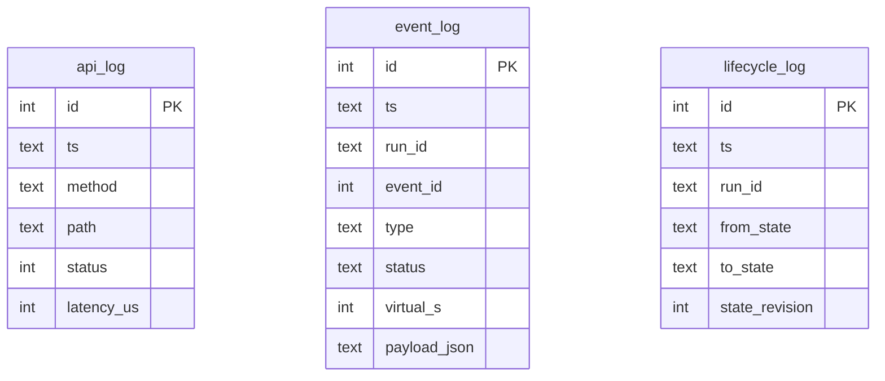

# Logging and diagnostics

DSTNS records what it does in three places inside the logs directory (`logs/`
by default, `--logs DIR` on the server, `/app/logs` in Docker).

| File | Format | Contents |
|---|---|---|
| `system.log` | Text, one entry per line | Start-up, lifecycle transitions, map downloads and cache sweeps, world generation, errors |
| `runtime.db` | SQLite (WAL mode) | Structured journal: every API request, every operator command, every lifecycle transition |
| `global_view.json` | JSON | The full state of the run, rewritten every 10 seconds |
| `operator.token` | Text, mode 0600 | The operator credential (not a log, but lives here) |

## `system.log`

```text
2026-10-01T12:00:03+0000 [INFO] [logging] runtime logger initialized
2026-10-01T12:00:03+0000 [INFO] [engine] DSTNS engine idle
2026-10-01T12:00:03+0000 [INFO] [api] listening on http://127.0.0.1:8090
2026-10-01T12:00:04+0000 [INFO] [lifecycle] IDLE -> PREPARING run=
2026-10-01T12:00:41+0000 [INFO] [lifecycle] PREPARING -> READY run=run_4f1fccc516c6
2026-10-01T12:00:41+0000 [INFO] [lifecycle] READY -> RUNNING run=run_4f1fccc516c6
2026-10-01T12:03:10+0000 [ERROR] [api] POST /api/v1/playback/seek: seconds must be in [0, 86400]
```

Format: `timestamp [LEVEL] [component] message`, with the timestamp in local time and its UTC offset (ISO 8601). Levels are `INFO`, `WARN` and
`ERROR`. Every message is a single line: newlines inside a message are replaced
with spaces, so a request path cannot forge entries.

Components you will see:

| Component | Logs |
|---|---|
| `engine` | Engine start and stop |
| `lifecycle` | Every state transition, with the run ID |
| `api` | The listen address, and every request that failed (method, path, reason) |
| `world` | World regeneration jobs and their outcome |
| `maps` | Map cache sweeps |
| `logging` | The logger itself |

## `runtime.db`



| Table | One row per |
|---|---|
| `api_log` | HTTP request |
| `event_log` | Operator command (tick rate, day, module, edge override, signal toggle, manual weather), with its parameters in `payload_json` |
| `lifecycle_log` | Lifecycle transition |

`runtime_metadata` and `event_schedule` exist in the schema but are not
currently written.

Query it directly:

```bash
sqlite3 logs/runtime.db "SELECT ts, from_state, to_state FROM lifecycle_log ORDER BY id DESC LIMIT 10;"
sqlite3 logs/runtime.db "SELECT status, COUNT(*) FROM api_log GROUP BY status;"
sqlite3 logs/runtime.db "SELECT ts, type, payload_json FROM event_log WHERE run_id='run_4f1fccc516c6';"
```

## Reading logs

=== "CLI"

    ```bash
    ./launcher logs            # choose a source interactively
    ./launcher logs system
    ./launcher logs api
    ./launcher logs event
    ./launcher logs playback   # lifecycle transitions
    ```

=== "HTTP"

    ```bash
    curl -s localhost:8090/api/v1/view/logs/system            # last 250 lines
    curl -s 'localhost:8090/api/v1/view/logs/api?limit=50'    # newest first, up to 1000
    curl -s 'localhost:8090/api/v1/view/logs/events?limit=50'
    ```

=== "Docker"

    ```bash
    docker compose logs -f dstns                             # entrypoint and server output
    docker compose exec dstns tail -f /app/logs/system.log
    ```

## Known limitations

!!! warning "The API journal grows without bound"
    `api_log` records every request, and an open observer polls about four
    times a second: some 350,000 rows per day of watching. The file stays small
    per row, but nothing prunes it. Clear it with `./launcher reset` (or
    `docker compose down --volumes`), or trim it:

    ```bash
    sqlite3 logs/runtime.db "DELETE FROM api_log WHERE ts < datetime('now','-1 day'); VACUUM;"
    ```

!!! note "`latency_us` is always 0"
    The HTTP library's logging hook does not report timing, so the column is
    recorded as zero. Use a reverse proxy's access log for latency.

## Diagnosing a problem

1. **Is the server up?** `curl -s localhost:8090/health`.
2. **What state is the run in?** `curl -s localhost:8090/api/v1/playback/status`;
   look at `lifecycle` and `preparation_error`.
3. **What went wrong?** `grep -E "ERROR|WARN" logs/system.log | tail`.
4. **Which request failed?** `sqlite3 logs/runtime.db "SELECT * FROM api_log WHERE status >= 400 ORDER BY id DESC LIMIT 20;"`.
5. **A map problem?** `curl -s localhost:8090/api/v1/system/map-status`.

Then see [Troubleshooting](../troubleshooting.md).
