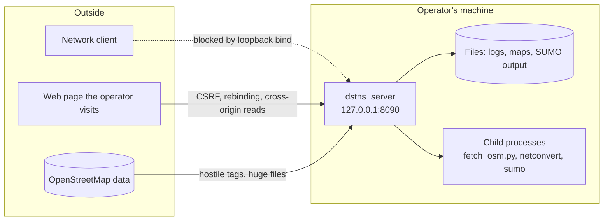
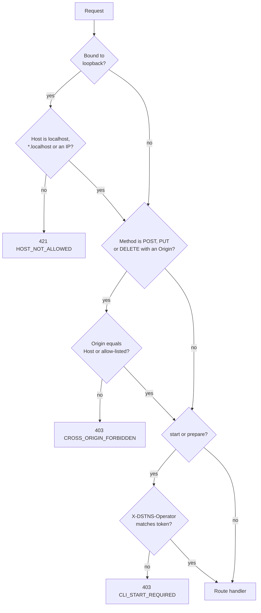

# Security

This page describes how a DSTNS server defends itself, what it deliberately does
not defend against, and what an operator must do when exposing it beyond a single
machine. The project's vulnerability-reporting process is in the repository's
[security policy](https://github.com/varunkarthic/DSTNS/blob/main/SECURITY.md).

!!! abstract "Summary"
    DSTNS is a **single-operator** tool. The server listens on loopback by
    default, refuses cross-site and DNS-rebinding requests from browsers, and
    requires a credential to start a run. It has **no user accounts**: anyone who
    can reach the port can control the run. Keep the default bind, or place an
    authenticating proxy in front of it.

## Threat model

The server is attacked from three places: the **network**, the **browser** of the
person running it, and the **data** it ingests.



| Threat | Example | Mitigation | Residual risk |
|---|---|---|---|
| Network exposure | A neighbour on the same Wi-Fi pauses your run | Loopback bind by default; Compose publishes on `127.0.0.1` | None until you choose to expose it |
| Cross-site request forgery | A page you visit posts `/system/terminate` | Origin check on state-changing requests | Clients that send no `Origin` (scripts) are not checked, by design |
| DNS rebinding | `evil.example` re-points to `127.0.0.1` and drives the run | Host allow-list when bound to loopback | None for loopback-bound servers |
| Cross-origin reads | A page reads your run state with `fetch` | CORS granted only to the server's own origin and `DSTNS_ALLOWED_ORIGINS` | None in browsers; a non-browser client can still read |
| Unauthorised start | A reachable client chooses the seed and map | Operator credential on `start` and `prepare` | The credential protects only those two routes |
| Hostile input | Out-of-range IDs, times, counts, JSON | Validation by type and range | See [Request validation](#request-validation) |
| Hostile map | A crafted OSM file | UTF-8 repair, length caps, size limit on downloads | A very large file is bounded, not free |
| Command injection | A SUMO directory named `x; rm -rf ~` | Every shell argument single-quoted | The SUMO endpoints still write where told |
| Log forging | A URL containing `%0A` | Newlines flattened | None |

**Out of scope:** an attacker with a shell on the host; confidentiality of run
state on a server others can reach; request-volume denial of service; isolating
several users from one another.

## Bind address

The server binds to **`127.0.0.1`** unless told otherwise, so only processes on
the same machine can reach it.

```bash
./build/dstns_server                      # 127.0.0.1:8090
./build/dstns_server --host 0.0.0.0       # every interface: deliberate exposure
```

The launcher reads `api.host` from `config/defaults.json` (also `127.0.0.1`). In
Docker, the container listens on `0.0.0.0` *inside* its network namespace, and
Compose publishes that port on the host's loopback:

```yaml
ports:
  - "${DSTNS_BIND:-127.0.0.1}:${DSTNS_HOST_PORT:-8090}:8090"
```

`DSTNS_BIND=0.0.0.0 docker compose up` publishes it to the network. Do this only
behind the [TLS gateway](docker.md#tls-gateway) or another authenticating proxy.

## The request guard

Every request passes one function, the pre-routing guard in `src/api.cpp`, before
any route handler runs.



### Host check: DNS rebinding

A hostile page cannot read `http://127.0.0.1:8090` directly, because browsers
isolate origins. **DNS rebinding** works around that: the attacker serves a page
from `rebind.evil.example`, then changes the DNS answer for that name to
`127.0.0.1`. The browser still believes it is talking to the attacker's origin, so
it allows the requests, and sends `Host: rebind.evil.example`.

The Origin-versus-Host check below cannot catch this, because the page's `Origin`
and the request's `Host` both name the attacker and therefore match. The guard
instead inspects the `Host` header itself:

```cpp
bool host_allowed(std::string host) {
    // Strip a port: "[::1]:8090" and "127.0.0.1:8090" alike.
    if (!host.empty() && host.front() == '[') { /* ... */ return true; }  // IPv6 literal
    if (const auto colon = host.rfind(':'); colon != std::string::npos) host.erase(colon);
    for (auto& c : host) c = static_cast<char>(std::tolower(static_cast<unsigned char>(c)));
    if (host.empty()) return true;                                  // HTTP/1.0, not a browser
    if (host == "localhost" || host.ends_with(".localhost")) return true;
    if (host.find_first_not_of("0123456789.") == std::string::npos) return true;  // IPv4 literal
    return in_allow_list(host, std::getenv("DSTNS_ALLOWED_HOSTS"));
}
```

The excerpt is condensed: in the source the IPv6 branch checks for a closing
bracket, and the allow-list loop that `in_allow_list` stands for is written out
in place.

Line by line: IP literals and `localhost` names cannot be rebound (there is no DNS
answer to change), so they pass; any other name must be listed in
`DSTNS_ALLOWED_HOSTS`. The check applies to reads as well as writes, and only when
the server is bound to loopback. A server behind a reverse proxy legitimately sees
whatever hostname the proxy forwards, so the check is off there.

```bash
# Refused: a rebound request carries the attacker's name.
curl -i -H 'Host: rebind.evil.example:8090' http://127.0.0.1:8090/api/v1/playback/status
# HTTP/1.1 421 Misdirected Request    {"error":{"code":"HOST_NOT_ALLOWED", ...}}

# Admit a local alias:
DSTNS_ALLOWED_HOSTS=dstns.lan ./build/dstns_server
```

### Origin check: cross-site request forgery

A browser attaches an `Origin` header to every cross-origin request and to every
same-origin request that is not a `GET` or `HEAD`. Without a check, any page the
operator visits could submit a form to `http://127.0.0.1:8090/terminate`. The guard
refuses any `POST`, `PUT` or `DELETE` that carries an `Origin` unless it names the
server itself:

```cpp
if (req.method != "GET" && req.method != "HEAD" && req.method != "OPTIONS"
    && req.has_header("Origin")
    && !same_origin(req.get_header_value("Origin"),
                    req.get_header_value("Host"),
                    req.get_header_value("X-Forwarded-Host"))) {
    // 403 CROSS_ORIGIN_FORBIDDEN
}
```

`same_origin` accepts an origin whose `host[:port]` equals the request's `Host`,
or the first `X-Forwarded-Host` entry (set by a reverse proxy), or an origin
listed in `DSTNS_ALLOWED_ORIGINS`. `Origin: null` (sandboxed frames, some
redirects) is always refused.

```bash
# Refused:
curl -i -X POST -H 'Origin: https://evil.example' http://127.0.0.1:8090/api/v1/playback/pause
# HTTP/1.1 403 Forbidden    {"error":{"code":"CROSS_ORIGIN_FORBIDDEN", ...}}

# Allowed: no Origin (scripts, the CLI) or the server's own origin.
curl -i -X POST http://127.0.0.1:8090/api/v1/playback/pause
```

!!! warning "This is not authentication"
    Requests with no `Origin` header (`curl`, scripts, the CLI) are not checked,
    because a browser cannot be made to send a cross-site write without one. The
    check defends the operator's browser; it does not stop a network client.
    That is the bind address's and the proxy's job.

| Setup | What it needs |
|---|---|
| Observer served by `dstns_server` | Nothing |
| Vite dev server (`npm run dev`) | Nothing: it proxies `/api` and keeps the browser's `Host` |
| Docker TLS gateway | Nothing: `nginx.conf` forwards `X-Forwarded-Host` |
| Your own reverse proxy | Forward `Host`, or set `X-Forwarded-Host`, and overwrite client-supplied copies |
| Observer on another origin (`VITE_DSTNS_API_URL`) | Add that origin to `DSTNS_ALLOWED_ORIGINS` |

### Cross-origin reads: CORS

`Access-Control-Allow-Origin` is set per request, never to `*`:

```cpp
server_->set_post_routing_handler([](const auto& req, auto& res) {
    const auto origin = req.get_header_value("Origin");
    if (!origin.empty() && same_origin(origin, req.get_header_value("Host"),
                                       req.get_header_value("X-Forwarded-Host")))
        res.set_header("Access-Control-Allow-Origin", origin);
    res.set_header("Vary", "Origin");
});
```

A foreign page can still cause a `GET` to be sent, because browsers send simple
requests, but it cannot read the response. `Vary: Origin` stops a shared cache
from serving one origin's grant to another.

### Operator credential

At start-up `dstns_server` writes a random 256-bit credential to
`<logs>/operator.token` with mode `0600`, or uses `DSTNS_OPERATOR_TOKEN` if set.
`POST /api/v1/playback/start` and `/prepare` must present it:

```bash
curl -X POST http://127.0.0.1:8090/api/v1/playback/start \
  -H "X-DSTNS-Operator: $(cat logs/operator.token)" \
  -d '{"seed":"382923"}'
```

A missing or wrong value returns 403 `CLI_START_REQUIRED`. The credential
**only** guards those two routes. It is not a general bearer token: pause, seek,
control and world regeneration need none. The credential is captured when the
server starts, so editing the file later does not change what the running server
accepts; restart to rotate it.

## Shutdown

`POST /api/v1/system/terminate` (alias `POST /terminate`) stops the run and
exits. There is no `GET` form: a GET can be triggered by an `` tag or a
link, with no CORS or Origin signal at all. The engine kills an in-flight map
download's whole process group, so nothing outlives the server.

## Request validation

Handlers validate by throwing; one exception handler maps each exception type to a
status and a stable error code (see [API errors](../api/errors.md)).

| Input | Rule | Why |
|---|---|---|
| Path IDs (`/edges/{id}`, `/signals/{id}`) | Parsed as 32-bit unsigned; overflow is 400 | `std::stoul` then a narrowing cast would turn 4294967296 into edge 0 |
| Times (`target_time`, SUMO `begin_s`) | Seconds in [0, 86400] or `HH:MM:SS` | Unsigned JSON numbers skipped the range check |
| Query numbers (`limit`, `since_news_id`) | Unsigned decimal; a sign is 400 | `stoull("-1")` wraps to 2^64 - 1 |
| Undo and redo `count` | Integer in [1, 10000], read signed | `nlohmann::json` wraps a negative number into an unsigned type |
| Tick rate | Finite, in (0, 5] | NaN and infinity must not reach the clock |
| Edge overrides | Finite multipliers in [0, 2] | |
| Weather | Intensity, gain in [0, 1]; radius > 0; duration 1 to 1440 min | Overflow of the end time |
| Surges | Factor in (0, 10]; radius in (0, 20000] m; duration 1 to 86400 s | A negative factor produced negative demand |
| Seeds, saved-seed IDs | Decimal, `0x` hex, `auto`; IDs match `[A-Za-z0-9][A-Za-z0-9_-]{0,63}` | IDs name database rows |
| Map configuration | Extent 500 to 20000 m; district 200 to 50000 nodes | Bounds memory and download size |

The pattern behind most rows is the same: a value read from JSON into a wider or
signed type, then narrowed without checking. The fix is to parse into the
destination type and reject what does not fit:

```cpp
std::uint32_t path_id(const std::string& text) {
    std::uint32_t parsed = 0;
    const auto [end, error] = std::from_chars(text.data(), text.data() + text.size(), parsed);
    if (text.empty() || error != std::errc{} || end != text.data() + text.size())
        throw std::invalid_argument("identifier out of range: " + text);
    return parsed;
}
```

`std::from_chars` reports overflow through `error`, so `4294967296` is rejected
rather than wrapped.

## External processes

The server starts two kinds of external program:

- **The map downloader** (`python3 scripts/fetch_osm.py`), through `posix_spawn`
  of `/bin/sh -c`. Every argument is single-quoted, the child has its own process
  group (so termination can kill it and its descendants), and its pipe is
  close-on-exec.
- **SUMO** (`netconvert`, `sumo`), through `popen`. Every path, including the
  `directory` from the request body of `/export/sumo` and `/system/sumo-simulate`,
  is quoted, and exit statuses are checked.

Quoting is done once, by one function:

```cpp
std::string shell_quote(const std::string& value) {
    std::string quoted = "'";
    for (const char c : value) {
        if (c == '\'') quoted += "'\\''";   // close the quote, emit an escaped ', reopen
        else quoted += c;
    }
    return quoted + "'";
}
```

Inside single quotes the shell interprets nothing, so the only character that
needs handling is the single quote itself. A directory named `x'; rm -rf ~; '`
becomes one inert argument.

!!! danger "The SUMO endpoints write wherever told"
    `directory` is created and written with the server's permissions. The
    shell-injection risk is closed, but the endpoints are not sandboxed to a
    directory. Do not expose the API to untrusted users while this holds.

## Untrusted text

OpenStreetMap data arrives from the network and may be corrupt or hostile. Values
are repaired to valid UTF-8 and capped at 512 bytes as they are read, and the
JSON serialiser refuses to emit invalid UTF-8, so a bad byte cannot break a
response, a log line or a hash. Downloader output reaches error messages only
through `sanitize_message`. Downloads are capped at 200 MiB.

## Logs

The system log writes one line per message: newlines are replaced with spaces, so
a request path with an encoded `%0A` cannot forge entries. The SQLite journal uses
prepared statements throughout, and the one dynamic table name is checked against
an allow-list first.

## Containers

- The image runs as an unprivileged user (UID 10001) under `tini`, never root.
- It never mounts the Docker socket and needs no added capabilities.
- Maps and logs live on named volumes; nothing else is writable.
- The TLS gateway terminates TLS 1.2 and 1.3, sets `X-Content-Type-Options`,
  `X-Frame-Options` and `Strict-Transport-Security`, and forwards
  `X-Forwarded-Host`. It adds encryption, not authentication.

## Hardening checklist

- [ ] Keep the default `127.0.0.1` bind. If remote access is needed, place an
      authenticating reverse proxy with TLS in front and publish only the proxy.
- [ ] Do not set `DSTNS_BIND=0.0.0.0` or `--host 0.0.0.0` without that proxy.
- [ ] Overwrite `Host` and `X-Forwarded-Host` at the proxy, and block direct access
      to port 8090.
- [ ] Keep `logs/operator.token` readable only by the operator, and never commit it.
- [ ] Run as a dedicated unprivileged account with writable access only to the
      logs and maps directories.
- [ ] Set `DSTNS_DISABLE_WORLD_REGENERATION=1` if viewers should not replace the
      world.
- [ ] Set `DSTNS_ALLOWED_ORIGINS` and `DSTNS_ALLOWED_HOSTS` only to names you
      control.
- [ ] Use a trusted certificate in `docker/certificates/` for anything beyond
      local development.
- [ ] Keep the image and dependencies current: pull tested updates with `docker compose up -d --pull always`
      and review the changelog before upgrading.

## Verifying your deployment

Run these from a machine that should **not** have access, and from one that should.

```bash
# 1. Which interface is the server bound to?
lsof -nP -iTCP:8090 -sTCP:LISTEN         # expect 127.0.0.1:8090 for a local install

# 2. Can another machine reach it?  (run from that machine; expect a refusal)
curl -m 3 http://<server-ip>:8090/health

# 3. Cross-site writes are refused?
curl -s -o /dev/null -w '%{http_code}\n' -X POST \
  -H 'Origin: https://evil.example' http://127.0.0.1:8090/api/v1/playback/pause   # 403

# 4. DNS rebinding is refused?
curl -s -o /dev/null -w '%{http_code}\n' \
  -H 'Host: rebind.evil.example' http://127.0.0.1:8090/health                     # 421

# 5. Starting a run needs the credential?
curl -s -o /dev/null -w '%{http_code}\n' -X POST \
  http://127.0.0.1:8090/api/v1/playback/start -d '{}'                             # 403
```

The same checks run automatically in `tests/api/hardening_smoke.py`; see
[Testing](../development/testing.md).

## Reporting a vulnerability

Do not open a public issue. Follow the
[security policy](https://github.com/varunkarthic/DSTNS/blob/main/SECURITY.md):
report privately through the repository's **Security** tab. The policy states
the supported versions, what to include, response targets, scope and safe harbor.
