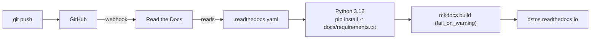
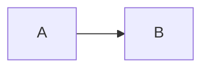

# Building the documentation

This site is built with [MkDocs](https://www.mkdocs.org/) and the
[Material](https://squidfunk.github.io/mkdocs-material/) theme, and published by
[Read the Docs](https://readthedocs.org/). The sources are the Markdown files in
`docs/`.

## Preview locally

```bash
python3 -m venv .venv-docs
.venv-docs/bin/pip install -r docs/requirements.txt
.venv-docs/bin/mkdocs serve              # http://127.0.0.1:8000, reloads on save
.venv-docs/bin/mkdocs build --strict     # the build Read the Docs runs
```

`serve` starts a local server that rebuilds on every save. `--strict` turns every
warning into an error: a broken link, a missing anchor, or a page that exists but is
not in the navigation fails the build. The pinned versions in
`docs/requirements.txt` make a local build match the published one.

## How it is published



| File | Role |
|---|---|
| `.readthedocs.yaml` | Read the Docs build: Ubuntu 24.04, Python 3.12, the MkDocs config, fail on warnings |
| `mkdocs.yml` | Site name, theme, navigation, Markdown extensions, plugins |
| `docs/requirements.txt` | Pinned toolchain |
| `docs/assets/` | Logo, wordmarks, screenshots, `extra.css`, MathJax configuration |
| `docs/overrides/` | The header template |
| `docs/api/openapi.yaml` | The OpenAPI description rendered on the [OpenAPI explorer](../api/openapi.md) |

To host your own copy, import your fork at [readthedocs.org](https://readthedocs.org/);
it finds `.readthedocs.yaml` and builds the default branch.

## Notation

The site uses a few Markdown extensions beyond the basics.

**Admonitions** call out something the reader should not miss:

```markdown
!!! warning "Southern-hemisphere boxes"
    Pass `--bbox=` with an equals sign.
```

The types in use are `note`, `tip`, `info`, `warning`, `failure`, `question` and
`abstract`; a `???` admonition is collapsed.

**Diagrams** are Mermaid in a fenced block:

````markdown

````

**Mathematics** uses `\( ... \)` inline and `\[ ... \]` for display, rendered by
MathJax.

**Tabs** present alternatives, such as Docker or a source build:

````markdown
=== "Docker"

    ```bash
    docker compose up
    ```

=== "From source"

    ```bash
    ./launcher
    ```
````

Link between pages with relative paths to the `.md` file, and every new page must be
listed under `nav:` in `mkdocs.yml` or the strict build fails. Screenshots live in
`docs/assets/screenshots/`; add `{ .screenshot }` after an image for the framed style.

## Checking a build

```bash
.venv-docs/bin/mkdocs build --strict
```

This builds the site and rejects warnings, including broken internal links and missing
navigation entries. It does not test external websites or prove that a documented
command works, so run the commands you document and look at the generated pages in a
browser for table layout, code wrapping and navigation.
