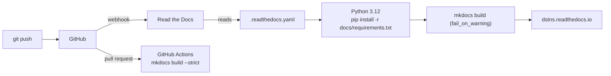

# Writing documentation

This site is built with [MkDocs](https://www.mkdocs.org/) and the
[Material](https://squidfunk.github.io/mkdocs-material/) theme, and published by
[Read the Docs](https://readthedocs.org/). The sources are the Markdown files
in `docs/`.

## Preview locally

```bash
python3 -m venv .venv-docs
.venv-docs/bin/pip install -r docs/requirements.txt
.venv-docs/bin/mkdocs serve              # http://127.0.0.1:8000, reloads on save
.venv-docs/bin/mkdocs build --strict     # exactly what CI and Read the Docs run
```

`--strict` turns every warning into an error: a broken link, a missing anchor,
or a page that exists but is not in the navigation fails the build.

## How it is published



| File | Role |
|---|---|
| `.readthedocs.yaml` | Read the Docs build: Ubuntu 24.04, Python 3.12, the MkDocs config, fail on warnings |
| `mkdocs.yml` | Site name, theme, navigation, Markdown extensions, plugins |
| `docs/requirements.txt` | Pinned toolchain, so local, CI and Read the Docs builds agree |
| `docs/assets/` | Logo, wordmarks, screenshots, `extra.css`, MathJax configuration |
| `docs/api/openapi.yaml` | The OpenAPI description rendered on the [OpenAPI explorer](../api/openapi.md) |

### Connecting Read the Docs

1. Sign in at [readthedocs.org](https://readthedocs.org/) with GitHub.
2. **Add project → Import from GitHub**, choose `varunkarthic/DSTNS`.
3. Read the Docs finds `.readthedocs.yaml` and builds `main` as `latest`.
4. Optional: under **Versions**, activate tags to publish versioned docs, and
   under **Settings → Pull request builds** enable previews.

!!! warning "Private repositories"
    The free Read the Docs Community plan builds **public** repositories only.
    While the repository is private, either make it public, use [Read the Docs
    for Business](https://about.readthedocs.com/), or publish the same build
    from GitHub Actions to GitHub Pages (`mkdocs gh-deploy`).

## Conventions

### Structure

| Section | Holds |
|---|---|
| Getting started | Task-first pages for new users |
| User guide | Operating DSTNS: CLI, observer, configuration |
| Concepts | How it works inside |
| API | The HTTP API, one page per group |
| Deployment | Running it for others |
| Development | Changing it |

Every new page goes into `nav:` in `mkdocs.yml`, or the build fails.

### Style

- Write for the reader's task. Lead with what to do; explain after.
- Real values only: every number, default and limit must match the code. Check
  it, and run the command you document.
- Code blocks get a language (`bash`, `json`, `cpp`, `text`), and a `title=` for
  files.
- Use admonitions for what the reader must not miss:

    ```markdown
    !!! warning "Southern-hemisphere boxes"
        Pass `--bbox=` with an equals sign.
    ```

    Types used here: `note`, `tip`, `info`, `warning`, `failure`, `question`,
    `abstract`. A `???` admonition is collapsed.

- Diagrams are Mermaid, in a fenced block:

    ````markdown
    ```mermaid
    flowchart LR
        A --> B
    ```
    ````

- Maths uses `\( … \)` inline and `\[ … \]` for display.
- Alternatives (macOS/Linux, Docker/source) go in content tabs (`=== "Docker"`).
- Link between pages with relative paths to the `.md` file; link to source
  code with a full GitHub URL.

### Screenshots

Screenshots live in `docs/assets/screenshots/` and are taken from a real run
at 1600 × 960. Add `{ .screenshot }` after the image for the framed style.
