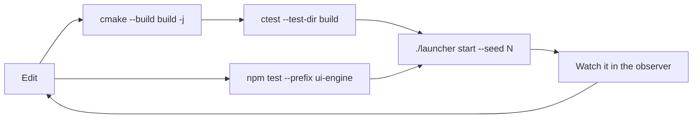

# Development

How the code is organised, how to build it, how to run its tests, and how the
documentation site is built. DSTNS is released under the AGPL, so you are free to
read it, build it and adapt it for your own use.

| Page | Covers |
|---|---|
| [Building from source](building.md) | Build options, targets, sanitizers, editor setup, the observer's dev server |
| [Testing](testing.md) | Every test suite, what it proves, and how to run it |
| [Building the documentation](documentation.md) | Previewing and building this site |
| [Quality assurance](quality-assurance.md) | Quality gates, review method, and the register of defects found and fixed |
| [Components](../components/index.md) | Per-class design notes for the core |
| [Design decisions](../design/decisions.md) | Why the system is built the way it is |

## Repository map

```text
DSTNS/
├── apps/dstns_server/        server entry point (flags, token, cache sweep)
├── include/dstns/, src/      the core library: engine, API, scenario, OSM, events, ASB, …
├── tools/                    dstns_scenario_export, _replay_verify, _road_index, _benchmark
├── tests/
│   ├── unit/                 native unit suites (one executable each)
│   ├── property/, replay/, performance/
│   ├── api/                  HTTP suites against a real server (Python)
│   ├── cli/                  wrapper integration, downloader and saved-seed suites
│   ├── launcher/             Python service and terminal interface suites
│   ├── integration/          SUMO smoke test
│   └── fixtures/             small OSM files
├── ui-engine/                the observer (React, Vite, Vitest)
├── dstns_launcher/           Python launcher: core, Textual interface, compatibility mode
├── scripts/                  build, test, dev, reset, fetch_osm.py
├── docker/                   entrypoint, dstns-run, TLS gateway
├── config/                   defaults.json, ui-config.json
├── data/fixtures/            a recorded real district
├── docs/                     this documentation (MkDocs)
├── Dockerfile, docker-compose.yml
├── mkdocs.yml, .readthedocs.yaml
└── .github/workflows/        continuous integration
```

## The development loop



For observer work, run the core once and the Vite dev server with hot reload:

```bash
./scripts/dev.sh          # dstns_server on 8090 + Vite on 5173 (proxying /api)
./launcher start --seed 382923 --no-open
open http://localhost:5173
```

## Related

- [Operations runbook](../deployment/operations.md): deploy, diagnose and recover.
- [Python client walkthrough](../api/client-walkthrough.md): write an integration.
- [Security policy](https://github.com/varunkarthic/DSTNS/blob/main/SECURITY.md): reporting a vulnerability.
