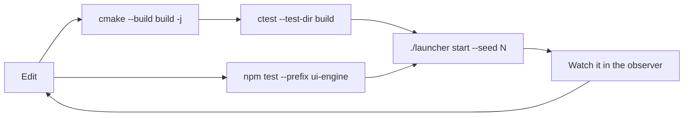

# Development

Everything needed to change DSTNS: the code layout, building, testing,
documenting and contributing.

| Page | For |
|---|---|
| [Contributing](contributing.md) | Workflow, conventions, commit style, review checklist |
| [Building from source](building.md) | Build options, targets, sanitizers, IDE setup, the observer's dev server |
| [Testing](testing.md) | Every test suite, what it proves, and how to write a new test |
| [Writing documentation](documentation.md) | This site: MkDocs, Read the Docs, conventions |
| [Maintainer guide](maintainers.md) | Going public, repository security settings, handling vulnerability reports, releasing |
| [Code evaluation, October 2026](audit-2026-10.md) | The latest review: defects found and fixed, and known issues |
| [Components](../components/index.md) | Per-class design notes for the core |

## Repository map

```text
DSTNS/
├── apps/dstns_server/        server entry point (flags, token, cache sweep)
├── include/dstns/, src/      the core library: engine, API, scenario, OSM, events, ASB, …
├── tools/                    dstns_scenario_export, _replay_verify, _road_index, _benchmark
├── tests/
│   ├── unit/                 native unit suites (one executable each)
│   ├── property/, replay/, performance/
│   ├── api/                  HTTP suites against a real server (Python)
│   ├── cli/                  launcher, downloader and saved-seed suites
│   ├── integration/          SUMO smoke test
│   └── fixtures/             small OSM files
├── ui-engine/                the observer (React, Vite, Vitest)
├── dstns-operator-cli/       the operator CLI (Node) and saved-seed store (Python)
├── scripts/                  build, test, dev, reset, fetch_osm.py
├── docker/                   entrypoint, dstns-run, TLS gateway
├── config/                   defaults.json, ui-config.json
├── data/fixtures/            a recorded real district
├── docs/                     this documentation (MkDocs)
├── Dockerfile, docker-compose.yml
├── mkdocs.yml, .readthedocs.yaml
└── .github/workflows/        continuous integration
```

## The development loop



For observer work, run the core once and the Vite dev server with hot reload:

```bash
./scripts/dev.sh          # dstns_server on 8090 + Vite on 5173 (proxying /api)
./launcher start --seed 382923 --no-open
open http://localhost:5173
```

## Maintenance guides

- [Dependency maintenance](dependencies.md): review and validate automated updates.
- [Operations runbook](../deployment/operations.md): deploy, diagnose and recover.
- [Python client walkthrough](../api/client-walkthrough.md): implement an integration.
- [Security policy](https://github.com/varunkarthic/DSTNS/blob/main/SECURITY.md):
  report a vulnerability and understand support and disclosure practices.
