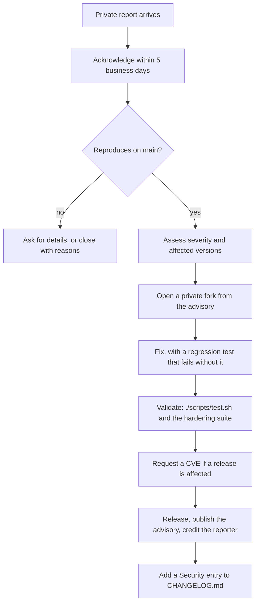

# Maintainer guide

This page is for people with admin access to the repository. It covers the
settings that make a public repository safe to run, how to handle a vulnerability
report, and how to cut a release.

## Before making the repository public

Work through this checklist once, in order. Each item says why it matters.

### 1. Audit the contents

Everything in the repository, including its full history, becomes public.

```bash
# Secrets and credentials in any commit, not just the latest
git log --all -p -G'(BEGIN (RSA|OPENSSH|EC) PRIVATE KEY|ghp_[A-Za-z0-9]{36}|AKIA[0-9A-Z]{16}|xox[baprs]-)' --format='%h %s' | head

# Files that should never be committed
git ls-files | grep -iE '\.(pem|key|p12|pfx|env)$|operator\.token|\.sqlite3?$|\.db$'

# Personal paths and addresses
git grep -nIE '/Users/[a-z]+|/home/[a-z]+|@(gmail|outlook)\.com' -- . ':!*.osm.xml' ':!package-lock.json'
```

The first two commands should print nothing. The third may show old local paths
(a username in a path is low risk, but it is personal). The bundled map fixture
contains OpenStreetMap `contact:email` tags written by mapmakers; these are public
OpenStreetMap data and are not a leak.

If a real secret is found, **rotate it first**, then remove it from history with
[`git filter-repo`](https://github.com/newren/git-filter-repo); deleting a file in a
new commit does not remove it from earlier ones.

**Check who is named in history.** Every commit records its author's name and email,
and those become public with the repository:

```bash
git log --all --format='%an <%ae>' | sort | uniq -c | sort -rn
```

Addresses at `users.noreply.github.com` are GitHub's privacy-preserving form. A
personal address (a Gmail or university address) belongs to a person who may not
expect it to be published. Before going public, either get each contributor's consent
or rewrite those commits to a noreply address with a
[`.mailmap`](https://git-scm.com/docs/gitmailmap) and `git filter-repo --mailmap`.
Rewriting history changes every commit hash after the first changed one, so do it
once, before anyone else clones, and tell collaborators to re-clone.

### 2. Turn on the security features

With the repository public, enable the following in **Settings → Code security**
(or by API). Private vulnerability reporting is what makes
[SECURITY.md](https://github.com/varunkarthic/DSTNS/blob/main/SECURITY.md) work.

| Feature | Why | Command |
|---|---|---|
| Private vulnerability reporting | The channel the security policy points to | `gh api -X PUT repos/OWNER/REPO/private-vulnerability-reporting` |
| Dependabot alerts | Known-vulnerable dependencies | `gh api -X PUT repos/OWNER/REPO/vulnerability-alerts` |
| Dependabot security updates | Automatic fix PRs | `gh api -X PUT repos/OWNER/REPO/automated-security-fixes` |
| Secret scanning and push protection | Blocks a pushed credential | `gh api -X PATCH repos/OWNER/REPO -f 'security_and_analysis[secret_scanning][status]=enabled' -f 'security_and_analysis[secret_scanning_push_protection][status]=enabled'` |
| CodeQL | Static analysis | Already configured in `.github/workflows/codeql.yml` |

Replace `OWNER/REPO` with `varunkarthic/DSTNS`. Then confirm:

```bash
gh api repos/varunkarthic/DSTNS/private-vulnerability-reporting --jq .enabled    # true
gh api repos/varunkarthic/DSTNS --jq .security_and_analysis                       # features enabled
```

### 3. Protect the default branch

A protected `main` means a bad merge or a stolen token cannot rewrite history or
skip review. Apply a rule that requires the CI jobs and a review:

```bash
gh api -X PUT repos/varunkarthic/DSTNS/branches/main/protection --input - <<'JSON'
{
  "required_status_checks": {
    "strict": true,
    "contexts": ["Core (C++ and HTTP)", "Observer", "Documentation", "Container image"]
  },
  "enforce_admins": false,
  "required_pull_request_reviews": { "required_approving_review_count": 0, "require_code_owner_reviews": false },
  "restrictions": null,
  "required_linear_history": true,
  "allow_force_pushes": false,
  "allow_deletions": false
}
JSON
```

| Setting | Effect |
|---|---|
| `contexts` | A pull request cannot merge until these CI jobs pass |
| `strict` | The branch must be up to date with `main` before merging |
| `required_approving_review_count: 0` | Changes must arrive as a pull request, but need no approval. GitHub does not let you approve your own pull request, so requiring 1 approval would make every change of a **solo maintainer** unmergeable. Raise it once there is a second maintainer |
| `require_code_owner_reviews: false` | Same reason: you are the only code owner. Turn it on, so changes to the API guard, SUMO bridge, downloader and Dockerfile need the owner's review, once others can open pull requests |
| `enforce_admins: false` | The owner can still merge their own work; set `true` once there are other maintainers |
| `allow_force_pushes: false` | History cannot be rewritten |

!!! warning "This can lock you out of direct pushes"
    With a review requirement, even the owner must open pull requests. Branch
    protection on a **private** repository needs a paid GitHub plan.

### 4. Secure the account

- Enable two-factor authentication, ideally with a hardware key or passkey.
- Use a fine-grained personal access token with the minimum scopes, and an expiry.
- Keep `.github/workflows` permissions read-only by default. The workflows here
  already declare `permissions: contents: read`; only CodeQL adds
  `security-events: write`.
- Review **Settings → Actions → General**: restrict actions to those from GitHub and
  verified creators, and require approval for workflows from first-time contributors.

### 5. Set up documentation hosting

Read the Docs needs the repository to be public on the free plan. See
[Writing documentation](documentation.md#connecting-read-the-docs).

## Handling a vulnerability report

The policy promises acknowledgement in 5 business days and an assessment in 14.



1. **Reproduce** in an isolated environment with the bundled map.
2. **Score** it. Use CVSS as a guide, and weigh the deployment: a flaw reachable only
   with shell access on the host is not the same as one a web page can trigger.
3. **Fix privately.** From the advisory page choose **Start a temporary private fork**,
   so the fix is not visible until it is released.
4. **Test.** Add a regression test, ideally in `tests/api/hardening_smoke.py`, that
   fails before the fix. Run `./scripts/test.sh`.
5. **Publish.** Merge the private fork, tag a release, publish the advisory, and
   credit the reporter if they consent. Aim for the 30-day (high severity) or 90-day
   target in the policy.
6. **Record it.** Add an entry under **Security** in [CHANGELOG.md](../changelog.md).

## Releasing

DSTNS follows [Semantic Versioning](https://semver.org/) for the API contract and the
engine, with changes recorded in [Keep a Changelog](https://keepachangelog.com/)
format.

| Change | Version bump |
|---|---|
| Fix with no behaviour change | patch |
| New route, field or setting, backwards compatible | minor |
| Removed or renamed route or field, or changed results for existing seeds | major |

```bash
# 1. Move the Unreleased entries in CHANGELOG.md under a new version heading and date.
# 2. Bump the engine version in CMakeLists.txt (project(dstns VERSION ...)) and, if the
#    observer changed, VERSION in ui-engine/src/App.tsx.
./scripts/test.sh                                   # everything green
git commit -am "chore(release): 2.1.0"
git tag -a v2.1.0 -m "DSTNS 2.1.0"
git push origin main v2.1.0
gh release create v2.1.0 --notes-file <(sed -n '/## \[2.1.0\]/,/## \[2.0.0\]/p' CHANGELOG.md | sed '$d')
```

!!! note "Results change is a breaking change"
    The [reproducibility guarantee](../concepts/reproducibility.md) holds within one
    version, so a fix that alters results for an existing seed or map (the October
    2026 roundabout fix is an example) must be called out in the changelog and, for
    a stable release, treated as a major change.

## Routine maintenance

| Task | How often | How |
|---|---|---|
| Review Dependabot pull requests | Weekly | [Dependency maintenance](dependencies.md) |
| Triage new issues and questions | Weekly | Label, ask for a seed and version, close duplicates |
| Review CodeQL alerts | On each alert | **Security → Code scanning** |
| Rebuild the container image | Monthly and on base-image advisories | `docker compose build --pull` |
| Re-run the full suite on a clean checkout | Before each release | `./scripts/test.sh` |
