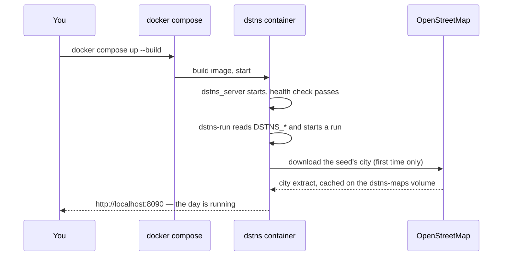

# Run with Docker

The DSTNS image holds everything: the engine, the observer it serves, the map
downloader and a recorded offline district. It runs on `linux/amd64` and
`linux/arm64` (Apple silicon) alike.

!!! abstract "In one line"
    `docker compose up --build`, then open <http://localhost:8090>.

## Requirements

- Docker Engine 24+ or Docker Desktop, with Compose v2 (`docker compose`, not
  `docker-compose`).
- About 1 GB of free memory for a typical district, 250 MB for the image and
  up to 50 MB per downloaded city.
- Internet access for city maps, unless you [run offline](#run-offline).

## Start

```bash
git clone https://github.com/varunkarthic/DSTNS.git
cd DSTNS
docker compose up --build
```

```text
dstns-1  | [dstns-run] seed 17310766248549826767: preparing the world
dstns-1  | [dstns-run] contacting OpenStreetMap for Dar es Salaam, Tanzania
dstns-1  | [dstns-run] downloading Dar es Salaam, Tanzania: 20 MiB
dstns-1  | [dstns-run] validating the Dar es Salaam, Tanzania extract
dstns-1  | [dstns-run] building
dstns-1  | [dstns-run] run run_4f1fccc516c6 is RUNNING; open the observer …
```

Open **<http://localhost:8090>**. Add `-d` to run in the background, and use
`docker compose logs -f` to follow it.



## Choose the run

The first run is configured with environment variables. Set them in your
shell, or in a `.env` file next to `docker-compose.yml`:

```bash
DSTNS_SEED=382923 DSTNS_DAY_TYPE=weekend DSTNS_SPEED=2 docker compose up
```

```dotenv title=".env"
DSTNS_SEED=382923
DSTNS_DAY_TYPE=weekend
DSTNS_SPEED=2
```

| Variable | Default | Meaning |
|---|---|---|
| `DSTNS_SEED` | `auto` | The seed. `auto` draws a fresh one |
| `DSTNS_DAY_TYPE` | `weekday` | `weekday` or `weekend` |
| `DSTNS_SPEED` | `1` | Speed, more than 0 and at most 5 |
| `DSTNS_DURATION` | `3600` | Wall-clock seconds a day takes at 1×, 60 to 3600 |
| `DSTNS_OSM_FILE` | `auto` | `auto` lets the seed choose a city; or a path inside the container |
| `DSTNS_HOST_PORT` | `8090` | Port on your machine |
| `DSTNS_AUTOSTART` | `1` | `0` starts the server idle, with no run |

Every variable is listed in the [Docker reference](../deployment/docker.md#environment-variables).

## Start another run

There is no need to restart the container:

```bash
docker compose exec dstns dstns-run --seed 42
docker compose exec dstns dstns-run --seed 42 --day-type weekend --speed 3
docker compose exec dstns dstns-run --status         # what is running
docker compose exec dstns dstns-run --help
```

`dstns-run` replaces the current run and follows the new one until it is
live. You can also use **Generate a new world** in the observer.

## Run offline

The image includes a recorded real district (1,196 junctions). Use it when
the machine has no internet access:

```bash
DSTNS_OSM_FILE=/app/data/fixtures/real_network.osm.xml docker compose up
```

Cities you have already downloaded stay in the `dstns-maps` volume and also
work offline.

## Stop, restart, clean up

```bash
docker compose stop                 # stop; the run state is lost, maps are kept
docker compose start                # start again (a fresh run)
docker compose down                 # remove the container, keep the volumes
docker compose down --volumes       # also delete cached maps and logs
```

## HTTPS

An nginx gateway with a self-signed certificate is one flag away:

```bash
docker compose --profile tls up --build
```

Open **<https://localhost:8443>** and accept the certificate warning. To use
your own certificate, put `dstns.crt` and `dstns.key` in
`docker/certificates/` first. See [Docker reference: TLS](../deployment/docker.md#tls-gateway).

## With SUMO

```bash
DSTNS_WITH_SUMO=1 docker compose up --build
```

This installs Debian's SUMO 1.15 package into the image, taking it from 234 MB to about 1.1 GB.
See the [SUMO adapter](../components/sumo-adapter.md).

## Problems?

??? failure "`port is already allocated`"
    Something else uses port 8090. Pick another: `DSTNS_HOST_PORT=9090 docker compose up`.

??? failure "`MAP_FETCH_FAILED` in the log"
    The container cannot reach OpenStreetMap's Overpass API. Check that Docker
    has network access (a proxy may need `HTTPS_PROXY` in the environment), or
    [run offline](#run-offline). The observer stays up and shows the reason.

??? failure "The build fails at `npm ci` or `cmake`"
    Both download dependencies. Retry; behind a proxy, pass it to the build:
    `docker compose build --build-arg HTTPS_PROXY=$HTTPS_PROXY`.

??? question "The observer shows DEGRADED"
    The browser is falling behind the simulation, often in a background tab or
    a virtual machine. DSTNS slows itself down to match; see
    [Adaptive backpressure](../concepts/backpressure.md).

Full reference, production advice and more fixes: [Docker
deployment](../deployment/docker.md).

## Access control and operational readiness

Compose publishes the observer on **`127.0.0.1` only**, so nothing outside your
machine can reach it. To serve other machines, set `DSTNS_BIND=0.0.0.0` (this
applies to the TLS gateway port as well). The TLS profile supplies encryption, not
user authentication, and the plain HTTP port stays mapped, so put an
authenticating proxy in front before allowing remote clients. See
[Security](../deployment/security.md).

Use the [Operations runbook](../deployment/operations.md) to distinguish a healthy
container from a running simulation, preserve experiment inputs, and plan upgrades.
