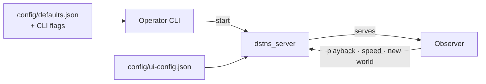

# User guide

How to operate DSTNS day to day: starting and steering runs, reading the
observer, and configuring both.

| Page | Covers |
|---|---|
| **Running simulations** | |
| [Operator CLI](operator-cli.md) | Every command and flag of `./launcher`, and what happens step by step when a run starts |
| [Playback control](playback-control.md) | Play, pause, speed, step, seek, reset, new worlds and the end of the day, in the observer and over HTTP |
| [Seeds and places](seeds-and-places.md) | What a seed decides, the 181-city catalogue, the map cache and pinned maps |
| [Saved seeds](saved-seeds.md) | Naming, saving, inspecting, replaying and sharing complete run configurations |
| **Observing** | |
| [Observer interface](observer-interface.md) | The browser interface, control by control: map, telemetry, notifications, Auto Focus, tutorial, report |
| [Reports and exports](reports.md) | The PDF report, data from the API, log files and the SUMO bundle |
| **Configuring** | |
| [Configuration](configuration.md) | `config/defaults.json`, start request fields, CLI and server flags, environment variables |
| [GPU acceleration](gpu-acceleration.md) | Running the physics on a GPU: turning it on and off, platforms, diagnostics, preparing a machine |
| [Observer configuration](observer-configuration.md) | `config/ui-config.json`: the interface's starting state |
| **How-to** | |
| [Recipes](recipes.md) | Short answers to common tasks |

The division of authority: **the CLI decides what runs** (seed, day type, map,
duration, speed), **the observer decides how it is watched** (layers, focus,
notifications) and offers playback, speed and a new world. Neither holds
simulation state; both read what the core publishes.
