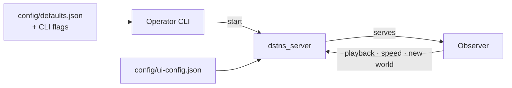

# User guide

How to operate DSTNS day to day: starting and steering runs, reading the
observer, and configuring both.

| Page | Covers |
|---|---|
| [Operator CLI](operator-cli.md) | Every command and flag of `./launcher`, and what happens step by step when a run starts |
| [Observer interface](observer-interface.md) | The browser interface, control by control: map, telemetry, notifications, Auto Focus, tutorial, report |
| [Playback control](playback-control.md) | Play, pause, step, seek, reset and speed, and how each maps to the engine |
| [Seeds and places](seeds-and-places.md) | What a seed decides, the 181-city catalogue, the map cache, pinned maps and saved seeds |
| [Configuration](configuration.md) | `config/defaults.json`, start request fields, CLI and server flags, environment variables |
| [Observer configuration](observer-configuration.md) | `config/ui-config.json`: the interface's starting state |

The division of authority: **the CLI decides what runs** (seed, day type, map,
duration, speed), **the observer decides how it is watched** (layers, focus,
notifications) and offers playback, speed and a new world. Neither holds
simulation state; both read what the core publishes.
