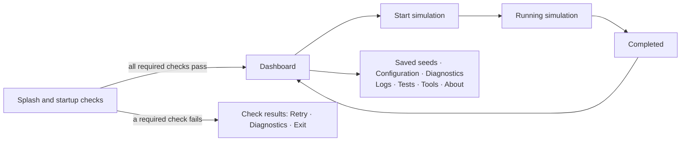

# Launcher

`./launcher` is how an operator builds DSTNS, checks that a machine can run it,
starts and supervises simulations, edits the configuration, manages saved seeds,
reads logs and runs the tests. It is also the only supported way to start a
simulation: the server refuses start requests that lack the credential the launcher
holds.

The launcher has a keyboard-driven terminal interface for interactive use, and plain
commands for scripts. Both drive the same operations, so anything one can do the
other can too.

## At a glance

```bash
./launcher                        # open the launcher (in a terminal)
./launcher start --seed 382923    # start a particular run
./launcher test unit              # a scripted command: prints lines, returns a status
./launcher help                   # every command and option
```

`python3 launcher.py` is equivalent to `./launcher`. Both run the Python package
`dstns_launcher`.

## Interfaces

| Interface | When it is used | Needs |
|---|---|---|
| **Terminal interface** | Interactive use in a terminal | Textual and Rich, installed automatically (below) |
| **Compatibility mode** | The terminal interface cannot start, or `--reduced-ui` | Rich if available, otherwise nothing |
| **Plain mode** | `--no-tui`, `TERM=dumb`, or Rich is unavailable | Nothing beyond Python |
| **Scripted output** | Any command run without a terminal, and `test`, `seeds`, `sumo`, `reset`, `ui`, `help`, `version`, `license` | Nothing beyond Python |

The launcher never becomes impossible to start because a richer interface failed. If
the terminal interface cannot start, or stops unexpectedly, the launcher records the
reason in `logs/launcher.log`, says so in one line, and continues in compatibility
mode:

```text
DSTNS Launcher

The enhanced terminal interface could not be started.
Switching to compatibility mode.

Reason:
  The Textual package is not installed.
  Details: logs/launcher.log
```

### Installing the terminal interface

The terminal interface uses two Python packages, [Textual](https://textual.textualize.io/)
and [Rich](https://rich.readthedocs.io/). The first time `./launcher` is used
interactively, it creates a private environment, `.venv-launcher/`, and installs the
pinned versions listed in `dstns_launcher/requirements.txt` into it. Nothing is
installed into your system Python. Later starts use the environment directly.

If the installation cannot complete (no network, no `venv` module, an unwritable
directory) the launcher continues in compatibility mode. Set
`DSTNS_LAUNCHER_NO_INSTALL=1` to prevent the installation altogether. To install by
hand:

```bash
python3 -m venv .venv-launcher
.venv-launcher/bin/pip install -r dstns_launcher/requirements.txt
```

Scripted commands never install anything.

## The terminal interface



### Splash

The DSTNS wordmark is generated from the same SVG outlines as the documentation
logo, preserving its open-sided D and rounded letter shapes. It uses Unicode
half-block characters, with a smaller rendering for narrower terminals and plain
`D S T N S` when the artwork cannot fit or Unicode is unavailable. No special
font, image protocol or graphics library is required.

The splash shows the version, licence and real startup checks for **at least three
seconds**. The reading time overlaps the checks: a five-second check does not add
another three-second delay. When checks finish early, the animation stops and a
static completion message remains until the display time ends. Keyboard input
and resizing stay responsive.

Passing checks lead to the dashboard (or the requested run). A required failure
opens the detailed results and remedies. Checks are not repeated during this
transition. `--no-splash` skips the splash and its minimum display time, then runs
the same checks on the environment screen.

### Loading feedback

The splash, environment check, simulation preparation, tests and tools share an
ASCII activity indicator. It advances four times per second only while work is
active on the visible screen. The label names the current step; it stops when
the operation completes or fails. Environment checks also show the actual number
of completed checks. Percentages are never simulated; only the opening splash has
the three-second minimum display time described above.

During a map download, the launcher shows received MiB. A progress bar appears
only when the server provides a positive byte total. When the total is unknown,
the activity label remains visible without a percentage. Once the world is ready,
the running screen switches to actual simulation progress.

```bash
./launcher --no-animation              # keep status text; disable terminal motion
./launcher --no-splash                 # go directly to environment checks
./launcher --no-tui start --no-open \
  --seed 382923 --osm-file data/fixtures/real_network.osm.xml
```

The first command retains the full keyboard interface with a static `[working]`
marker. The second removes only the opening splash. The third uses plain output
and the bundled real OSM extract, so map acquisition does not need a network
connection; missing build dependencies may still require installation. Plain
mode and redirected output do not emit animation frames.

### Environment check

The splash runs these real checks concurrently and reports their completion
count and the latest check. They also run on the environment screen when
`--no-splash` is used, or when retrying failed checks:

| Check | Required | Fails or warns when |
|---|---|---|
| Host platform | Yes | Not macOS or Linux (warning) |
| Python | Yes | Older than 3.10 (warning) |
| Build tools | Yes | The core is not built and CMake or a C++ compiler is missing |
| Configuration | Yes | `config/defaults.json` or `config/ui-config.json` is invalid |
| Workspace | Yes | The logs directory is not writable |
| Map downloader | Yes | `scripts/fetch_osm.py` is missing or does not compile |
| Map cache | Yes | `data/maps/` is not writable |
| Simulation core | Yes | The binary is missing (warning: it is built on start) |
| Node.js | No | Missing or older than 20; needed only to rebuild the observer |
| Licence | No | `LICENSE` is missing or not the AGPL text |
| Observer settings | No | `config/ui-config.json` has values the observer ignores |
| Observer bundle | No | Not built, or older than its sources (rebuilt on start) |
| API port | No | Informational: in use by a running server, or free |
| SUMO | No | Installed but does not start |
| Vulkan | No, unless `compute.backend` is `vulkan` with `require_vulkan` | No GPU passed the self-test. In `auto` and `cpu` modes this is informational: the simulation runs on the CPU |
| Compute backend | No | Informational: what the server will do with GPUs |
| Shader compiler | No | Informational: needed only to change the compute shaders |

The last three appear under **GPU acceleration**. The Vulkan check is a real test,
run by the server binary: every device is brought up, its pipelines compiled, a
kernel dispatched and the answer checked. Its result is cached in
`data/cache/compute-probe.json` against the binary, the compute settings and the
installed drivers, so after the first launch it takes a millisecond.

Each state is shown with a symbol **and** a word: `○ Pending`, `◌ Checking`, `✓ OK`,
`! Warning`, `✗ Failed`, `- Skipped`. If every required check passes, the launcher
continues to the dashboard; warnings stay visible there. If one fails, it explains why
and what to do, and offers **Retry**, **Diagnostics**, **Continue to the dashboard**
and **Exit**.

These startup checks validate configuration, compile-check the map downloader,
probe the core executable and installed tools, inspect the observer bundle, and
check workspace access and the API port. They are readiness checks, not the full
regression suite. Run **Tests**, or enable suites in **Diagnostics**, for native,
HTTP and observer test cases. Scripted commands do not add splash delays.

### Dashboard

The menu on the left, details of the highlighted item on the right, and the server's
live state in the header (`✓ READY`, `◌ RUNNING`, `✗ NOT READY`). When a simulation is
running, **Running simulation** appears at the top of the menu.

| Item | Opens |
|---|---|
| Start simulation | The start form |
| Saved seeds | Saved configurations: start, inspect or delete |
| Configuration | The editor for `config/defaults.json` |
| Diagnostics | Every check, optionally with the test suites; server, terminal and path details |
| Logs | The system log and the API, operator-event and lifecycle journals |
| Tests | The test stages, with live output |
| Tools | The SUMO toolchain check, rebuilding the observer, resetting runtime data |
| Documentation | This site, in your browser |
| About | Version, copyright, licence and map-data attribution |
| Exit | Leaves the launcher, stopping a simulation it started after confirmation |

### Start simulation

| Field | Meaning |
|---|---|
| Seed | Empty for a fresh seed, or decimal or `0x` hexadecimal up to 128 bits |
| Day type | Weekday or weekend |
| Map | Chosen by the seed, a cached city, the bundled offline district, or another file |
| Speed | Initial speed, greater than 0 and at most 5 |
| Save as, Description | Optionally save the configuration as a [saved seed](saved-seeds.md) |
| Open observer | Open the observer in your browser when the run starts |

Values are checked with the same rules as the command line, and problems are shown
beside the field. **Ctrl+S** or **Start simulation** begins.

### Running simulation

While the world is prepared the screen shows what is actually happening: each build
step, the server starting, and, for a seed-selected city, the map download with its
real size when the server knows it. Then it shows the engine's own figures, refreshed
four times a second:

| Shown | Source |
|---|---|
| Place, seed, day | The loaded world |
| Simulation time and progress | `GET /api/v1/playback/status` |
| State and speed | The same |
| Vehicles (modelled), halting | `GET /api/v1/view/traffic` |
| Congestion and its 15-minute average | `GET /api/v1/view/congestion` |
| Flooded and closed roads, active storms | `GET /api/v1/view/traffic` |
| CPU and memory | Measured with `ps`, for a server this launcher started only |
| Time until the day ends | Remaining virtual time divided by the current rate, while running |

Below them is the live log: the launcher's own messages and new lines of the server's
`system.log`. The terminal does not attempt to draw the city; the observer does that.
Polling never touches the simulation, so watching from the terminal cannot change a
run.

| Key | Action |
|---|---|
| Space or p | Pause or resume |
| o | Open the observer |
| s | Stop the simulation, after confirmation |
| Esc or b | Back to the dashboard; the simulation keeps running |
| f | Toggle following the newest log line |
| c | Clear the visible log (the log files are untouched) |
| End | Jump to the newest log line |

**Stopping** asks first. It requests a graceful shutdown, shows *Stopping
simulation…*, waits up to ten seconds, and only then terminates a server the launcher
started. It reports that the simulation stopped only once the server has actually
exited.

### Completed

When the virtual day reaches 24:00:00 the launcher shows the run's summary and offers
**Open the observer** (where **Save Report** produces the PDF), **Restart the same
day**, **Run another simulation** and **Back to main menu**.

### Configuration

Edits `config/defaults.json`, grouped as **Run**, **Map**, **Modules**, **Weather**
and **Server**. Only settings that the launcher or the engine actually read are
listed; see [Configuration](configuration.md) for every key. Each value is validated
as you type, with the reason shown beside it, and invalid values are never written.

The header shows `! UNSAVED` while there are changes. **Ctrl+S** saves. Leaving with
unsaved changes asks **Save and continue**, **Discard changes** or **Cancel**.

### Errors

A recoverable error stays inside the interface. It says what happened, what to do,
and where the details are, and offers the next steps:

```text
╭─ Unable to start the simulation ─────────────────────╮
│ could not fetch the map                               │
│                                                       │
│ Check the network, VPN or proxy, or set               │
│ DSTNS_OVERPASS_ENDPOINTS to a reachable instance.     │
│                                                       │
│ Details have been written to: logs/launcher.log       │
│                                                       │
│ > Retry                                               │
│   Diagnostics                                         │
│   Return to menu                                      │
╰───────────────────────────────────────────────────────╯
```

Python tracebacks are shown only with `--debug`.

## Keyboard

| Key | Action |
|---|---|
| ↑ ↓, or k j | Move |
| Home, End | First or last item |
| Enter | Select |
| Tab, Shift+Tab | Next or previous control |
| Esc | Back, or close a dialog |
| ? | Help for the current screen |
| q | Quit (from the dashboard and the environment check) |
| Ctrl+C | Quit safely: if a simulation this launcher started is running, it asks first |

The selected item always carries a `>` marker, so selection is visible without colour.
A mouse works but is never needed.

## Terminal size and capabilities

| Class | Size | Layout |
|---|---|---|
| Large | At least 100 × 30 | Sidebar and content, full wordmark, full key hints |
| Medium | At least 70 × 22 | Narrower sidebar, shorter hints |
| Small | At least 50 × 15 | One column: the menu above the content |
| Too small | Below 50 × 15 | A notice with the current and minimum size; R switches to compatibility mode |

Resizing reflows the screen and keeps the current screen, the selection, form values
and a running simulation. Menus and status summaries adapt to the available
width. Log panes support scrolling when previously rendered output is wider than
the resized terminal.

In the small running layout, the place, seed, simulation time, state and speed
remain visible alongside progress and live output. The additional network and
process metrics return when the terminal is enlarged; the browser observer also
provides the network details.

The launcher assumes only the terminal's own monospace font: no Nerd Fonts, no
ligatures, no images. Colour degrades from truecolour to 256 and 16 colours to none
(set `NO_COLOR=1` or pass `--no-color`), and every state is also written as a word.
It works over SSH and in IDE terminals.

## Commands

| Command | Does |
|---|---|
| *(none)* | In a terminal, opens the launcher. Without one, starts a run, like `start` |
| `start` | Build what changed, start or reuse the server, start a run. In a terminal, shows it on the running screen |
| `console` | Opens the launcher's dashboard |
| `seeds save\|list\|inspect\|delete [ID]` | Manage saved seeds, printing JSON; see [Saved seeds](saved-seeds.md) |
| `ui open\|dev\|build\|install` | Open the observer, run its Vite development server, build its bundle, or install its dependencies |
| `logs [system\|api\|event\|playback]` | Print a log. Without a source, in a terminal, opens the log viewer |
| `config` | Opens the configuration editor; without a terminal, prints the current values |
| `test [all\|unit\|api\|replay\|benchmark\|sumo\|ui]` | Run test stages and print a summary; the exit status is non-zero if any fails |
| `sumo` | Check the SUMO toolchain on a synthetic grid, outside the server |
| `diagnostics [gpu] [--refresh]` | Run the environment checks and print them; `gpu` tests every Vulkan device for real and lists the results (exit 3 if the simulation would run on the CPU) |
| `bootstrap [--check] [--yes] [--profile minimal\|standard\|full]` | Install what DSTNS needs with the system package manager, after showing the plan; `--check` only reports. Never installs GPU drivers. See [GPU acceleration](gpu-acceleration.md#preparing-a-machine) |
| `reset [--yes]` | Delete runtime logs, the journal, checkpoints and temporary files, after confirmation |
| `help`, `version`, `license` | Usage, version and licence notice, the licence text |
| `--mode=server` | Run `dstns_server` in the foreground with the configured host and port |

### Run options

For `start` and `seeds save`:

| Option | Range | Meaning |
|---|---|---|
| `--seed N` | Decimal or `0x` hex, up to 128 bits | The seed. Omitted: a fresh 64-bit seed |
| `--saved-seed ID` | | Run a saved configuration; excludes `--seed` |
| `--save-seed ID` | | Save this run's configuration under `ID` |
| `--description TEXT` | | Note stored with `--save-seed` |
| `--day-type weekday\|weekend` | | Day type |
| `--duration S` | Integer 60 to 3600 | Wall-clock seconds per virtual day at 1× |
| `--speed X` | 0.01 to 5 | Initial speed multiplier |
| `--max-nodes N` | Integer 2 to 50000 | Graph size cap |
| `--osm-file PATH` | Existing file | Pin a map instead of letting the seed choose |
| `--open`, `--no-open` | | Open the observer in a browser. Default: when a desktop is present |
| `--compute auto\|cpu\|vulkan` | | Where the physics runs, for a server this launcher starts; overrides `compute.backend`. Results are identical on every backend |
| `--gpu-device SPEC` | | The GPU: index, UUID or part of its name |

### Interface options

| Option | Effect |
|---|---|
| `--reduced-ui` | Use compatibility mode |
| `--no-tui` | Use plain mode |
| `--no-color` | No colour (`NO_COLOR` is also honoured) |
| `--no-splash` | Skip the splash; retain environment checks |
| `--no-animation` | Disable terminal animation while keeping activity labels |
| `--debug` | Verbose launcher log, tracebacks, and diagnostics on standard error for scripted commands |
| `--verbose`, `-v` | Show command output while builds and tests run |
| `--yes`, `-y` | Do not ask for confirmation (`reset`, `bootstrap`) |

## What happens when a run starts

1. **Validate.** `config/defaults.json` and the options are checked against the same
   bounds the engine enforces, and the start request is assembled (see
   [Configuration](configuration.md#precedence)).
2. **Build what changed.** The launcher fingerprints the core's sources
   (`CMakeLists.txt`, `src/`, `include/`, `apps/dstns_server`) and the observer's, and
   rebuilds each only when its fingerprint differs from the one stored beside the last
   build (`.launcher-source`).
3. **Find a server.** If the port (`DSTNS_API_PORT`, else the last one recorded in
   `logs/launcher.json`, else `api.port`) answers `/health` as a current DSTNS server,
   the launcher attaches to it. If something else holds the port, or an older DSTNS, it
   uses the next free port. Otherwise it starts `dstns_server --host H --port P --logs L`
   and waits up to 15 seconds for it to be healthy.
4. **Open the observer**, when requested, and wait for it to load, so the world's
   preparation is watched in the browser rather than behind a blank tab.
5. **Start the run.** `POST /api/v1/playback/start` with the operator credential from
   `logs/operator.token`, following the map download for a seed-selected city.
6. **Confirm the world.** The launcher reads the topology, checks that a real
   OpenStreetMap network loaded, and reports the city, the coordinates, whether the map
   was downloaded or cached, and the size of the network.

If a run is already in progress on the server and no run options were given, the
launcher shows that run instead of starting another.

Without a terminal, `start` then follows the server it started and exits with its
status: 0 when the server stops normally, 1 otherwise. A server it attached to is left
running.

## Ending a session

Leaving the launcher stops a server it started, after confirmation in the interface. A
server it attached to keeps running. When the launcher is ended by `SIGTERM`, `SIGHUP`
(the terminal closed) or Ctrl+C in scripted use, it stops a server it started before
exiting. Cancellation during startup also reaches build commands and their
descendants, prevents a cancelled build from being marked complete, and stops a
server created by the pending startup. **Stop** on the running screen requests
server shutdown; it is separate from pausing simulation time.

## Exit codes

| Code | Meaning |
|---|---|
| 0 | Success |
| 1 | A launcher, configuration, environment or simulation failure, or a failed test stage |
| 3 | `diagnostics gpu`: no usable GPU; the simulation would run on the CPU |
| 130 | Interrupted with Ctrl+C |
| 143 | Terminated with `SIGTERM` |

## Diagnostics

The launcher writes its own log to `logs/launcher.log` (rotated at 1 MB, two backups):
the version, Python and operating system, the terminal's capabilities, environment
check results, server starts and stops, fallbacks to compatibility mode, and the full
traceback of any unexpected error. It never records the operator credential or
environment values. Run with `--debug` for more detail, and for tracebacks on screen.

**Diagnostics** in the dashboard re-runs every check, optionally with the core, HTTP,
loading and observer test suites, and shows the running server's version, compute
backend and SUMO status, the terminal's size and capabilities, and the paths in use.
**GPU diagnostics** tests every Vulkan device and lists each one's result.

## Failure messages

| Message | Meaning and remedy |
|---|---|
| `playback.tick_rate must be in (0, 5]` | `config/defaults.json` asks for a speed the engine refuses |
| `Seed must be a decimal integer or 0x hexadecimal, within 128 bits` | Malformed `--seed` |
| `--seed and --saved-seed are mutually exclusive` | Pick one |
| `OSM data unavailable; provide --osm-file PATH` | A pinned map path does not exist |
| `MAP_FETCH_FAILED …` | The seed's district could not be downloaded. The launcher lists maps already on disk and the command to run one offline |
| `Server did not become healthy within 15s` | See [Troubleshooting](../troubleshooting.md#health-check-timeout-during-start-up) |
| `The server did not load a usable real OSM network.` | The run started but the topology is empty or synthetic |
| `Unknown option: …`, `Unknown command: …` | See `./launcher help` |

More in [Troubleshooting](../troubleshooting.md#the-launcher).
