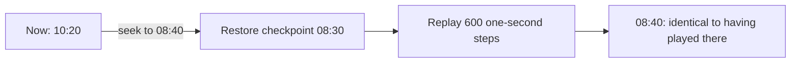
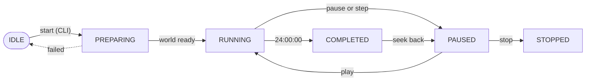

# Playback control

How to move through a simulated day: play and pause, change speed, step, jump
backwards and forwards, restart the day, replace the world, and stop. Every control in
the observer is a real engine operation, and every one is also available over HTTP,
so this page shows both.

## The virtual day

A run simulates one day, from 00:00:00 to 24:00:00 (86,400 virtual seconds). At 1×,
the whole day takes the configured duration, an hour by default (`--duration`, 60 to
3,600 wall-clock seconds). At 2× it takes half as long, and so on.

Whatever the speed, the physics advances in steps of exactly one virtual second, so
**speed changes pacing, never results**. Playing, stepping and seeking to the same
time all give identical state.

## Controls at a glance

| Control | Observer | HTTP | Effect |
|---|---|---|---|
| Play | **Play** | `POST /api/v1/playback/play` | Virtual time runs |
| Pause | **Pause** | `POST /api/v1/playback/pause` | Virtual time stops; the world stays readable |
| Speed | **0.25×** to **5×** | `PUT /api/v1/control/tick-rate` | Changes how fast virtual time passes |
| Step | **Step** | `POST /api/v1/playback/step` | Advances a fixed interval and holds paused |
| Back | **Back** | `POST /api/v1/playback/seek` | Moves back by the skip interval |
| Forward | **Forward** | `POST /api/v1/playback/seek` | Moves forward by the skip interval |
| Jump to a time | | `POST /api/v1/playback/seek` | Moves to any time of day |
| Reset | **Reset**, after confirmation | `POST /api/v1/playback/seek` to 0 | Restarts the same day from 00:00:00 |
| New world | **Generate a new world**, after confirmation | `POST /api/v1/world/regenerate` | Replaces the world with one from a fresh seed |
| Terminate | **Terminate**, after confirmation | `POST /api/v1/system/terminate` | Ends the run and stops the server |

The observer's controls are in the command rail along the bottom of the screen. See
[Observer interface: command rail](observer-interface.md#command-rail) for their
appearance and keyboard behaviour.

## Play and pause

```bash
curl -s -X POST localhost:8090/api/v1/playback/pause
curl -s -X POST localhost:8090/api/v1/playback/play
```

Pausing a paused run, or playing a running one, succeeds without changing anything
(`"changed": false`). A client acting automatically can attach a **guard** so that it
never overrides a decision the operator made in the meantime:

```json
{ "expected_run_id": "run_3fa2c1d0e9b4", "expected_playback_revision": 41 }
```

If the run or its playback state has changed since the client read them, the request
fails with 409 and nothing happens.

## Speed

The observer offers 0.25×, 0.5×, 1×, 2×, 3× and 5×. The API accepts any rate greater
than 0 and at most 5:

```bash
curl -s -X PUT localhost:8090/api/v1/control/tick-rate \
     -H "Content-Type: application/json" -d '{"tick_rate": 2}'
```

A speed change takes effect from the current instant; it never applies retroactively.
Speed changes are recorded in the control history and can be undone.

!!! note "When the observer lowers the speed itself"
    If the browser cannot keep up, [Adaptive backpressure](../concepts/backpressure.md)
    holds the applied speed below the one requested. The speed control shows the
    applied rate in amber with the requested rate underlined, and restores the request
    automatically once the browser has caught up.

## Step

**Step** advances by the step interval (1 minute by default) and leaves the run
paused, so you can watch the day minute by minute:

```bash
curl -s -X POST localhost:8090/api/v1/playback/step \
     -H "Content-Type: application/json" -d '{"seconds": 60}'
```

`seconds` is 1 to 3,600. A step that reaches 24:00:00 completes the run; a step at
24:00:00 is refused with 409.

## Seek: back, forward and jump

**Back** and **Forward** move by the skip interval (15 minutes by default) and keep the
current play state. Over HTTP, seek to any time:

```bash
curl -s -X POST localhost:8090/api/v1/playback/seek \
     -H "Content-Type: application/json" -d '{"target_time": "17:30:00"}'
```

`target_time` is `HH:MM:SS` or a number of seconds from 0 to 86,400. Add
`"play": true` to start playing at the target.

### How seeking stays exact



The engine stores a checkpoint of the whole network every 15 virtual minutes. A
backward seek restores the nearest checkpoint at or before the target and replays the
physics forward to it; a forward seek simulates forward. Either way the result is
identical to having played to that time. The longest possible replay is 899 seconds,
which takes a fraction of a second.

While a seek replays, the run is briefly `SEEKING`. Seeking to 24:00:00 completes the
run. Seeking is refused (409) while a world is being prepared or the server is
terminating.

!!! info "Operator edits and seeking"
    Road overrides, signal overrides and other operator edits are not rewound by a
    seek: they stand until undone. See
    [Known limitations](../limitations.md#operator-edits-are-not-part-of-the-replay-journal).

## Reset: restart the day

**Reset** asks for confirmation, then returns the same world to 00:00:00. The seed, the
map and the scenario are unchanged, so the day plays out exactly as before.

`POST /api/v1/playback/reset` is a different, stronger operation: it discards the
world entirely and returns the server to `IDLE`, ready for the CLI to start a new run.
The observer does not use it.

## Generate a new world

**Generate a new world** (the arrows beside the seed) replaces the world with one from
a fresh, securely generated seed, keeping the rest of the configuration. A
seed-selected map moves to the new seed's city; a pinned map stays pinned.

1. The observer asks for confirmation.
2. The current world keeps running while the new one is prepared, with progress shown.
3. The new world is installed at 00:00:00, paused, at the requested speed.
4. If preparation fails, the current world is left exactly as it was.

Operators can disable this with `DSTNS_DISABLE_WORLD_REGENERATION=1`. Choosing a
*specific* seed is a CLI operation: `./launcher start --seed N`.

## Stop and terminate

| Operation | Request | Result |
|---|---|---|
| Stop | `POST /api/v1/playback/stop` | The run moves to `STOPPED`; the world stays readable |
| Terminate | `POST /api/v1/system/terminate` | The server shuts down; a CLI session attached to it ends |

The observer offers only **Terminate**, after confirmation.

## The end of the day

When the clock reaches 24:00:00, by playing, stepping or seeking, the run becomes
`COMPLETED` and the observer offers to save a report, restart the same day, or
generate a new world. Seeking back into the day from `COMPLETED` resumes the run.
See [Reports and exports](reports.md).

## Lifecycle



A seek from any of the running states passes briefly through `SEEKING` and returns to
the state it came from: running if it was running or `play` was requested, otherwise
paused. `stop` is also accepted while running.

Every state and transition, with the requests that are allowed in each, is in
[Lifecycle](../api/lifecycle.md).

## Related

- [Simulation engine: checkpoints and seeking](../concepts/simulation-engine.md#checkpoints-and-seeking)
- [Playback API](../api/playback-api.md): every request and response field
- [Observer configuration](observer-configuration.md#playback): skip and step intervals
