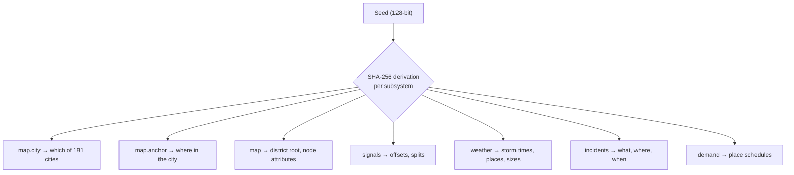

# Seeds and places

A DSTNS run is named by one number, its **seed**. The seed decides where the
simulation happens and everything that happens there. This page explains what
a seed is, how it becomes a real place, how maps are cached, and how to save
and share configurations.

## What a seed is

A seed is an unsigned integer of up to 128 bits. You write it as a decimal
number everywhere you see one: on the command line, in the observer, in
reports. The same seed shown in the interface is the one you type to get the
same world back.

| You write | Means |
|---|---|
| `382923` | That seed |
| `0x5d7cb` | The same seed in hexadecimal (the internal form, shown as `seed_hex` in the API) |
| *(nothing)*, `auto`, `random`, `0` | Draw a fresh 64-bit seed, short enough to read off the screen and retype |

```bash
./launcher start --seed 382923
./launcher start --seed 0x5d7cb      # the same world
./launcher start                     # a fresh seed
```

## What a seed decides



Each subsystem draws from its own sub-seed, derived from the master seed with
SHA-256 and a fixed label. Changing one subsystem's code therefore never
shifts another's random choices. See [Deterministic
seeding](../concepts/deterministic-seeding.md).

## From seed to place

Under the `urban-crfg-v3` map selection:

1. **City.** The `map.city` sub-seed picks one of 181 cities in 83 countries,
   on every inhabited continent (25 south of the equator, 62 west of
   Greenwich).
2. **Extract.** The city's extract is a square, 5 km on a side by default,
   centred on the city. Every seed that lands on the same city shares it.
3. **Anchor.** The `map.anchor` sub-seed picks a point in the middle half of
   the extract.
4. **District.** The road network grows outward from the junction nearest the
   anchor, along real roads, until it reaches about 3,000 junctions.

Two seeds that land on the same city therefore give two different districts of
it, from one download. See [OSM map generation](../concepts/osm-map-generation.md)
for the details.

!!! note "The catalogue is part of the version"
    Which city a seed means depends on the catalogue and its order. Changing
    either would silently move every saved seed somewhere else, so they are
    frozen under the version name `urban-crfg-v3`, and seeds saved under any
    other version are refused rather than reinterpreted.

??? info "All 181 cities, in catalogue order"
    | # | City | Country | Latitude | Longitude |
    |---:|---|---|---:|---:|
    | 0 | London | United Kingdom | 51.5074 | -0.1278 |
    | 1 | Paris | France | 48.8566 | 2.3522 |
    | 2 | Berlin | Germany | 52.5200 | 13.4050 |
    | 3 | Madrid | Spain | 40.4168 | -3.7038 |
    | 4 | Barcelona | Spain | 41.3874 | 2.1686 |
    | 5 | Rome | Italy | 41.9028 | 12.4964 |
    | 6 | Milan | Italy | 45.4642 | 9.1900 |
    | 7 | Amsterdam | Netherlands | 52.3676 | 4.9041 |
    | 8 | Rotterdam | Netherlands | 51.9244 | 4.4777 |
    | 9 | Brussels | Belgium | 50.8503 | 4.3517 |
    | 10 | Vienna | Austria | 48.2082 | 16.3738 |
    | 11 | Prague | Czechia | 50.0755 | 14.4378 |
    | 12 | Budapest | Hungary | 47.4979 | 19.0402 |
    | 13 | Warsaw | Poland | 52.2297 | 21.0122 |
    | 14 | Krakow | Poland | 50.0647 | 19.9450 |
    | 15 | Copenhagen | Denmark | 55.6761 | 12.5683 |
    | 16 | Stockholm | Sweden | 59.3293 | 18.0686 |
    | 17 | Oslo | Norway | 59.9139 | 10.7522 |
    | 18 | Helsinki | Finland | 60.1699 | 24.9384 |
    | 19 | Dublin | Ireland | 53.3498 | -6.2603 |
    | 20 | Edinburgh | United Kingdom | 55.9533 | -3.1883 |
    | 21 | Manchester | United Kingdom | 53.4808 | -2.2426 |
    | 22 | Birmingham | United Kingdom | 52.4862 | -1.8904 |
    | 23 | Glasgow | United Kingdom | 55.8642 | -4.2518 |
    | 24 | Lisbon | Portugal | 38.7223 | -9.1393 |
    | 25 | Porto | Portugal | 41.1579 | -8.6291 |
    | 26 | Zurich | Switzerland | 47.3769 | 8.5417 |
    | 27 | Geneva | Switzerland | 46.2044 | 6.1432 |
    | 28 | Munich | Germany | 48.1351 | 11.5820 |
    | 29 | Hamburg | Germany | 53.5511 | 9.9937 |
    | 30 | Frankfurt | Germany | 50.1109 | 8.6821 |
    | 31 | Cologne | Germany | 50.9375 | 6.9603 |
    | 32 | Stuttgart | Germany | 48.7758 | 9.1829 |
    | 33 | Lyon | France | 45.7640 | 4.8357 |
    | 34 | Marseille | France | 43.2965 | 5.3698 |
    | 35 | Toulouse | France | 43.6047 | 1.4442 |
    | 36 | Naples | Italy | 40.8518 | 14.2681 |
    | 37 | Turin | Italy | 45.0703 | 7.6869 |
    | 38 | Florence | Italy | 43.7696 | 11.2558 |
    | 39 | Athens | Greece | 37.9838 | 23.7275 |
    | 40 | Bucharest | Romania | 44.4268 | 26.1025 |
    | 41 | Sofia | Bulgaria | 42.6977 | 23.3219 |
    | 42 | Belgrade | Serbia | 44.7866 | 20.4489 |
    | 43 | Zagreb | Croatia | 45.8150 | 15.9819 |
    | 44 | Ljubljana | Slovenia | 46.0569 | 14.5058 |
    | 45 | Bratislava | Slovakia | 48.1486 | 17.1077 |
    | 46 | Vilnius | Lithuania | 54.6872 | 25.2797 |
    | 47 | Riga | Latvia | 56.9496 | 24.1052 |
    | 48 | Tallinn | Estonia | 59.4370 | 24.7536 |
    | 49 | Valencia | Spain | 39.4699 | -0.3763 |
    | 50 | Seville | Spain | 37.3891 | -5.9845 |
    | 51 | Bilbao | Spain | 43.2630 | -2.9350 |
    | 52 | Antwerp | Belgium | 51.2194 | 4.4025 |
    | 53 | Gothenburg | Sweden | 57.7089 | 11.9746 |
    | 54 | Istanbul | Turkey | 41.0082 | 28.9784 |
    | 55 | Ankara | Turkey | 39.9334 | 32.8597 |
    | 56 | Izmir | Turkey | 38.4237 | 27.1428 |
    | 57 | Tokyo | Japan | 35.6762 | 139.6503 |
    | 58 | Osaka | Japan | 34.6937 | 135.5023 |
    | 59 | Yokohama | Japan | 35.4437 | 139.6380 |
    | 60 | Nagoya | Japan | 35.1815 | 136.9066 |
    | 61 | Fukuoka | Japan | 33.5904 | 130.4017 |
    | 62 | Sapporo | Japan | 43.0618 | 141.3545 |
    | 63 | Seoul | South Korea | 37.5665 | 126.9780 |
    | 64 | Busan | South Korea | 35.1796 | 129.0756 |
    | 65 | Incheon | South Korea | 37.4563 | 126.7052 |
    | 66 | Taipei | Taiwan | 25.0330 | 121.5654 |
    | 67 | Kaohsiung | Taiwan | 22.6273 | 120.3014 |
    | 68 | Hong Kong | China | 22.3193 | 114.1694 |
    | 69 | Singapore | Singapore | 1.3521 | 103.8198 |
    | 70 | Kuala Lumpur | Malaysia | 3.1390 | 101.6869 |
    | 71 | Bangkok | Thailand | 13.7563 | 100.5018 |
    | 72 | Ho Chi Minh City | Vietnam | 10.7769 | 106.7009 |
    | 73 | Hanoi | Vietnam | 21.0278 | 105.8342 |
    | 74 | Jakarta | Indonesia | -6.2088 | 106.8456 |
    | 75 | Manila | Philippines | 14.5995 | 120.9842 |
    | 76 | Shanghai | China | 31.2304 | 121.4737 |
    | 77 | Beijing | China | 39.9042 | 116.4074 |
    | 78 | Shenzhen | China | 22.5431 | 114.0579 |
    | 79 | Guangzhou | China | 23.1291 | 113.2644 |
    | 80 | Chengdu | China | 30.5728 | 104.0668 |
    | 81 | Hangzhou | China | 30.2741 | 120.1551 |
    | 82 | Mumbai | India | 19.0760 | 72.8777 |
    | 83 | Delhi | India | 28.6139 | 77.2090 |
    | 84 | Bengaluru | India | 12.9716 | 77.5946 |
    | 85 | Chennai | India | 13.0827 | 80.2707 |
    | 86 | Hyderabad | India | 17.3850 | 78.4867 |
    | 87 | Kolkata | India | 22.5726 | 88.3639 |
    | 88 | Pune | India | 18.5204 | 73.8567 |
    | 89 | Ahmedabad | India | 23.0225 | 72.5714 |
    | 90 | Jaipur | India | 26.9124 | 75.7873 |
    | 91 | Karachi | Pakistan | 24.8607 | 67.0011 |
    | 92 | Lahore | Pakistan | 31.5204 | 74.3587 |
    | 93 | Dhaka | Bangladesh | 23.8103 | 90.4125 |
    | 94 | Colombo | Sri Lanka | 6.9271 | 79.8612 |
    | 95 | Kathmandu | Nepal | 27.7172 | 85.3240 |
    | 96 | Tel Aviv | Israel | 32.0853 | 34.7818 |
    | 97 | Dubai | United Arab Emirates | 25.2048 | 55.2708 |
    | 98 | Abu Dhabi | United Arab Emirates | 24.4539 | 54.3773 |
    | 99 | Doha | Qatar | 25.2854 | 51.5310 |
    | 100 | Riyadh | Saudi Arabia | 24.7136 | 46.6753 |
    | 101 | Jeddah | Saudi Arabia | 21.4858 | 39.1925 |
    | 102 | Kuwait City | Kuwait | 29.3759 | 47.9774 |
    | 103 | Amman | Jordan | 31.9454 | 35.9284 |
    | 104 | Baku | Azerbaijan | 40.4093 | 49.8671 |
    | 105 | Tbilisi | Georgia | 41.7151 | 44.8271 |
    | 106 | Yerevan | Armenia | 40.1792 | 44.4991 |
    | 107 | Tashkent | Uzbekistan | 41.2995 | 69.2401 |
    | 108 | Almaty | Kazakhstan | 43.2220 | 76.8512 |
    | 109 | Cairo | Egypt | 30.0444 | 31.2357 |
    | 110 | Alexandria | Egypt | 31.2001 | 29.9187 |
    | 111 | Casablanca | Morocco | 33.5731 | -7.5898 |
    | 112 | Rabat | Morocco | 34.0209 | -6.8416 |
    | 113 | Tunis | Tunisia | 36.8065 | 10.1815 |
    | 114 | Algiers | Algeria | 36.7538 | 3.0588 |
    | 115 | Lagos | Nigeria | 6.5244 | 3.3792 |
    | 116 | Abuja | Nigeria | 9.0765 | 7.3986 |
    | 117 | Accra | Ghana | 5.6037 | -0.1870 |
    | 118 | Nairobi | Kenya | -1.2921 | 36.8219 |
    | 119 | Addis Ababa | Ethiopia | 9.0320 | 38.7469 |
    | 120 | Dar es Salaam | Tanzania | -6.7924 | 39.2083 |
    | 121 | Kampala | Uganda | 0.3476 | 32.5825 |
    | 122 | Johannesburg | South Africa | -26.2041 | 28.0473 |
    | 123 | Cape Town | South Africa | -33.9249 | 18.4241 |
    | 124 | Durban | South Africa | -29.8587 | 31.0218 |
    | 125 | Pretoria | South Africa | -25.7479 | 28.2293 |
    | 126 | New York | United States | 40.7128 | -74.0060 |
    | 127 | Chicago | United States | 41.8781 | -87.6298 |
    | 128 | Los Angeles | United States | 34.0522 | -118.2437 |
    | 129 | San Francisco | United States | 37.7749 | -122.4194 |
    | 130 | Seattle | United States | 47.6062 | -122.3321 |
    | 131 | Boston | United States | 42.3601 | -71.0589 |
    | 132 | Philadelphia | United States | 39.9526 | -75.1652 |
    | 133 | Washington | United States | 38.9072 | -77.0369 |
    | 134 | Atlanta | United States | 33.7490 | -84.3880 |
    | 135 | Miami | United States | 25.7617 | -80.1918 |
    | 136 | Houston | United States | 29.7604 | -95.3698 |
    | 137 | Dallas | United States | 32.7767 | -96.7970 |
    | 138 | Austin | United States | 30.2672 | -97.7431 |
    | 139 | Denver | United States | 39.7392 | -104.9903 |
    | 140 | Portland | United States | 45.5152 | -122.6784 |
    | 141 | Minneapolis | United States | 44.9778 | -93.2650 |
    | 142 | Detroit | United States | 42.3314 | -83.0458 |
    | 143 | Pittsburgh | United States | 40.4406 | -79.9959 |
    | 144 | San Diego | United States | 32.7157 | -117.1611 |
    | 145 | Phoenix | United States | 33.4484 | -112.0740 |
    | 146 | Las Vegas | United States | 36.1699 | -115.1398 |
    | 147 | New Orleans | United States | 29.9511 | -90.0715 |
    | 148 | Toronto | Canada | 43.6532 | -79.3832 |
    | 149 | Montreal | Canada | 45.5019 | -73.5674 |
    | 150 | Vancouver | Canada | 49.2827 | -123.1207 |
    | 151 | Ottawa | Canada | 45.4215 | -75.6972 |
    | 152 | Calgary | Canada | 51.0447 | -114.0719 |
    | 153 | Mexico City | Mexico | 19.4326 | -99.1332 |
    | 154 | Guadalajara | Mexico | 20.6597 | -103.3496 |
    | 155 | Monterrey | Mexico | 25.6866 | -100.3161 |
    | 156 | Panama City | Panama | 8.9824 | -79.5199 |
    | 157 | San Jose | Costa Rica | 9.9281 | -84.0907 |
    | 158 | Havana | Cuba | 23.1136 | -82.3666 |
    | 159 | Santo Domingo | Dominican Republic | 18.4861 | -69.9312 |
    | 160 | Guatemala City | Guatemala | 14.6349 | -90.5069 |
    | 161 | Bogota | Colombia | 4.7110 | -74.0721 |
    | 162 | Medellin | Colombia | 6.2442 | -75.5812 |
    | 163 | Lima | Peru | -12.0464 | -77.0428 |
    | 164 | Santiago | Chile | -33.4489 | -70.6693 |
    | 165 | Buenos Aires | Argentina | -34.6037 | -58.3816 |
    | 166 | Sao Paulo | Brazil | -23.5505 | -46.6333 |
    | 167 | Rio de Janeiro | Brazil | -22.9068 | -43.1729 |
    | 168 | Brasilia | Brazil | -15.7939 | -47.8828 |
    | 169 | Curitiba | Brazil | -25.4284 | -49.2733 |
    | 170 | Porto Alegre | Brazil | -30.0346 | -51.2177 |
    | 171 | Montevideo | Uruguay | -34.9011 | -56.1645 |
    | 172 | Quito | Ecuador | -0.1807 | -78.4678 |
    | 173 | Sydney | Australia | -33.8688 | 151.2093 |
    | 174 | Melbourne | Australia | -37.8136 | 144.9631 |
    | 175 | Brisbane | Australia | -27.4698 | 153.0251 |
    | 176 | Perth | Australia | -31.9505 | 115.8605 |
    | 177 | Adelaide | Australia | -34.9285 | 138.6007 |
    | 178 | Auckland | New Zealand | -36.8485 | 174.7633 |
    | 179 | Wellington | New Zealand | -41.2866 | 174.7756 |
    | 180 | Christchurch | New Zealand | -43.5321 | 172.6362 |

## The map cache

A city's extract is downloaded from OpenStreetMap's Overpass API the first time
a seed needs it, then kept:

```text
data/maps/
├── dar-es-salaam_x5000.osm.xml            the extract (typically 5 to 50 MB)
└── dar-es-salaam_x5000.osm.manifest.json  where and when it came from, its SHA-256
```

| Situation | What happens |
|---|---|
| The city is cached | Used immediately, no network |
| Not cached, network available | Downloaded (20 to 60 s), validated, cached |
| Not cached, no network | The run fails with `MAP_FETCH_FAILED`, naming the city; no other city is substituted |
| A cached file is truncated | Deleted and downloaded again |

At start-up the server sweeps the cache: by default it keeps the newest
extract and removes older ones (`--map-cache prune`, `--map-cache-keep 1`;
the Docker image keeps 3). Interrupted downloads are always removed. Set
`--map-cache keep` to keep everything.

!!! warning "Why there is no fallback map"
    A seed means a place. Substituting another city when a download fails
    would make the same seed mean different worlds on different days. DSTNS
    fails loudly instead, and the CLI lists the maps you have, with the command
    to run one offline.

## Pinning a map

To run a specific map, offline or not, pin it:

```bash
./launcher start --osm-file data/maps/dar-es-salaam_x5000.osm.xml
./launcher start --osm-file data/fixtures/real_network.osm.xml   # bundled
```

With a pinned map the seed still chooses the district's root and every
simulated detail, but not the city. Any OpenStreetMap XML file works; export
one from [openstreetmap.org](https://www.openstreetmap.org/export) or Overpass.

!!! tip "Fetching a larger area"
    `python3 scripts/fetch_osm.py --bbox=S,W,N,E --output=data/maps/area.osm.xml`
    downloads any bounding box. Write `--bbox=` with an equals sign: a southern
    or western box starts with a minus sign.

## Saving and sharing configurations

A seed alone reproduces a world. A **saved seed** also records the day type,
duration, speed and modules under a name and, for a pinned map, keeps a verified
copy of the map file:

```bash
./launcher start --seed 382923 --day-type weekend --save-seed harbour-weekend \
                 --description "Weekend demo for the review"
./launcher seeds list
./launcher start --saved-seed harbour-weekend
```

Every command, what is stored and how replay is verified are described in
[Saved seeds](saved-seeds.md).

To share a run with someone, give them the seed and the day type. If you used a
pinned map, give them the file too, or copy your `data/seed-store/` directory.

## Reproducibility guarantees

The same seed, configuration, map bytes and DSTNS version produce the same
world and the same day, on any machine. Operator actions (overrides, toggles,
manual rain) are part of a run's history and change it from the moment they
are applied. The full contract, and how it is tested, is in
[Reproducibility](../concepts/reproducibility.md).
