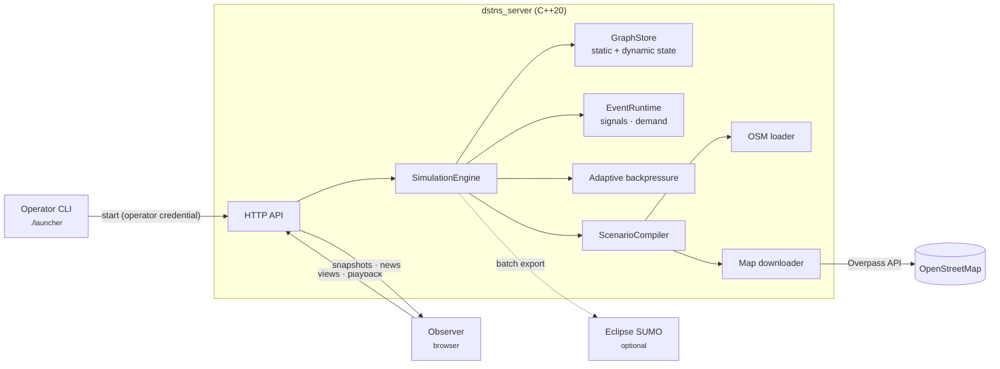

---
hide:
  - navigation
  - toc
---

# Deterministic Spatiotemporal Transport Network Simulator { .dstns-title }

A seed picks a real city district from OpenStreetMap and simulates a full day
of traffic on it: signals, demand, weather, flooding and incidents, on one
authoritative virtual clock. Reproducibility depends on the seed, configuration,
map bytes and build; see
[Reproducibility](concepts/reproducibility.md).

[Quick start](getting-started/quick-start.md){ .md-button .md-button--primary }
[Run with Docker](getting-started/docker.md){ .md-button }
[API reference](api/index.md){ .md-button }

{ .screenshot }

## What DSTNS does

-   **Seed-based geographic selection**

    ---

    A seed resolves to one of 181 cities on every inhabited continent and a
    district inside it. The road network is downloaded once and cached.

    [Seeds and places](guide/seeds-and-places.md)

-   **Deterministic simulation**

    ---

    SHA-256 sub-seeds per subsystem, fixed one-second physics, checkpoint
    replay. Matching inputs and compatible builds produce matching scenario
    and runtime state.

    [Reproducibility](concepts/reproducibility.md)

-   **Integrated traffic and environmental models**

    ---

    Signals coordinated in green waves, place-driven weekday and weekend
    demand, storms, flooding that closes roads, at least four incidents a day.

    [Simulation engine](concepts/simulation-engine.md)

-   **Checkpoint replay**

    ---

    Pause, step, seek backwards and forwards through the day; undo and redo
    operator controls.

    [Playback control](guide/playback-control.md)

-   **Browser observer**

    ---

    Live map, telemetry, notifications, Auto Focus, a guided tutorial and a
    PDF report, kept in step by adaptive backpressure.

    [Observer interface](guide/observer-interface.md)

-   **HTTP API**

    ---

    Every view and control over JSON, with an index the server generates
    itself and an OpenAPI description.

    [API guide](api/index.md)

## How it fits together

## Where to start

| You want to… | Read |
|---|---|
| See it running in five minutes | [Quick start](getting-started/quick-start.md) |
| Run it in a container | [Run with Docker](getting-started/docker.md) |
| Build it on your machine | [Installation](getting-started/installation.md) |
| Learn the interface | [Your first simulation](getting-started/first-simulation.md) |
| Understand how it works | [Architecture](concepts/architecture.md), then [Simulation engine](concepts/simulation-engine.md) |
| Drive it from code | [API guide](api/index.md) |
| Deploy it for others | [Deployment](deployment/index.md) and [Security](deployment/security.md) |
| Fix something | [Troubleshooting](troubleshooting.md) and [FAQ](faq.md) |
| Contribute | [Contributing](development/contributing.md) |

!!! info "Model scope"
    The live model is **aggregate**: flows and queues per directed road
    segment, not individual vehicles. The observer's moving dots show modelled
    flow. Eclipse SUMO is available as a separate microscopic cross-check and
    never writes back into a live run.

## Integration and maintenance

| Task | Guide |
|---|---|
| Write an API client with checked results | [Python client walkthrough](api/client-walkthrough.md) |
| Operate and recover a deployment | [Operations runbook](deployment/operations.md) |
| Review dependency updates | [Dependency maintenance](development/dependencies.md) |
| Report a security concern | [Security policy](https://github.com/varunkarthic/DSTNS/blob/main/SECURITY.md) |
