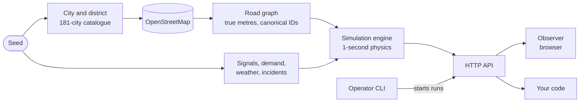

<div class="dstns-first" markdown>

<div class="dstns-hero" markdown>

<h1 class="dstns-hero__logo"><span class="dstns-wordmark" role="img" aria-label="DSTNS"></span></h1>

<p class="dstns-hero__full">Deterministic Spatiotemporal Transport Network Simulator</p>

<p class="dstns-lede">
DSTNS selects a city district from OpenStreetMap using a seed and simulates a
virtual day of traffic, signals, demand, weather, flooding and incidents on one
authoritative clock. The same seed gives the same world and the same day, on any
machine.
</p>

<div class="dstns-actions" markdown>

[Get started](getting-started/quick-start.md){ .md-button .md-button--primary }
[Run with Docker](getting-started/docker.md){ .md-button }
[API reference](api/index.md){ .md-button }

</div>

</div>

<div class="dstns-stats" markdown>
<div markdown><strong>181</strong><span>cities in the catalogue</span></div>
<div markdown><strong>3,000</strong><span>junctions per district</span></div>
<div markdown><strong>1 s</strong><span>fixed physics step</span></div>
<div markdown><strong>96</strong><span>checkpoints per day</span></div>
<div markdown><strong>0.25 to 5x</strong><span>playback speed</span></div>
</div>

</div>

<div class="dstns-shot" markdown>

{ .screenshot }

</div>

## Explore the documentation

<div class="dstns-cards" markdown>

<div class="dstns-card" markdown>
[Getting started](getting-started/index.md){ .dstns-card__title }

Install, run with Docker, and take your first simulation.

[Quick start](getting-started/quick-start.md){ .dstns-chip } [Docker](getting-started/docker.md){ .dstns-chip }
</div>

<div class="dstns-card" markdown>
[User guide](guide/index.md){ .dstns-card__title }

The operator CLI, the observer, playback, seeds and configuration.

[Operator CLI](guide/operator-cli.md){ .dstns-chip } [Seeds](guide/seeds-and-places.md){ .dstns-chip }
</div>

<div class="dstns-card" markdown>
[Concepts](concepts/index.md){ .dstns-card__title }

How a seed becomes a world and a day, with the equations.

[Architecture](concepts/architecture.md){ .dstns-chip } [Maths](concepts/mathematical-model.md){ .dstns-chip }
</div>

<div class="dstns-card" markdown>
[API](api/index.md){ .dstns-card__title }

Playback, control, view and streaming routes, schemas and examples.

[Reference](api/reference.md){ .dstns-chip } [Errors](api/errors.md){ .dstns-chip }
</div>

<div class="dstns-card" markdown>
[Deployment](deployment/index.md){ .dstns-card__title }

Containers, TLS, security, logging and operations.

[Security](deployment/security.md){ .dstns-chip } [Operations](deployment/operations.md){ .dstns-chip }
</div>

<div class="dstns-card" markdown>
[Components](components/index.md){ .dstns-card__title }

Per-class design notes for the engine, graph, routing and more.

[Engine](components/playback-engine.md){ .dstns-chip } [API server](components/api-server.md){ .dstns-chip }
</div>

<div class="dstns-card" markdown>
[Design specs](design/index.md){ .dstns-card__title }

The formal mathematical, architecture and API specifications.

[Foundation](design/mathematical-foundation.md){ .dstns-chip } [Runtime spec](design/api-runtime-event-spec.md){ .dstns-chip }
</div>

<div class="dstns-card" markdown>
[Help](troubleshooting.md){ .dstns-card__title }

Symptoms and remedies, answers to common questions, a glossary.

[FAQ](faq.md){ .dstns-chip } [Glossary](glossary.md){ .dstns-chip }
</div>

</div>

## Start in one minute

=== "Docker"

    ```bash
    git clone https://github.com/varunkarthic/DSTNS.git && cd DSTNS
    docker compose up --build
    ```

    Open <http://localhost:8090>. The container picks a seed, downloads that city's
    map the first time, and starts the day.

=== "From source"

    ```bash
    git clone https://github.com/varunkarthic/DSTNS.git && cd DSTNS
    ./launcher start --seed 382923
    ```

    The launcher builds what changed, starts the server, opens the observer
    and starts a run from seed `382923`.

=== "API only"

    ```bash
    curl -s http://127.0.0.1:8090/api/v1/playback/status
    curl -s -X POST http://127.0.0.1:8090/api/v1/playback/seek \
         -d '{"target_time": "08:00:00"}'
    ```

    The first command reads the run's state; the second jumps to the morning
    peak. Seeking is exact: the engine restores a checkpoint and replays.

## How it works



Every random choice is derived from the seed through SHA-256, one stream per
subsystem. With \( s \) the seed and \( \ell \) a subsystem label, the sub-seed is the
first 128 bits of

\[
s_\ell = \operatorname{SHA\text{-}256}\big(\operatorname{hex}(s) \,\Vert\, \texttt{":"} \,\Vert\, \ell\big)
\]

so changing how one subsystem draws numbers never moves another's. Physics then
advances in fixed one-second steps, so playing to a time and seeking to it reach
identical state. [Deterministic seeding](concepts/deterministic-seeding.md) works the
whole path through for a real seed, and [Reproducibility](concepts/reproducibility.md) states exactly what
is guaranteed.

## What is in the box

| Component | What it is | Documentation |
|---|---|---|
| **Core** (`dstns_server`) | C++20 engine and HTTP server. Compiles a scenario from a seed, runs the virtual day, serves the API and the observer on one port | [Architecture](concepts/architecture.md), [Simulation engine](concepts/simulation-engine.md) |
| **Operator CLI** (`./launcher`) | Builds what changed, starts and supervises the server, starts runs, saved seeds, logs, tests | [Operator CLI](guide/operator-cli.md) |
| **Observer** (`ui-engine/`) | React application: map, telemetry, playback, notifications, PDF report | [Observer interface](guide/observer-interface.md) |
| **Container image** | One 234 MB multi-architecture image with a TLS gateway profile | [Docker deployment](deployment/docker.md) |
| **SUMO adapter** | Exports a world to Eclipse SUMO as a microscopic cross-check | [SUMO adapter](components/sumo-adapter.md) |

!!! info "Model scope"
    The live model is **aggregate**: flows and queues per directed road segment,
    not individual vehicles. That is what makes a whole day of a 3,000-junction
    district cheap enough to scrub back and forth interactively. The moving dots
    in the observer show modelled flow. SUMO is a separate batch job and never
    writes back into a live run.

## Find what you need

<div class="dstns-chips" markdown>
[Install](getting-started/installation.md){ .dstns-chip }
[Choose a seed](guide/seeds-and-places.md){ .dstns-chip }
[Commands and flags](guide/operator-cli.md){ .dstns-chip }
[Look up a formula](concepts/mathematical-model.md){ .dstns-chip }
[Handle an error](api/errors.md){ .dstns-chip }
[Fix a problem](troubleshooting.md){ .dstns-chip }
[Secure a deployment](deployment/security.md){ .dstns-chip }
[Call the API](api/index.md){ .dstns-chip }
</div>
