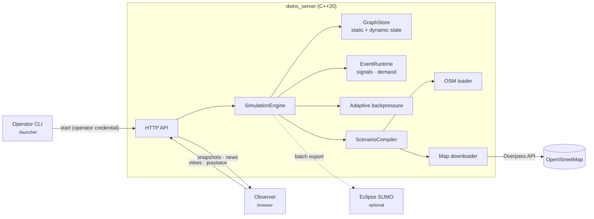

---
hide:
  - navigation
  - toc
---

# Deterministic Spatiotemporal Transport Network Simulator { .dstns-title }

A seed picks a real city district from OpenStreetMap and simulates a full day
of traffic on it: signals, demand, weather, flooding and incidents, on one
authoritative virtual clock. The same seed always gives the same world and the
same day.

[Quick start](getting-started/quick-start.md){ .md-button .md-button--primary }
[Run with Docker](getting-started/docker.md){ .md-button }
[API reference](api/index.md){ .md-button }

{ .screenshot }

## What DSTNS does

-   :material-earth: **Real places, chosen by a number**

    ---

    A seed resolves to one of 181 cities on every inhabited continent and a
    district inside it. The road network is downloaded once and cached.

    [:octicons-arrow-right-24: Seeds and places](guide/seeds-and-places.md)

-   :material-dice-multiple: **Deterministic to the bit**

    ---

    SHA-256 sub-seeds per subsystem, fixed one-second physics, checkpoint
    replay. Two engines with the same seed agree exactly.

    [:octicons-arrow-right-24: Reproducibility](concepts/reproducibility.md)

-   :material-traffic-light: **A living network**

    ---

    Signals coordinated in green waves, place-driven weekday and weekend
    demand, storms, flooding that closes roads, at least four incidents a day.

    [:octicons-arrow-right-24: Simulation engine](concepts/simulation-engine.md)

-   :material-history: **Time travel**

    ---

    Pause, step, seek backwards and forwards through the day; undo and redo
    operator controls.

    [:octicons-arrow-right-24: Playback control](guide/playback-control.md)

-   :material-monitor-dashboard: **An observer built for watching**

    ---

    Live map, telemetry, notifications, Auto Focus, a guided tutorial and a
    PDF report, kept in step by adaptive backpressure.

    [:octicons-arrow-right-24: Observer interface](guide/observer-interface.md)

-   :material-api: **A complete HTTP API**

    ---

    Every view and control over JSON, with an index the server generates
    itself and an OpenAPI description.

    [:octicons-arrow-right-24: API guide](api/index.md)

## How it fits together

## Where to start

| You want to… | Read |
|---|---|
| See it running in five minutes | [Quick start](getting-started/quick-start.md) |
| Run it in a container | [Run with Docker](getting-started/docker.md) |
| Build it on your machine | [Installation](getting-started/installation.md) |
| Learn the interface | [Your first simulation](getting-started/first-simulation.md) |
| Understand how it works | [Architecture](concepts/architecture.md), then [Simulation engine](concepts/simulation-engine.md) |
| Drive it from code | [API guide](api/index.md) |
| Deploy it for others | [Deployment](deployment/index.md) and [Security](deployment/security.md) |
| Fix something | [Troubleshooting](troubleshooting.md) and [FAQ](faq.md) |
| Contribute | [Contributing](development/contributing.md) |

!!! info "Model scope"
    The live model is **aggregate**: flows and queues per directed road
    segment, not individual vehicles. The observer's moving dots show modelled
    flow. Eclipse SUMO is available as a separate microscopic cross-check and
    never writes back into a live run.
