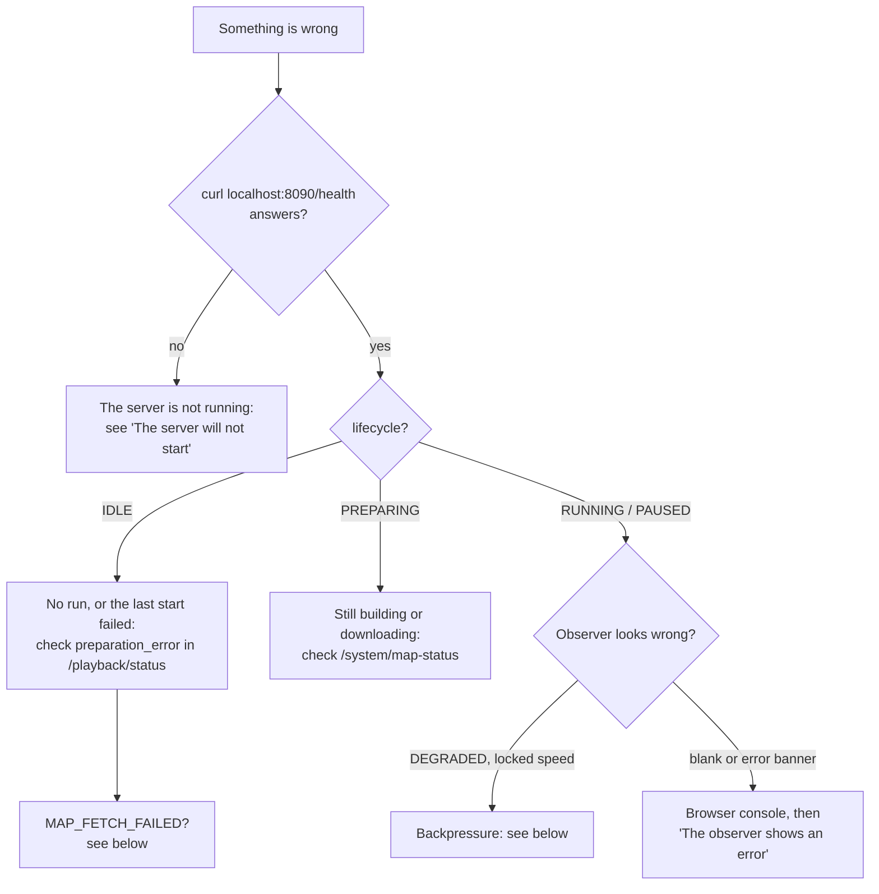

# Troubleshooting

Symptoms first, then what causes them and what to do. For log locations see
[Logging](deployment/logging.md); `./launcher logs` reads them all.


## Quick diagnosis



```bash
curl -s localhost:8090/health
curl -s localhost:8090/api/v1/playback/status | python3 -c 'import json,sys;d=json.load(sys.stdin)["data"];print(d["lifecycle"], d["preparation_error"])'
grep -E "ERROR|WARN" logs/system.log | tail
```

## The launcher

Both `./launcher` and `python3 launcher.py` use the Python launcher. In an
interactive terminal, the default command opens its dashboard after checking the
environment. Choose **Start simulation**, or run `./launcher start` directly.

| Symptom | Diagnosis and action |
|---|---|
| Compatibility mode opens | Check `logs/launcher.log` for an installation or Textual error. Core commands remain available. Install the pinned packages with `.venv-launcher/bin/python -m pip install -r dstns_launcher/requirements.txt`, after creating that environment with `python3 -m venv .venv-launcher` if necessary. |
| Installation cannot use the network | Set `DSTNS_LAUNCHER_NO_INSTALL=1` to skip automatic interface installation. Use `--no-tui` for the standard-library interface. This does not install missing C++ or observer build dependencies. |
| Terminal too small | Resize to at least 50 columns by 15 rows, or press **R** for compatibility mode. The previous screen's state is retained while resizing. |
| Animation is distracting or slow over SSH | Use `--no-animation`. Status labels remain visible. `--no-splash` skips only the opening wordmark. `TERM=dumb` automatically uses plain mode. |
| Activity is moving but there is no percentage | The current operation has no measured total. The label and output identify the work; download percentages appear only with a known byte total. Check `logs/launcher.log` and `logs/system.log` for failures. |
| An environment check fails | Read its remedy, fix the reported dependency or file, and choose **Retry**. **Diagnostics** can run additional test suites. |

```bash
# Plain output and verbose diagnostics using a local map.
./launcher --no-tui --debug start --no-open \
  --seed 382923 --osm-file data/fixtures/real_network.osm.xml
```

This bypasses the optional terminal packages and map download, helping isolate
interface problems from server or build failures. Debug information is written
to `logs/launcher.log` (under `DSTNS_LOGS_DIR` when set). Review logs before
sharing them; do not share `operator.token` or credentials.

## The server will not start

Run it in the foreground to see why:

```bash
./build/dstns_server --port 8090 --logs logs
```

| Output | Fix |
|---|---|
| `DSTNS fatal: --port must be in [1, 65535]` | Use a real port |
| `DSTNS fatal: unknown argument: …` | See `dstns_server --help` |
| `cannot write operator credential` | `logs/` is not writable |
| `cannot open runtime log database` | `logs/runtime.db` is locked or the directory is read-only; `./launcher reset` |
| `API server failed to listen on …` | The port is taken; see below |

## Port 8090 or 8443 already in use

The CLI already moves to the next free port when 8090 is held by something
other than a current DSTNS server, and prints the port it chose. To free it:

```bash
lsof -i :8090
curl -X POST http://127.0.0.1:8090/api/v1/system/terminate   # a DSTNS server
kill <PID>                                                    # anything else
```

## Health check timeout during start-up

`Server did not become healthy within 15s`: the process started but never
answered `/health`. The CLI prints the tail of the server's output. Usually
`logs/` is not writable, or a stale build is running; `./launcher reset`, then
start again (the CLI rebuilds when sources change).

## MAP_FETCH_FAILED

The seed's city extract could not be downloaded, and DSTNS never substitutes
another city. The message names the city, the coordinates and the cause, and
the CLI lists maps already on disk.

- Check the network, VPN or proxy.
- Overpass mirrors rate-limit heavy users. Wait, or point at another instance:
  `DSTNS_OVERPASS_ENDPOINTS=https://overpass.example/api/interpreter ./launcher`.
- `implausibly small map` means the mirror returned an error page: the same
  rate limiting.
- Run offline from a cached extract:
  `./launcher start --osm-file data/maps/<city>_x5000.osm.xml`.

## Start-up stuck in PREPARING

Large extracts take 20 to 50 seconds to download the first time.
`curl -s localhost:8090/api/v1/system/map-status` shows the phase and bytes;
`preparation` says whether the core is `selecting`, `acquiring` or `building`.
Terminating at any point kills the download cleanly.

## CLI_START_REQUIRED

Runs are started by the CLI, which sends the credential in
`logs/operator.token`. A script that starts runs itself must send
`X-DSTNS-Operator: $(cat logs/operator.token)`, using the same `--logs`
directory the server was started with.

## CROSS_ORIGIN_FORBIDDEN

A browser page on one origin tried to change state on a server at another. If
that page is yours (the observer served from elsewhere, or a dashboard of your
own), add its origin: `DSTNS_ALLOWED_ORIGINS=https://ops.example.org`. Behind a
reverse proxy, forward the client's `Host` or set `X-Forwarded-Host`. See
[Security](deployment/security.md#origin-check-cross-site-request-forgery).

## SUMO reported unavailable

`/api/v1/system/info` reports `sumo.available: false` unless both `sumo` and
`netconvert` *start* and answer `--version`. Run them yourself:

```bash
$SUMO_HOME/bin/netconvert --version
$SUMO_HOME/bin/sumo --version
```

A `dyld: Library not loaded` (macOS) or `error while loading shared libraries`
(Linux) means the SUMO build links a library that has since changed. On macOS
with Homebrew this happens when an upgrade replaces `abseil` or `re2` under a
locally built SUMO. Rebuild SUMO against the current libraries, or reinstall
it (`brew reinstall sumo`). Set `SUMO_HOME` if SUMO is installed outside the
standard prefixes.

## The observer says it is behind, or locks speed

That is Adaptive Simulation Backpressure: the browser cannot keep up with the
simulation rate. It first lowers the rate ceiling, then turns layers and motion
off, then suspends the interface. It recovers on its own once the browser
catches up. Close other heavy tabs, choose a lower speed, or turn off layers.
See [ASB](concepts/backpressure.md).

## The interface says the window is too small

The observer needs at least 1024 × 640 CSS pixels and says so rather than
squeezing. Enlarge the window or zoom out.

## playback.tick_rate must be in (0, 5]

`config/defaults.json` or `--speed` asks for more than the engine allows.
Speeds offered in the interface are 0.25, 0.5, 1, 2, 3 and 5.

## Self-signed certificate warnings

The development gateway generates a self-signed certificate. Accept it in the
browser for local use, or mount trusted certificates into
`docker/certificates/`.

## Tests fail after pulling

Reconfigure from scratch: CMake fetches pinned versions of nlohmann/json and
cpp-httplib, and a stale cache can mix versions.

```bash
rm -rf build && cmake -S . -B build -DDSTNS_BUILD_TESTS=ON && cmake --build build -j
npm ci --prefix ui-engine
```

If only `api_smoke.py` fails at its SUMO step, see [SUMO reported
unavailable](#sumo-reported-unavailable).

## Southern-hemisphere cities fail to download

Engine 2.0.0 could not download any city south of the equator (Sydney, São Paulo,
Johannesburg, Dar es Salaam…) on Python before 3.13, failing with
`argument --bbox: expected one argument`. Update to 2.1.0 or later; see the
[release notes](changelog.md). If you call
`scripts/fetch_osm.py` yourself, write `--bbox=S,W,N,E` with an equals sign.

## The observer shows an error

| Message | Meaning |
|---|---|
| "Simulator unavailable. Waiting to reconnect…" | The server stopped or the network dropped; the observer retries every second |
| "Synchronizing a new simulation…" | The run changed between two requests; resolves itself |
| "Map data is missing or incomplete." | The topology came back empty; check `preparation_error` |
| "Request failed (502)" or another status | Something in front of the server (a proxy or gateway) answered; check it |
| A dialog appears and vanishes | A defect in observer 2.2.0, fixed in 2.3.0; update |

Open the browser's developer console for the failing request.

## Docker

| Symptom | Fix |
|---|---|
| `port is already allocated` | `DSTNS_HOST_PORT=9090 docker compose up` |
| `[dstns-run] preparation failed: … no route to Overpass` | The container has no outbound HTTPS; set `HTTPS_PROXY`, or `DSTNS_OSM_FILE=/app/data/fixtures/real_network.osm.xml` |
| `Permission denied` on `/app/data/maps` | A bind-mounted directory must be writable by UID 10001 |
| The container restarts in a loop | `docker compose logs dstns` shows the server's last line |
| The build fails at `npm ci` or `cmake` | Network during the build; retry or pass `--build-arg HTTPS_PROXY=…` |

More in [Docker deployment: troubleshooting](deployment/docker.md#troubleshooting).

## A build fails after a system update

```text
make[3]: *** No rule to make target `/opt/homebrew/Cellar/sqlite/3.50.4/lib/libsqlite3.dylib'
```

A library the build was configured against was replaced. Reconfigure:

```bash
cmake --fresh -S . -B build -DCMAKE_BUILD_TYPE=Release -DDSTNS_BUILD_TESTS=ON
cmake --build build -j
```

!!! warning "Don't filter build output"
    `cmake --build build | grep error:` hides `make: *** … Error 2`, and a failed
    link leaves the previous executable in place, so you test old code without
    knowing. Check the exit status.

## A saved seed is refused

| Message | Fix |
|---|---|
| `Saved seed requires an unsupported map version` | It was saved under a different seed-to-place algorithm; save the configuration again |
| `Saved map content changed; refusing a non-reproducible run` | The stored copy of its pinned map was modified; restore it or save again |
| `Seed ID must be 1-64 letters, digits, underscores or hyphens` | Use only letters, digits, `_` and `-`, starting with a letter or digit |
| `Unknown saved seed: ID` | Check `./launcher seeds list`, and `DSTNS_SEED_DB` if you moved the store |

See [Saved seeds](guide/saved-seeds.md).

## The documentation does not build

```bash
.venv-docs/bin/mkdocs build --strict
```

| Warning | Fix |
|---|---|
| `… not included in the "nav" configuration` | Add the page to `nav:` in `mkdocs.yml` |
| `contains a link '…', but the target is not found` | Fix the relative path; on macOS a case-only rename may not have reached the disk (`mv FILE tmp && mv tmp file`) |
| `contains a link '…#anchor', but … no such anchor` | Headings become anchors in lowercase with hyphens |

See [Writing documentation](development/documentation.md).

## Diagnosing something else

Three things explain most behaviour you cannot account for:

- `logs/system.log`, which records every lifecycle change and error
  (`grep -E "ERROR|WARN" logs/system.log | tail`);
- `curl -s localhost:8090/api/v1/system/info`, which reports the version, build and
  whether SUMO is usable;
- the seed and the exact command you ran, since the same seed always reproduces the same
  world, so a problem you can reproduce with one seed can be reproduced again.

See [Logging](deployment/logging.md) for how to read the logs.
